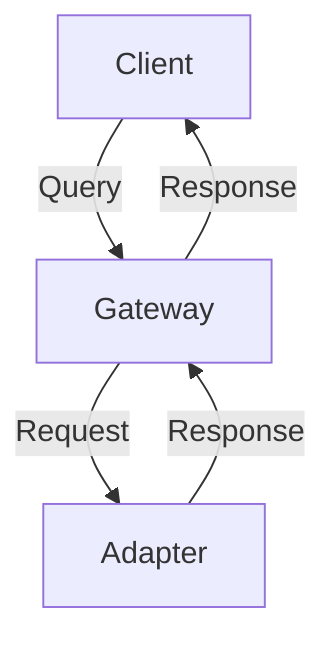

# DictaMesh Documentation Portal

This directory contains the complete documentation portal for DictaMesh, built with [Docusaurus 3](https://docusaurus.io/).

## 🌐 Live Site

**Production**: https://docs.dictamesh.com (will be available after deployment)

## 🎯 Overview

The DictaMesh documentation portal provides:

- **User Documentation**: Getting started guides, tutorials, and usage examples
- **API Reference**: REST API, GraphQL API, Go packages, and event schemas
- **Architecture Documentation**: System design, patterns, and best practices
- **Operations Guides**: Installation, configuration, monitoring, and troubleshooting
- **Contributing Guidelines**: How to contribute to the project

## 🏗️ Stack

| Component | Technology | Purpose |
|-----------|-----------|---------|
| **Framework** | Docusaurus 3 | Static site generator with versioning |
| **Language** | TypeScript + React | UI components and pages |
| **Styling** | CSS Modules | Scoped component styling |
| **Search** | Algolia DocSearch | Fast, accurate documentation search |
| **Diagrams** | Mermaid.js | Version-controlled diagrams |
| **Hosting** | GitHub Pages | Free, reliable hosting |
| **Deployment** | GitHub Actions | Automated CI/CD |

## 📁 Structure

```
docs-portal/
├── docs/                       # Documentation content (Markdown)
│   ├── getting-started/
│   ├── guides/
│   ├── architecture/
│   ├── api-reference/
│   ├── operations/
│   └── contributing/
├── blog/                       # Release notes, updates
├── src/
│   ├── components/             # React components
│   ├── css/                    # Custom styles
│   └── pages/                  # Custom pages (homepage, etc.)
├── static/                     # Static assets
│   ├── img/
│   ├── schemas/                # Avro schemas
│   └── openapi/                # OpenAPI specs
├── docusaurus.config.js        # Docusaurus configuration
├── sidebars.js                 # Sidebar structure
└── package.json
```

## 🚀 Local Development

### Prerequisites

- Node.js 18+ and npm
- Git

### Quick Start

```bash
# Install dependencies
npm install

# Start development server
npm start
```

This will start a local development server at http://localhost:3000. Most changes are reflected live without having to restart the server.

### Available Scripts

| Command | Description |
|---------|-------------|
| `npm start` | Start development server |
| `npm run build` | Build production site |
| `npm run serve` | Serve production build locally |
| `npm run clear` | Clear build cache |
| `npm run lint` | Run ESLint |
| `npm run format` | Format code with Prettier |
| `npm run typecheck` | Type check TypeScript |

## 📝 Writing Documentation

### Creating a New Document

1. Create a new Markdown file in the appropriate directory:
   ```bash
   touch docs/guides/my-new-guide.md
   ```

2. Add frontmatter:
   ```markdown
   ---
   sidebar_position: 3
   ---

   # My New Guide

   Content goes here...
   ```

3. The document will automatically appear in the sidebar based on its location and `sidebar_position`.

### Markdown Features

#### Code Blocks with Syntax Highlighting

````markdown
```go
func main() {
    fmt.Println("Hello, DictaMesh!")
}
```
````

#### Admonitions (Callouts)

```markdown
:::tip
This is a helpful tip!
:::

:::warning
This is a warning!
:::

:::danger
This is dangerous!
:::

:::info
This is informational.
:::
```

#### Mermaid Diagrams

````markdown

````

#### Tabs

```markdown
import Tabs from '@theme/Tabs';
import TabItem from '@theme/TabItem';

<Tabs>
  <TabItem value="js" label="JavaScript">

  ```js
  console.log('Hello from JavaScript!');
  ```

  </TabItem>
  <TabItem value="go" label="Go">

  ```go
  fmt.Println("Hello from Go!")
  ```

  </TabItem>
</Tabs>
```

### Linking Between Documents

```markdown
<!-- Relative path -->
[Getting Started](./getting-started/introduction.md)

<!-- Absolute path from docs/ -->
[Architecture](/docs/architecture/overview)

<!-- With anchor -->
[Installation Guide](./installation.md#prerequisites)
```

## 🎨 Customization

### Theme Colors

Edit `src/css/custom.css` to customize colors:

```css
:root {
  --ifm-color-primary: #0066cc;
  --ifm-color-primary-dark: #005cb8;
  /* ... */
}
```

### Logo

Replace `static/img/logo.svg` and `static/img/logo-dark.svg` with your logo files.

### Homepage

Edit `src/pages/index.tsx` to customize the homepage.

### Features

Edit `src/components/HomepageFeatures/index.tsx` to update the feature cards.

## 📊 Versioning

Docusaurus supports documentation versioning for maintaining docs across multiple releases.

### Create a New Version

```bash
npm run docusaurus docs:version 1.0
```

This creates:
- `versioned_docs/version-1.0/` - Snapshot of current docs
- `versioned_sidebars/version-1.0-sidebars.json` - Snapshot of sidebar
- Updates `versions.json`

### Version Structure

```
docs/                          # Next version (in development)
versioned_docs/
├── version-1.0/              # Version 1.0 docs
└── version-0.9/              # Version 0.9 docs (legacy)
versions.json                  # List of versions
```

### Version URLs

- Latest: `https://docs.dictamesh.com/`
- Version 1.0: `https://docs.dictamesh.com/1.0/`
- Next (development): `https://docs.dictamesh.com/next/`

## 🔍 Search

### Algolia DocSearch Setup

1. **Apply for Free Tier**: https://docsearch.algolia.com/apply/

2. **Add API Keys to `docusaurus.config.js`**:
   ```js
   themeConfig: {
     algolia: {
       appId: 'YOUR_APP_ID',
       apiKey: 'YOUR_SEARCH_API_KEY',
       indexName: 'dictamesh',
     },
   }
   ```

3. **Configure Crawler** (`.algolia/config.json`):
   ```json
   {
     "index_name": "dictamesh",
     "start_urls": ["https://docs.dictamesh.com/"],
     "sitemap_urls": ["https://docs.dictamesh.com/sitemap.xml"]
   }
   ```

## 🚢 Deployment

### GitHub Pages (Automatic)

Documentation is automatically deployed to GitHub Pages when changes are pushed to `main` branch.

The GitHub Action (`.github/workflows/deploy-docs.yml`) handles:
1. Installing dependencies
2. Building the site
3. Deploying to GitHub Pages

### Manual Deployment

```bash
# Build the site
npm run build

# Serve locally to test
npm run serve

# Deploy (if configured)
npm run deploy
```

### Custom Domain

1. Add `CNAME` file in `static/`:
   ```
   docs.dictamesh.com
   ```

2. Configure DNS:
   ```
   CNAME docs.dictamesh.com -> dictamesh.github.io
   ```

3. Enable HTTPS in GitHub repository settings → Pages

## 📈 Analytics

### Plausible Analytics (Planned)

Add to `docusaurus.config.js`:

```js
scripts: [
  {
    src: 'https://plausible.dictamesh.com/js/script.js',
    'data-domain': 'docs.dictamesh.com',
    defer: true,
  },
]
```

## 🧪 Quality Checks

### Build Check

```bash
npm run build
```

Ensures:
- ✅ All links resolve correctly
- ✅ No Markdown syntax errors
- ✅ TypeScript compiles
- ✅ Production bundle is optimized

### Type Check

```bash
npm run typecheck
```

### Linting

```bash
npm run lint
```

### Broken Link Check

```bash
npx docusaurus-check-links
```

## 📋 Content Guidelines

### Writing Style

- **Be Clear**: Use simple language, avoid jargon
- **Be Concise**: Get to the point quickly
- **Be Consistent**: Follow existing patterns
- **Be Helpful**: Provide examples and context

### Code Examples

- **Complete**: Examples should be runnable
- **Annotated**: Add comments explaining key parts
- **Tested**: Verify examples work
- **Relevant**: Match the documentation context

### Screenshots

- **Current**: Update when UI changes
- **Annotated**: Highlight important areas
- **Compressed**: Use optimized formats (WebP, PNG)
- **Dark Mode**: Provide both light and dark versions if relevant

## 🤝 Contributing

We welcome contributions to the documentation!

### How to Contribute

1. **Fork the repository**
2. **Create a feature branch**: `git checkout -b docs/my-improvement`
3. **Make your changes**
4. **Test locally**: `npm start`
5. **Build to verify**: `npm run build`
6. **Submit a pull request**

### Pull Request Guidelines

- Provide a clear description of changes
- Reference related issues
- Ensure all checks pass
- Request review from maintainers

## 🐛 Troubleshooting

### Port 3000 Already in Use

```bash
# Use a different port
npm start -- --port 3001
```

### Build Errors

Clear cache and rebuild:

```bash
npm run clear
rm -rf node_modules package-lock.json
npm install
npm run build
```

### Broken Links

Run the link checker:

```bash
npx docusaurus-check-links
```

## 📚 Resources

- [Docusaurus Documentation](https://docusaurus.io/docs)
- [Markdown Guide](https://www.markdownguide.org/)
- [Mermaid.js Documentation](https://mermaid.js.org/)
- [React Documentation](https://react.dev/)

## 📄 License

SPDX-License-Identifier: AGPL-3.0-or-later
Copyright (C) 2025 Controle Digital Ltda

See the [LICENSE](../LICENSE) file in the project root for details.

## 🆘 Support

- **Issues**: https://github.com/dictamesh/dictamesh/issues
- **Discussions**: https://github.com/dictamesh/dictamesh/discussions
- **Documentation**: https://docs.dictamesh.com

---

**Built with ❤️ using [Docusaurus](https://docusaurus.io/)**
