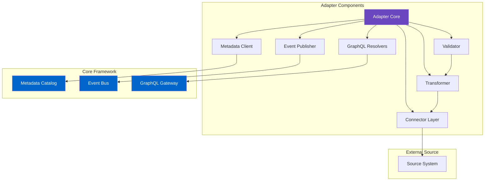
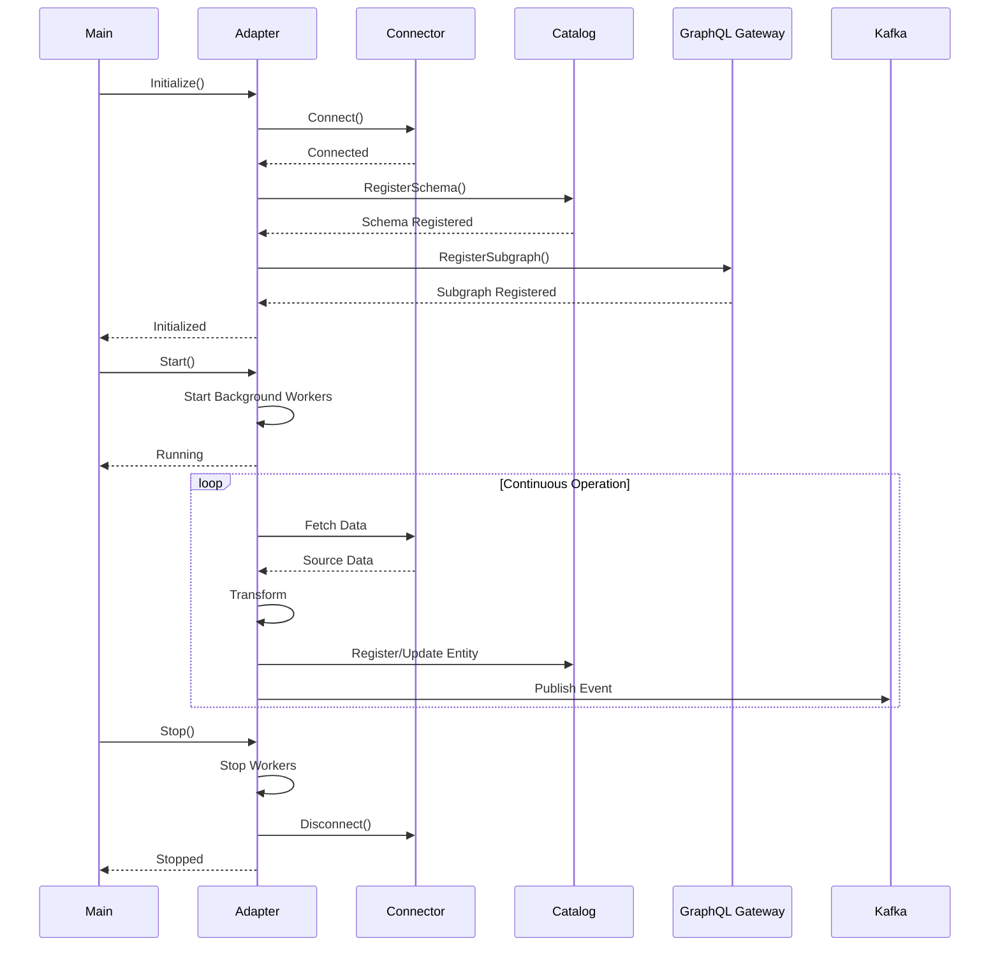

<!--
SPDX-License-Identifier: AGPL-3.0-or-later
Copyright (C) 2025 Controle Digital Ltda
-->

---
sidebar_position: 4
---

# Adapters

Adapters are the bridge between external data sources and the DictaMesh data mesh. They implement domain-specific business logic, transform source data to canonical models, and integrate with the core framework's metadata catalog, event bus, and GraphQL gateway.

## Adapter Architecture



## DataProductAdapter Interface

Every adapter implements the `DataProductAdapter` interface:

```go
// SPDX-License-Identifier: AGPL-3.0-or-later
// Copyright (C) 2025 Controle Digital Ltda

package adapter

import (
    "context"
    "time"
)

// DataProductAdapter defines the contract for all domain adapters
type DataProductAdapter interface {
    // Lifecycle Management
    Initialize(ctx context.Context) error
    Start(ctx context.Context) error
    Stop(ctx context.Context) error
    HealthCheck(ctx context.Context) error

    // Entity Operations
    GetEntity(ctx context.Context, id string) (*Entity, error)
    ListEntities(ctx context.Context, opts ListOptions) (*EntityList, error)
    SearchEntities(ctx context.Context, query SearchQuery) (*EntityList, error)

    // Metadata
    GetSchema() *Schema
    GetMetadata() *AdapterMetadata

    // Synchronization
    Sync(ctx context.Context, opts SyncOptions) error
    RegisterWebhook(ctx context.Context, config WebhookConfig) error
}

// Entity represents a canonical entity in the data mesh
type Entity struct {
    ID          string                 `json:"id"`
    Type        string                 `json:"type"`
    Domain      string                 `json:"domain"`
    Attributes  map[string]interface{} `json:"attributes"`
    Relationships []Relationship       `json:"relationships,omitempty"`
    Metadata    EntityMetadata         `json:"metadata"`
    Version     string                 `json:"version"`
}

// EntityMetadata contains entity lifecycle information
type EntityMetadata struct {
    CreatedAt    time.Time `json:"created_at"`
    UpdatedAt    time.Time `json:"updated_at"`
    SourceSystem string    `json:"source_system"`
    SourceID     string    `json:"source_id"`
    CacheControl CacheControl `json:"cache_control"`
    Quality      QualityMetrics `json:"quality"`
}

// Relationship represents a link to another entity
type Relationship struct {
    Type         string `json:"type"`         // "belongs_to", "has_many", etc.
    TargetID     string `json:"target_id"`
    TargetType   string `json:"target_type"`
    Cardinality  string `json:"cardinality"`  // "one", "many"
}

// ListOptions configures entity listing
type ListOptions struct {
    Pagination Pagination
    Filters    map[string]interface{}
    Sort       []SortField
    Fields     []string // Field selection
}

// SearchQuery defines search parameters
type SearchQuery struct {
    Query      string
    Filters    map[string]interface{}
    Pagination Pagination
    Facets     []string
}

// AdapterMetadata describes the adapter
type AdapterMetadata struct {
    Name           string              `json:"name"`
    Version        string              `json:"version"`
    Domain         string              `json:"domain"`
    EntityTypes    []string            `json:"entity_types"`
    Capabilities   Capabilities        `json:"capabilities"`
    SLOs           ServiceLevelObjectives `json:"slos"`
}

// Capabilities defines what the adapter supports
type Capabilities struct {
    SupportsSearch      bool `json:"supports_search"`
    SupportsWebhooks    bool `json:"supports_webhooks"`
    SupportsStreaming   bool `json:"supports_streaming"`
    SupportsAggregation bool `json:"supports_aggregation"`
    SupportsRelations   bool `json:"supports_relations"`
}

// ServiceLevelObjectives defines quality guarantees
type ServiceLevelObjectives struct {
    AvailabilitySLA float64       `json:"availability_sla"` // 0.999 = 99.9%
    LatencyP99      time.Duration `json:"latency_p99"`
    FreshnessSLA    time.Duration `json:"freshness_sla"`
}
```

## Base Adapter Implementation

DictaMesh provides a base adapter with common functionality:

```go
package adapter

type BaseAdapter struct {
    // Configuration
    config   *Config
    metadata *AdapterMetadata

    // Dependencies
    connector    connectors.Connector
    catalog      repository.CatalogRepository
    eventBus     events.Producer
    cache        cache.Cache
    transformer  Transformer
    validator    Validator

    // Observability
    logger  *zap.Logger
    tracer  trace.Tracer
    metrics *Metrics

    // State
    mu      sync.RWMutex
    running bool
}

func NewBaseAdapter(config *Config) *BaseAdapter {
    return &BaseAdapter{
        config:  config,
        logger:  config.Logger,
        tracer:  config.Tracer,
        metrics: NewMetrics(config.MetricsRegistry),
    }
}

func (a *BaseAdapter) Initialize(ctx context.Context) error {
    ctx, span := a.tracer.Start(ctx, "adapter.Initialize")
    defer span.End()

    // Connect to source system
    if err := a.connector.Connect(ctx); err != nil {
        return fmt.Errorf("connector failed: %w", err)
    }

    // Register schema with catalog
    if err := a.registerSchema(ctx); err != nil {
        return fmt.Errorf("schema registration failed: %w", err)
    }

    // Register GraphQL subgraph
    if err := a.registerGraphQL(ctx); err != nil {
        return fmt.Errorf("GraphQL registration failed: %w", err)
    }

    a.logger.Info("adapter initialized",
        zap.String("name", a.metadata.Name),
        zap.String("version", a.metadata.Version))

    return nil
}

func (a *BaseAdapter) Start(ctx context.Context) error {
    a.mu.Lock()
    defer a.mu.Unlock()

    if a.running {
        return ErrAlreadyRunning
    }

    // Start background workers
    go a.syncWorker(ctx)
    go a.healthCheckWorker(ctx)

    a.running = true
    a.logger.Info("adapter started")

    return nil
}

func (a *BaseAdapter) Stop(ctx context.Context) error {
    a.mu.Lock()
    defer a.mu.Unlock()

    if !a.running {
        return nil
    }

    // Graceful shutdown
    a.running = false

    // Close connections
    if err := a.connector.Disconnect(ctx); err != nil {
        a.logger.Error("failed to disconnect connector", zap.Error(err))
    }

    a.logger.Info("adapter stopped")
    return nil
}

func (a *BaseAdapter) GetEntity(ctx context.Context, id string) (*Entity, error) {
    ctx, span := a.tracer.Start(ctx, "adapter.GetEntity",
        trace.WithAttributes(
            attribute.String("entity.id", id),
            attribute.String("entity.type", a.metadata.EntityTypes[0]),
        ))
    defer span.End()

    start := time.Now()
    defer func() {
        a.metrics.GetEntityDuration.Observe(time.Since(start).Seconds())
    }()

    // Check cache
    cacheKey := fmt.Sprintf("entity:%s:%s", a.metadata.Name, id)
    if cached, ok := a.cache.Get(ctx, cacheKey); ok {
        a.metrics.CacheHits.Inc()
        span.SetAttributes(attribute.Bool("cache.hit", true))
        return cached.(*Entity), nil
    }
    a.metrics.CacheMisses.Inc()

    // Check metadata catalog first
    catalogEntity, err := a.catalog.Get(ctx, id)
    if err != nil && err != repository.ErrNotFound {
        return nil, fmt.Errorf("catalog lookup failed: %w", err)
    }

    // Fetch from source
    sourceData, err := a.fetchFromSource(ctx, id)
    if err != nil {
        a.metrics.GetEntityErrors.Inc()
        span.RecordError(err)
        return nil, fmt.Errorf("fetch failed: %w", err)
    }

    // Transform to canonical model
    entity, err := a.transformer.Transform(sourceData)
    if err != nil {
        return nil, fmt.Errorf("transformation failed: %w", err)
    }

    // Validate
    if err := a.validator.Validate(entity); err != nil {
        return nil, fmt.Errorf("validation failed: %w", err)
    }

    // Update catalog if needed
    if catalogEntity == nil {
        if err := a.registerEntity(ctx, entity); err != nil {
            a.logger.Error("failed to register entity", zap.Error(err))
        }
    }

    // Cache result
    ttl := a.metadata.SLOs.FreshnessSLA
    a.cache.Set(ctx, cacheKey, entity, ttl)

    a.metrics.GetEntitySuccess.Inc()
    return entity, nil
}
```

## Adapter Lifecycle



## Data Transformation

### Transformer Interface

```go
package transformer

type Transformer interface {
    Transform(source interface{}) (*adapter.Entity, error)
    TransformBatch(sources []interface{}) ([]*adapter.Entity, error)
}

type TransformerFunc func(source interface{}) (*adapter.Entity, error)

func (f TransformerFunc) Transform(source interface{}) (*adapter.Entity, error) {
    return f(source)
}

func (f TransformerFunc) TransformBatch(sources []interface{}) ([]*adapter.Entity, error) {
    entities := make([]*adapter.Entity, len(sources))
    for i, source := range sources {
        entity, err := f(source)
        if err != nil {
            return nil, fmt.Errorf("failed to transform item %d: %w", i, err)
        }
        entities[i] = entity
    }
    return entities, nil
}
```

### Example Transformation

```go
// Products Adapter Transformer
type ProductTransformer struct {
    domain string
}

func (t *ProductTransformer) Transform(source interface{}) (*adapter.Entity, error) {
    // Type assertion
    sourceProduct, ok := source.(map[string]interface{})
    if !ok {
        return nil, fmt.Errorf("invalid source type")
    }

    // Extract and validate required fields
    id, ok := sourceProduct["id"].(string)
    if !ok {
        return nil, fmt.Errorf("missing or invalid id")
    }

    name, _ := sourceProduct["name"].(string)
    price, _ := sourceProduct["price"].(float64)
    description, _ := sourceProduct["description"].(string)
    sku, _ := sourceProduct["sku"].(string)

    // Build canonical entity
    entity := &adapter.Entity{
        ID:     fmt.Sprintf("product:%s", id),
        Type:   "product",
        Domain: t.domain,
        Attributes: map[string]interface{}{
            "name":        name,
            "price":       price,
            "description": description,
            "sku":         sku,
            "currency":    "USD",
        },
        Metadata: adapter.EntityMetadata{
            SourceSystem: "shopify",
            SourceID:     id,
            CreatedAt:    parseTime(sourceProduct["created_at"]),
            UpdatedAt:    parseTime(sourceProduct["updated_at"]),
        },
        Version: "1.0.0",
    }

    // Extract relationships
    if categoryID, ok := sourceProduct["category_id"].(string); ok {
        entity.Relationships = append(entity.Relationships, adapter.Relationship{
            Type:        "belongs_to",
            TargetID:    fmt.Sprintf("category:%s", categoryID),
            TargetType:  "category",
            Cardinality: "one",
        })
    }

    // Add tags
    if tags, ok := sourceProduct["tags"].([]interface{}); ok {
        entity.Attributes["tags"] = tags
    }

    return entity, nil
}
```

## Data Validation

### Validator Interface

```go
package validator

type Validator interface {
    Validate(entity *adapter.Entity) error
}

type SchemaValidator struct {
    schemas map[string]*jsonschema.Schema
}

func (v *SchemaValidator) Validate(entity *adapter.Entity) error {
    schema, ok := v.schemas[entity.Type]
    if !ok {
        return fmt.Errorf("no schema for entity type: %s", entity.Type)
    }

    // Validate against JSON Schema
    result := schema.Validate(entity.Attributes)
    if !result.Valid() {
        var errors []string
        for _, err := range result.Errors() {
            errors = append(errors, err.String())
        }
        return fmt.Errorf("validation failed: %s", strings.Join(errors, "; "))
    }

    return nil
}
```

### Example Schema

```json
{
  "$schema": "http://json-schema.org/draft-07/schema#",
  "title": "Product",
  "type": "object",
  "required": ["name", "price", "sku"],
  "properties": {
    "name": {
      "type": "string",
      "minLength": 1,
      "maxLength": 255
    },
    "price": {
      "type": "number",
      "minimum": 0,
      "exclusiveMinimum": true
    },
    "sku": {
      "type": "string",
      "pattern": "^[A-Z0-9-]+$"
    },
    "description": {
      "type": "string",
      "maxLength": 5000
    },
    "currency": {
      "type": "string",
      "enum": ["USD", "EUR", "GBP", "BRL"]
    },
    "tags": {
      "type": "array",
      "items": {
        "type": "string"
      },
      "maxItems": 20
    }
  }
}
```

## Event Integration

### Publishing Events

```go
func (a *BaseAdapter) registerEntity(ctx context.Context, entity *adapter.Entity) error {
    // Register in metadata catalog
    catalogEntry := &models.EntityCatalog{
        ID:             entity.ID,
        EntityType:     entity.Type,
        Domain:         entity.Domain,
        SourceSystem:   entity.Metadata.SourceSystem,
        SourceEntityID: entity.Metadata.SourceID,
        SchemaVersion:  &entity.Version,
    }

    if err := a.catalog.Create(ctx, catalogEntry); err != nil {
        return err
    }

    // Publish EntityCreated event
    event := &events.Event{
        EventID:        uuid.New().String(),
        EventType:      "entity.created",
        Timestamp:      time.Now(),
        Source:         a.metadata.Name,
        SourceEntityID: entity.ID,
        Payload: map[string]interface{}{
            "entity_id":   entity.ID,
            "entity_type": entity.Type,
            "domain":      entity.Domain,
            "data":        entity.Attributes,
        },
    }

    if err := a.eventBus.Publish(ctx, event); err != nil {
        a.logger.Error("failed to publish event", zap.Error(err))
        // Don't fail the operation if event publish fails
    }

    return nil
}

func (a *BaseAdapter) updateEntity(ctx context.Context, entity *adapter.Entity) error {
    // Get existing entity to detect changes
    existing, err := a.catalog.Get(ctx, entity.ID)
    if err != nil {
        return err
    }

    // Detect changed fields
    changedFields := a.detectChanges(existing, entity)

    // Update catalog
    if err := a.catalog.Update(ctx, entity); err != nil {
        return err
    }

    // Publish EntityUpdated event
    event := &events.Event{
        EventID:        uuid.New().String(),
        EventType:      "entity.updated",
        Timestamp:      time.Now(),
        Source:         a.metadata.Name,
        SourceEntityID: entity.ID,
        Payload: map[string]interface{}{
            "entity_id":      entity.ID,
            "entity_type":    entity.Type,
            "changed_fields": changedFields,
            "data":           entity.Attributes,
        },
    }

    if err := a.eventBus.Publish(ctx, event); err != nil {
        a.logger.Error("failed to publish event", zap.Error(err))
    }

    // Invalidate cache
    cacheKey := fmt.Sprintf("entity:%s:%s", a.metadata.Name, entity.ID)
    a.cache.Delete(ctx, cacheKey)

    return nil
}
```

### Consuming Events

```go
func (a *BaseAdapter) consumeEvents(ctx context.Context) error {
    // Subscribe to related entity updates
    consumer := a.eventBus.Consumer()

    // Listen for category updates (affects products)
    consumer.Subscribe("entity.updated.category", func(ctx context.Context, event *events.Event) error {
        categoryID := event.Payload["entity_id"].(string)

        // Invalidate cache for all products in this category
        a.cache.DeletePattern(ctx, fmt.Sprintf("entity:product:*:category:%s", categoryID))

        return nil
    })

    // Listen for inventory updates
    consumer.Subscribe("entity.updated.inventory", func(ctx context.Context, event *events.Event) error {
        productID := event.Payload["product_id"].(string)

        // Update product availability
        return a.updateProductAvailability(ctx, productID)
    })

    return consumer.Start(ctx)
}
```

## GraphQL Integration

### Schema Definition

```graphql
# products-adapter/graphql/schema.graphql
extend schema
  @link(url: "https://specs.apollo.dev/federation/v2.0",
        import: ["@key", "@external", "@requires", "@provides"])

type Product @key(fields: "id") {
  id: ID!
  name: String!
  description: String
  price: Float!
  currency: String!
  sku: String!
  tags: [String!]!

  # Metadata
  createdAt: DateTime!
  updatedAt: DateTime!

  # Relationships (federated)
  category: Category
  inventory: Inventory @external
  reviews: [Review!] @external
}

type Category @key(fields: "id") {
  id: ID!
  name: String!
  products(limit: Int = 20, offset: Int = 0): ProductConnection!
}

type ProductConnection {
  edges: [ProductEdge!]!
  pageInfo: PageInfo!
  totalCount: Int!
}

type ProductEdge {
  node: Product!
  cursor: String!
}

type PageInfo {
  hasNextPage: Boolean!
  hasPreviousPage: Boolean!
  startCursor: String
  endCursor: String
}

extend type Query {
  product(id: ID!): Product
  products(
    limit: Int = 20
    offset: Int = 0
    filter: ProductFilter
    sort: ProductSort
  ): ProductConnection!

  searchProducts(
    query: String!
    limit: Int = 20
    offset: Int = 0
  ): ProductConnection!
}

input ProductFilter {
  priceMin: Float
  priceMax: Float
  categoryId: ID
  tags: [String!]
}

enum ProductSort {
  NAME_ASC
  NAME_DESC
  PRICE_ASC
  PRICE_DESC
  CREATED_AT_ASC
  CREATED_AT_DESC
}

scalar DateTime
```

### GraphQL Resolvers

```go
package graphql

type Resolver struct {
    adapter *ProductAdapter
}

func (r *Resolver) Query() QueryResolver {
    return &queryResolver{r}
}

func (r *Resolver) Product() ProductResolver {
    return &productResolver{r}
}

// Query resolvers
type queryResolver struct{ *Resolver }

func (r *queryResolver) Product(ctx context.Context, id string) (*Product, error) {
    entity, err := r.adapter.GetEntity(ctx, id)
    if err != nil {
        return nil, err
    }

    return toGraphQLProduct(entity), nil
}

func (r *queryResolver) Products(ctx context.Context, args struct {
    Limit  *int32
    Offset *int32
    Filter *ProductFilter
    Sort   *ProductSort
}) (*ProductConnection, error) {

    limit := int32(20)
    if args.Limit != nil {
        limit = *args.Limit
    }

    offset := int32(0)
    if args.Offset != nil {
        offset = *args.Offset
    }

    opts := adapter.ListOptions{
        Pagination: adapter.Pagination{
            Limit:  int(limit),
            Offset: int(offset),
        },
    }

    // Apply filters
    if args.Filter != nil {
        opts.Filters = buildFilters(args.Filter)
    }

    // Apply sort
    if args.Sort != nil {
        opts.Sort = buildSort(*args.Sort)
    }

    entities, err := r.adapter.ListEntities(ctx, opts)
    if err != nil {
        return nil, err
    }

    return buildConnection(entities, limit, offset), nil
}

// Product resolvers (for federated fields)
type productResolver struct{ *Resolver }

func (r *productResolver) Category(ctx context.Context, obj *Product) (*Category, error) {
    // Load category through DataLoader
    loader := ctx.Value("categoryLoader").(*dataloader.Loader)
    thunk := loader.Load(ctx, obj.CategoryID)
    result, err := thunk()
    if err != nil {
        return nil, err
    }
    return result.(*Category), nil
}

// Federation reference resolver
func (r *productResolver) __resolveReference(ctx context.Context, ref map[string]interface{}) (*Product, error) {
    id, ok := ref["id"].(string)
    if !ok {
        return nil, fmt.Errorf("invalid reference")
    }

    entity, err := r.adapter.GetEntity(ctx, id)
    if err != nil {
        return nil, err
    }

    return toGraphQLProduct(entity), nil
}

func toGraphQLProduct(entity *adapter.Entity) *Product {
    return &Product{
        ID:          entity.ID,
        Name:        entity.Attributes["name"].(string),
        Description: entity.Attributes["description"].(string),
        Price:       entity.Attributes["price"].(float64),
        Currency:    entity.Attributes["currency"].(string),
        SKU:         entity.Attributes["sku"].(string),
        Tags:        toStringSlice(entity.Attributes["tags"]),
        CreatedAt:   entity.Metadata.CreatedAt,
        UpdatedAt:   entity.Metadata.UpdatedAt,
    }
}
```

## Synchronization Strategies

### Full Sync

```go
func (a *BaseAdapter) FullSync(ctx context.Context) error {
    ctx, span := a.tracer.Start(ctx, "adapter.FullSync")
    defer span.End()

    a.logger.Info("starting full sync")

    var (
        offset   = 0
        pageSize = 100
        total    = 0
    )

    for {
        // Fetch batch
        entities, err := a.fetchBatch(ctx, offset, pageSize)
        if err != nil {
            return fmt.Errorf("fetch batch failed: %w", err)
        }

        if len(entities) == 0 {
            break
        }

        // Process batch
        for _, entity := range entities {
            if err := a.upsertEntity(ctx, entity); err != nil {
                a.logger.Error("failed to upsert entity",
                    zap.String("id", entity.ID),
                    zap.Error(err))
                continue
            }
            total++
        }

        offset += len(entities)

        // Check if done
        if len(entities) < pageSize {
            break
        }

        // Rate limit
        time.Sleep(100 * time.Millisecond)
    }

    a.logger.Info("full sync completed",
        zap.Int("total", total))

    return nil
}
```

### Incremental Sync

```go
func (a *BaseAdapter) IncrementalSync(ctx context.Context, since time.Time) error {
    ctx, span := a.tracer.Start(ctx, "adapter.IncrementalSync")
    defer span.End()

    a.logger.Info("starting incremental sync",
        zap.Time("since", since))

    // Fetch entities modified since timestamp
    entities, err := a.fetchModifiedSince(ctx, since)
    if err != nil {
        return fmt.Errorf("fetch modified failed: %w", err)
    }

    for _, entity := range entities {
        // Check if deleted
        if entity.Deleted {
            if err := a.deleteEntity(ctx, entity.ID); err != nil {
                a.logger.Error("failed to delete entity",
                    zap.String("id", entity.ID),
                    zap.Error(err))
            }
            continue
        }

        // Upsert
        if err := a.upsertEntity(ctx, entity); err != nil {
            a.logger.Error("failed to upsert entity",
                zap.String("id", entity.ID),
                zap.Error(err))
        }
    }

    return nil
}
```

### Webhook-Based Sync

```go
func (a *BaseAdapter) RegisterWebhook(ctx context.Context, config WebhookConfig) error {
    // Register webhook with source system
    webhook := &Webhook{
        URL:    config.URL,
        Events: []string{"product.created", "product.updated", "product.deleted"},
        Secret: config.Secret,
    }

    if err := a.connector.RegisterWebhook(ctx, webhook); err != nil {
        return err
    }

    // Start webhook handler
    go a.handleWebhooks(ctx)

    return nil
}

func (a *BaseAdapter) handleWebhooks(ctx context.Context) {
    http.HandleFunc("/webhook", func(w http.ResponseWriter, r *http.Request) {
        // Verify signature
        if !a.verifyWebhookSignature(r) {
            http.Error(w, "Invalid signature", http.StatusUnauthorized)
            return
        }

        // Parse webhook payload
        var payload WebhookPayload
        if err := json.NewDecoder(r.Body).Decode(&payload); err != nil {
            http.Error(w, "Invalid payload", http.StatusBadRequest)
            return
        }

        // Process webhook
        if err := a.processWebhook(ctx, &payload); err != nil {
            a.logger.Error("webhook processing failed", zap.Error(err))
            http.Error(w, "Processing failed", http.StatusInternalServerError)
            return
        }

        w.WriteHeader(http.StatusOK)
    })
}

func (a *BaseAdapter) processWebhook(ctx context.Context, payload *WebhookPayload) error {
    switch payload.Event {
    case "product.created", "product.updated":
        entity, err := a.transformer.Transform(payload.Data)
        if err != nil {
            return err
        }
        return a.upsertEntity(ctx, entity)

    case "product.deleted":
        return a.deleteEntity(ctx, payload.Data["id"].(string))

    default:
        return fmt.Errorf("unknown event type: %s", payload.Event)
    }
}
```

## Adapter Testing

### Unit Tests

```go
package adapter_test

func TestProductAdapter_GetEntity(t *testing.T) {
    // Setup
    ctx := context.Background()
    mockConnector := &mocks.MockConnector{}
    mockCatalog := &mocks.MockCatalogRepository{}
    mockCache := &mocks.MockCache{}

    adapter := &ProductAdapter{
        connector: mockConnector,
        catalog:   mockCatalog,
        cache:     mockCache,
    }

    // Mock responses
    sourceProduct := map[string]interface{}{
        "id":    "123",
        "name":  "Test Product",
        "price": 29.99,
    }
    mockConnector.On("Fetch", mock.Anything, mock.Anything).
        Return(sourceProduct, nil)

    // Execute
    entity, err := adapter.GetEntity(ctx, "product:123")

    // Assert
    assert.NoError(t, err)
    assert.Equal(t, "product:123", entity.ID)
    assert.Equal(t, "Test Product", entity.Attributes["name"])
    assert.Equal(t, 29.99, entity.Attributes["price"])

    mockConnector.AssertExpectations(t)
}
```

### Integration Tests

```go
func TestProductAdapter_Integration(t *testing.T) {
    if testing.Short() {
        t.Skip("skipping integration test")
    }

    // Setup real dependencies
    ctx := context.Background()
    db := setupTestDatabase(t)
    kafka := setupTestKafka(t)
    redis := setupTestRedis(t)

    adapter := NewProductAdapter(&Config{
        Catalog:  repository.NewCatalogRepository(db),
        EventBus: events.NewProducer(kafka),
        Cache:    cache.NewMultiLevel(redis),
    })

    // Initialize adapter
    err := adapter.Initialize(ctx)
    require.NoError(t, err)

    // Test full workflow
    t.Run("CreateAndRetrieve", func(t *testing.T) {
        // Create entity
        entity := &adapter.Entity{
            ID:   "product:test-123",
            Type: "product",
            Attributes: map[string]interface{}{
                "name":  "Integration Test Product",
                "price": 99.99,
            },
        }

        err := adapter.upsertEntity(ctx, entity)
        require.NoError(t, err)

        // Retrieve entity
        retrieved, err := adapter.GetEntity(ctx, "product:test-123")
        require.NoError(t, err)
        assert.Equal(t, entity.ID, retrieved.ID)
        assert.Equal(t, entity.Attributes["name"], retrieved.Attributes["name"])

        // Verify event published
        events := consumeEvents(kafka, "entity.created", 1*time.Second)
        assert.Len(t, events, 1)
        assert.Equal(t, "product:test-123", events[0].SourceEntityID)
    })

    // Cleanup
    adapter.Stop(ctx)
}
```

## Best Practices

### 1. Implement Idempotency

All operations should be idempotent:

```go
func (a *BaseAdapter) upsertEntity(ctx context.Context, entity *adapter.Entity) error {
    // Check if entity exists
    existing, err := a.catalog.Get(ctx, entity.ID)

    if err == repository.ErrNotFound {
        // Create new
        return a.registerEntity(ctx, entity)
    } else if err != nil {
        return err
    }

    // Update only if changed
    if !a.hasChanged(existing, entity) {
        return nil // No-op
    }

    return a.updateEntity(ctx, entity)
}
```

### 2. Handle Partial Failures

Use resilience patterns for external calls:

```go
func (a *BaseAdapter) fetchWithResilience(ctx context.Context, id string) (interface{}, error) {
    // Circuit breaker
    result, err := a.circuitBreaker.Execute(func() (interface{}, error) {
        // Retry logic
        return a.retryPolicy.Do(func() error {
            return a.connector.Fetch(ctx, id)
        })
    })

    if err != nil {
        // Fallback to cache
        if cached, ok := a.cache.Get(ctx, "fallback:"+id); ok {
            return cached, nil
        }
        return nil, err
    }

    return result, nil
}
```

### 3. Implement Proper Caching

Use cache control headers and TTLs:

```go
func (a *BaseAdapter) determineCacheTTL(entity *adapter.Entity) time.Duration {
    // Check cache control hints
    if cc, ok := entity.Metadata.CacheControl; ok {
        if cc.NoCache {
            return 0
        }
        if cc.MaxAge > 0 {
            return cc.MaxAge
        }
    }

    // Use SLO-based TTL
    return a.metadata.SLOs.FreshnessSLA
}
```

### 4. Monitor Adapter Health

Expose comprehensive health checks:

```go
func (a *BaseAdapter) HealthCheck(ctx context.Context) error {
    checks := []struct {
        name string
        fn   func(context.Context) error
    }{
        {"connector", a.connector.HealthCheck},
        {"catalog", a.catalog.Ping},
        {"cache", a.cache.Ping},
        {"event_bus", a.eventBus.Ping},
    }

    for _, check := range checks {
        if err := check.fn(ctx); err != nil {
            return fmt.Errorf("%s unhealthy: %w", check.name, err)
        }
    }

    return nil
}
```

## Next Steps

- **[Services](./services.md)** - Build services consuming adapter data
- **[Event-Driven Integration](./event-driven-integration.md)** - Advanced event patterns
- **[Metadata Catalog](./metadata-catalog.md)** - Metadata management deep dive

---

**Previous**: [← Connectors](./connectors.md) | **Next**: [Services →](./services.md)
