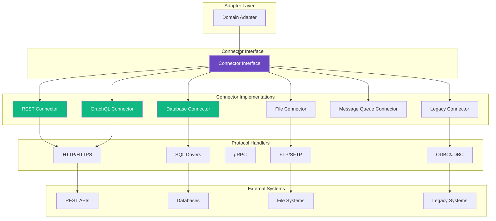

<!--
SPDX-License-Identifier: AGPL-3.0-or-later
Copyright (C) 2025 Controle Digital Ltda
-->

---
sidebar_position: 3
---

# Connectors

Connectors are the low-level protocol adapters that handle communication with external data sources. They abstract away the complexity of different protocols, authentication methods, and data formats, providing a consistent interface for adapters to build upon.

## Connector Architecture



## Connector Interface

### Base Interface

All connectors implement a common interface:

```go
// SPDX-License-Identifier: AGPL-3.0-or-later
// Copyright (C) 2025 Controle Digital Ltda

package connectors

import (
    "context"
    "io"
)

// Connector is the base interface for all data source connectors
type Connector interface {
    // Connect establishes connection to the data source
    Connect(ctx context.Context) error

    // Disconnect closes the connection
    Disconnect(ctx context.Context) error

    // HealthCheck verifies the connection is alive
    HealthCheck(ctx context.Context) error

    // GetCapabilities returns connector capabilities
    GetCapabilities() Capabilities
}

// DataConnector extends Connector with data operations
type DataConnector interface {
    Connector

    // Fetch retrieves data from the source
    Fetch(ctx context.Context, req *FetchRequest) (*FetchResponse, error)

    // Stream provides streaming data access
    Stream(ctx context.Context, req *StreamRequest) (<-chan *Record, <-chan error)

    // Execute performs write operations (optional)
    Execute(ctx context.Context, req *ExecuteRequest) (*ExecuteResponse, error)
}

// Capabilities describes what the connector supports
type Capabilities struct {
    SupportsStreaming   bool
    SupportsPagination  bool
    SupportsFiltering   bool
    SupportsSorting     bool
    SupportsAggregation bool
    SupportsTransactions bool
    MaxPageSize         int
    RateLimit           *RateLimit
}

// FetchRequest encapsulates data retrieval parameters
type FetchRequest struct {
    Resource   string                 // Resource identifier (table, endpoint, file)
    Filters    map[string]interface{} // Query filters
    Pagination *Pagination            // Pagination parameters
    Sort       []SortField            // Sort order
    Fields     []string               // Field selection
    Options    map[string]interface{} // Connector-specific options
}

// FetchResponse contains the retrieved data
type FetchResponse struct {
    Records    []*Record              // Retrieved records
    TotalCount int64                  // Total records (if known)
    NextCursor string                 // Cursor for next page
    Metadata   map[string]interface{} // Additional metadata
}

// Record represents a single data record
type Record struct {
    ID        string                 `json:"id"`
    Data      map[string]interface{} `json:"data"`
    Metadata  map[string]interface{} `json:"metadata,omitempty"`
    Timestamp time.Time              `json:"timestamp"`
}
```

### Connection Management

```go
package connectors

type BaseConnector struct {
    config      *Config
    logger      *zap.Logger
    metrics     *Metrics
    connected   bool
    mu          sync.RWMutex

    // Resilience
    circuitBreaker *CircuitBreaker
    retryPolicy    *RetryPolicy
    rateLimiter    *RateLimiter
}

func (c *BaseConnector) Connect(ctx context.Context) error {
    c.mu.Lock()
    defer c.mu.Unlock()

    if c.connected {
        return ErrAlreadyConnected
    }

    ctx, span := tracer.Start(ctx, "connector.Connect")
    defer span.End()

    // Apply retry policy for connection attempts
    err := c.retryPolicy.Do(func() error {
        return c.doConnect(ctx)
    })

    if err != nil {
        span.RecordError(err)
        return fmt.Errorf("failed to connect: %w", err)
    }

    c.connected = true
    c.logger.Info("connector connected",
        zap.String("type", c.config.Type),
        zap.String("endpoint", c.config.Endpoint))

    return nil
}

func (c *BaseConnector) Disconnect(ctx context.Context) error {
    c.mu.Lock()
    defer c.mu.Unlock()

    if !c.connected {
        return nil
    }

    if err := c.doDisconnect(ctx); err != nil {
        return fmt.Errorf("failed to disconnect: %w", err)
    }

    c.connected = false
    c.logger.Info("connector disconnected")

    return nil
}

func (c *BaseConnector) HealthCheck(ctx context.Context) error {
    c.mu.RLock()
    defer c.mu.RUnlock()

    if !c.connected {
        return ErrNotConnected
    }

    // Use circuit breaker for health checks
    _, err := c.circuitBreaker.Execute(func() (interface{}, error) {
        return nil, c.doHealthCheck(ctx)
    })

    return err
}
```

## REST Connector

### Implementation

```go
package rest

type RESTConnector struct {
    *connectors.BaseConnector

    client      *http.Client
    baseURL     string
    auth        AuthProvider
    headers     map[string]string
    timeout     time.Duration
}

type Config struct {
    BaseURL         string
    Timeout         time.Duration
    MaxRetries      int
    RetryBackoff    time.Duration
    RateLimitRPS    int

    // Authentication
    AuthType        string // "none", "apikey", "oauth2", "jwt", "basic"
    APIKey          string
    APIKeyHeader    string
    Username        string
    Password        string
    OAuth2Config    *OAuth2Config
}

func NewRESTConnector(config *Config) (*RESTConnector, error) {
    // Create HTTP client with custom transport
    transport := &http.Transport{
        MaxIdleConns:        100,
        MaxIdleConnsPerHost: 10,
        IdleConnTimeout:     90 * time.Second,
        DisableCompression:  false,
    }

    // Add retry transport
    transport = &RetryTransport{
        Transport:  transport,
        MaxRetries: config.MaxRetries,
        Backoff:    config.RetryBackoff,
    }

    // Add rate limit transport
    transport = &RateLimitTransport{
        Transport: transport,
        Limiter:   rate.NewLimiter(rate.Limit(config.RateLimitRPS), 1),
    }

    // Add tracing transport
    transport = otelhttp.NewTransport(transport)

    client := &http.Client{
        Transport: transport,
        Timeout:   config.Timeout,
    }

    connector := &RESTConnector{
        BaseConnector: connectors.NewBase(config),
        client:        client,
        baseURL:       config.BaseURL,
        timeout:       config.Timeout,
    }

    // Setup authentication
    if err := connector.setupAuth(config); err != nil {
        return nil, err
    }

    return connector, nil
}

func (c *RESTConnector) Fetch(ctx context.Context, req *connectors.FetchRequest) (*connectors.FetchResponse, error) {
    ctx, span := tracer.Start(ctx, "rest.Fetch",
        trace.WithAttributes(
            attribute.String("resource", req.Resource),
        ))
    defer span.End()

    // Build URL
    url := c.buildURL(req)

    // Build HTTP request
    httpReq, err := http.NewRequestWithContext(ctx, "GET", url, nil)
    if err != nil {
        return nil, fmt.Errorf("failed to create request: %w", err)
    }

    // Add authentication
    if err := c.auth.ApplyAuth(httpReq); err != nil {
        return nil, fmt.Errorf("failed to apply auth: %w", err)
    }

    // Add headers
    for k, v := range c.headers {
        httpReq.Header.Set(k, v)
    }
    httpReq.Header.Set("Accept", "application/json")

    // Execute request
    start := time.Now()
    resp, err := c.client.Do(httpReq)
    duration := time.Since(start)

    // Record metrics
    c.metrics.RequestDuration.Observe(duration.Seconds())
    c.metrics.RequestsTotal.Inc()

    if err != nil {
        c.metrics.RequestErrors.Inc()
        span.RecordError(err)
        return nil, fmt.Errorf("request failed: %w", err)
    }
    defer resp.Body.Close()

    // Check status code
    if resp.StatusCode < 200 || resp.StatusCode >= 300 {
        body, _ := io.ReadAll(resp.Body)
        return nil, fmt.Errorf("HTTP %d: %s", resp.StatusCode, string(body))
    }

    // Parse response
    var data map[string]interface{}
    if err := json.NewDecoder(resp.Body).Decode(&data); err != nil {
        return nil, fmt.Errorf("failed to decode response: %w", err)
    }

    // Transform to records
    records := c.transformResponse(data, req)

    return &connectors.FetchResponse{
        Records:    records,
        TotalCount: int64(len(records)),
    }, nil
}
```

### Authentication Providers

```go
package rest

type AuthProvider interface {
    ApplyAuth(req *http.Request) error
    RefreshToken(ctx context.Context) error
}

// API Key Authentication
type APIKeyAuth struct {
    APIKey     string
    HeaderName string // Default: "X-API-Key"
}

func (a *APIKeyAuth) ApplyAuth(req *http.Request) error {
    headerName := a.HeaderName
    if headerName == "" {
        headerName = "X-API-Key"
    }
    req.Header.Set(headerName, a.APIKey)
    return nil
}

// OAuth 2.0 Authentication
type OAuth2Auth struct {
    config      *oauth2.Config
    token       *oauth2.Token
    tokenSource oauth2.TokenSource
    mu          sync.RWMutex
}

func NewOAuth2Auth(config *oauth2.Config) *OAuth2Auth {
    return &OAuth2Auth{
        config: config,
    }
}

func (a *OAuth2Auth) ApplyAuth(req *http.Request) error {
    a.mu.RLock()
    defer a.mu.RUnlock()

    if a.token == nil {
        return fmt.Errorf("no token available")
    }

    // Check if token needs refresh
    if !a.token.Valid() {
        if err := a.RefreshToken(req.Context()); err != nil {
            return err
        }
    }

    a.token.SetAuthHeader(req)
    return nil
}

func (a *OAuth2Auth) RefreshToken(ctx context.Context) error {
    a.mu.Lock()
    defer a.mu.Unlock()

    token, err := a.tokenSource.Token()
    if err != nil {
        return fmt.Errorf("failed to refresh token: %w", err)
    }

    a.token = token
    return nil
}

// JWT Authentication
type JWTAuth struct {
    token       string
    expiresAt   time.Time
    signingKey  []byte
    issuer      string
}

func (a *JWTAuth) ApplyAuth(req *http.Request) error {
    // Check if token needs renewal
    if time.Now().After(a.expiresAt.Add(-5 * time.Minute)) {
        if err := a.renewToken(); err != nil {
            return err
        }
    }

    req.Header.Set("Authorization", "Bearer "+a.token)
    return nil
}

func (a *JWTAuth) renewToken() error {
    claims := jwt.MapClaims{
        "iss": a.issuer,
        "exp": time.Now().Add(1 * time.Hour).Unix(),
        "iat": time.Now().Unix(),
    }

    token := jwt.NewWithClaims(jwt.SigningMethodHS256, claims)
    signedToken, err := token.SignedString(a.signingKey)
    if err != nil {
        return err
    }

    a.token = signedToken
    a.expiresAt = time.Now().Add(1 * time.Hour)
    return nil
}
```

### Pagination Strategies

```go
package rest

type PaginationStrategy interface {
    BuildRequest(req *http.Request, page int, pageSize int)
    ParseResponse(data map[string]interface{}) (nextPage int, hasMore bool)
}

// Offset-based pagination
type OffsetPagination struct {
    OffsetParam string // Default: "offset"
    LimitParam  string // Default: "limit"
}

func (p *OffsetPagination) BuildRequest(req *http.Request, page int, pageSize int) {
    q := req.URL.Query()
    q.Set(p.OffsetParam, strconv.Itoa(page*pageSize))
    q.Set(p.LimitParam, strconv.Itoa(pageSize))
    req.URL.RawQuery = q.Encode()
}

// Cursor-based pagination
type CursorPagination struct {
    CursorParam string // Default: "cursor"
    LimitParam  string // Default: "limit"
    cursor      string
}

func (p *CursorPagination) BuildRequest(req *http.Request, page int, pageSize int) {
    q := req.URL.Query()
    if p.cursor != "" {
        q.Set(p.CursorParam, p.cursor)
    }
    q.Set(p.LimitParam, strconv.Itoa(pageSize))
    req.URL.RawQuery = q.Encode()
}

func (p *CursorPagination) ParseResponse(data map[string]interface{}) (int, bool) {
    if nextCursor, ok := data["next_cursor"].(string); ok && nextCursor != "" {
        p.cursor = nextCursor
        return 0, true
    }
    return 0, false
}

// Page-based pagination
type PagePagination struct {
    PageParam     string // Default: "page"
    PageSizeParam string // Default: "per_page"
}

func (p *PagePagination) BuildRequest(req *http.Request, page int, pageSize int) {
    q := req.URL.Query()
    q.Set(p.PageParam, strconv.Itoa(page+1)) // Most APIs use 1-indexed pages
    q.Set(p.PageSizeParam, strconv.Itoa(pageSize))
    req.URL.RawQuery = q.Encode()
}
```

## Database Connector

### Implementation

```go
package database

type DatabaseConnector struct {
    *connectors.BaseConnector

    driver   string // "postgres", "mysql", "mongodb", "oracle"
    db       *sql.DB
    pool     *pgxpool.Pool // For PostgreSQL
    config   *Config
}

type Config struct {
    Driver          string
    Host            string
    Port            int
    Database        string
    Username        string
    Password        string
    SSLMode         string

    // Connection Pool
    MaxOpenConns    int
    MaxIdleConns    int
    ConnMaxLifetime time.Duration
    ConnMaxIdleTime time.Duration

    // Query
    QueryTimeout    time.Duration
}

func NewDatabaseConnector(config *Config) (*DatabaseConnector, error) {
    connector := &DatabaseConnector{
        BaseConnector: connectors.NewBase(config),
        driver:        config.Driver,
        config:        config,
    }

    return connector, nil
}

func (c *DatabaseConnector) Connect(ctx context.Context) error {
    ctx, span := tracer.Start(ctx, "database.Connect")
    defer span.End()

    var err error

    switch c.driver {
    case "postgres":
        err = c.connectPostgreSQL(ctx)
    case "mysql":
        err = c.connectMySQL(ctx)
    case "mongodb":
        err = c.connectMongoDB(ctx)
    default:
        return fmt.Errorf("unsupported driver: %s", c.driver)
    }

    if err != nil {
        return fmt.Errorf("connection failed: %w", err)
    }

    return c.BaseConnector.Connect(ctx)
}

func (c *DatabaseConnector) connectPostgreSQL(ctx context.Context) error {
    dsn := fmt.Sprintf("host=%s port=%d user=%s password=%s dbname=%s sslmode=%s",
        c.config.Host, c.config.Port, c.config.Username,
        c.config.Password, c.config.Database, c.config.SSLMode)

    poolConfig, err := pgxpool.ParseConfig(dsn)
    if err != nil {
        return err
    }

    poolConfig.MaxConns = int32(c.config.MaxOpenConns)
    poolConfig.MinConns = int32(c.config.MaxIdleConns)
    poolConfig.MaxConnLifetime = c.config.ConnMaxLifetime
    poolConfig.MaxConnIdleTime = c.config.ConnMaxIdleTime

    pool, err := pgxpool.NewWithConfig(ctx, poolConfig)
    if err != nil {
        return err
    }

    // Test connection
    if err := pool.Ping(ctx); err != nil {
        pool.Close()
        return err
    }

    c.pool = pool
    return nil
}

func (c *DatabaseConnector) Fetch(ctx context.Context, req *connectors.FetchRequest) (*connectors.FetchResponse, error) {
    ctx, span := tracer.Start(ctx, "database.Fetch")
    defer span.End()

    // Build query
    query, args := c.buildQuery(req)

    // Execute with timeout
    queryCtx, cancel := context.WithTimeout(ctx, c.config.QueryTimeout)
    defer cancel()

    start := time.Now()
    rows, err := c.pool.Query(queryCtx, query, args...)
    duration := time.Since(start)

    c.metrics.QueryDuration.Observe(duration.Seconds())

    if err != nil {
        c.metrics.QueryErrors.Inc()
        return nil, fmt.Errorf("query failed: %w", err)
    }
    defer rows.Close()

    // Parse results
    records, err := c.parseRows(rows)
    if err != nil {
        return nil, fmt.Errorf("failed to parse rows: %w", err)
    }

    return &connectors.FetchResponse{
        Records:    records,
        TotalCount: int64(len(records)),
    }, nil
}

func (c *DatabaseConnector) buildQuery(req *connectors.FetchRequest) (string, []interface{}) {
    qb := NewQueryBuilder(c.driver)

    // SELECT
    qb.Select(req.Fields...)

    // FROM
    qb.From(req.Resource)

    // WHERE
    for field, value := range req.Filters {
        qb.Where(field, "=", value)
    }

    // ORDER BY
    for _, sort := range req.Sort {
        qb.OrderBy(sort.Field, sort.Direction)
    }

    // LIMIT/OFFSET
    if req.Pagination != nil {
        qb.Limit(req.Pagination.PageSize)
        qb.Offset(req.Pagination.Offset)
    }

    return qb.Build()
}
```

### Query Builder

```go
package database

type QueryBuilder struct {
    driver      string
    selectCols  []string
    fromTable   string
    whereClauses []whereClause
    orderBy     []orderByClause
    limit       int
    offset      int
    args        []interface{}
}

type whereClause struct {
    field    string
    operator string
    value    interface{}
}

type orderByClause struct {
    field     string
    direction string
}

func (qb *QueryBuilder) Select(cols ...string) *QueryBuilder {
    if len(cols) == 0 {
        qb.selectCols = []string{"*"}
    } else {
        qb.selectCols = cols
    }
    return qb
}

func (qb *QueryBuilder) From(table string) *QueryBuilder {
    qb.fromTable = table
    return qb
}

func (qb *QueryBuilder) Where(field string, op string, value interface{}) *QueryBuilder {
    qb.whereClauses = append(qb.whereClauses, whereClause{
        field:    field,
        operator: op,
        value:    value,
    })
    return qb
}

func (qb *QueryBuilder) OrderBy(field string, direction string) *QueryBuilder {
    qb.orderBy = append(qb.orderBy, orderByClause{
        field:     field,
        direction: direction,
    })
    return qb
}

func (qb *QueryBuilder) Limit(limit int) *QueryBuilder {
    qb.limit = limit
    return qb
}

func (qb *QueryBuilder) Offset(offset int) *QueryBuilder {
    qb.offset = offset
    return qb
}

func (qb *QueryBuilder) Build() (string, []interface{}) {
    var query strings.Builder

    // SELECT
    query.WriteString("SELECT ")
    query.WriteString(strings.Join(qb.selectCols, ", "))

    // FROM
    query.WriteString(" FROM ")
    query.WriteString(qb.fromTable)

    // WHERE
    if len(qb.whereClauses) > 0 {
        query.WriteString(" WHERE ")
        for i, clause := range qb.whereClauses {
            if i > 0 {
                query.WriteString(" AND ")
            }
            placeholder := qb.getPlaceholder(len(qb.args) + 1)
            query.WriteString(fmt.Sprintf("%s %s %s", clause.field, clause.operator, placeholder))
            qb.args = append(qb.args, clause.value)
        }
    }

    // ORDER BY
    if len(qb.orderBy) > 0 {
        query.WriteString(" ORDER BY ")
        for i, order := range qb.orderBy {
            if i > 0 {
                query.WriteString(", ")
            }
            query.WriteString(fmt.Sprintf("%s %s", order.field, order.direction))
        }
    }

    // LIMIT
    if qb.limit > 0 {
        query.WriteString(fmt.Sprintf(" LIMIT %d", qb.limit))
    }

    // OFFSET
    if qb.offset > 0 {
        query.WriteString(fmt.Sprintf(" OFFSET %d", qb.offset))
    }

    return query.String(), qb.args
}

func (qb *QueryBuilder) getPlaceholder(position int) string {
    switch qb.driver {
    case "postgres":
        return fmt.Sprintf("$%d", position)
    case "mysql":
        return "?"
    default:
        return "?"
    }
}
```

## File System Connector

```go
package file

type FileConnector struct {
    *connectors.BaseConnector

    storage     Storage
    parser      Parser
    compression Compression
}

type Storage interface {
    Read(ctx context.Context, path string) (io.ReadCloser, error)
    Write(ctx context.Context, path string, data io.Reader) error
    List(ctx context.Context, prefix string) ([]FileInfo, error)
    Delete(ctx context.Context, path string) error
}

// Local file system
type LocalStorage struct {
    basePath string
}

func (s *LocalStorage) Read(ctx context.Context, path string) (io.ReadCloser, error) {
    fullPath := filepath.Join(s.basePath, path)
    return os.Open(fullPath)
}

// S3 storage
type S3Storage struct {
    client *s3.Client
    bucket string
}

func (s *S3Storage) Read(ctx context.Context, path string) (io.ReadCloser, error) {
    result, err := s.client.GetObject(ctx, &s3.GetObjectInput{
        Bucket: aws.String(s.bucket),
        Key:    aws.String(path),
    })
    if err != nil {
        return nil, err
    }
    return result.Body, nil
}

// Parsers for different formats
type Parser interface {
    Parse(reader io.Reader) ([]*connectors.Record, error)
}

type CSVParser struct {
    Delimiter rune
    Headers   []string
}

func (p *CSVParser) Parse(reader io.Reader) ([]*connectors.Record, error) {
    csvReader := csv.NewReader(reader)
    csvReader.Comma = p.Delimiter

    var records []*connectors.Record

    // Read header if not provided
    if p.Headers == nil {
        header, err := csvReader.Read()
        if err != nil {
            return nil, err
        }
        p.Headers = header
    }

    // Read rows
    for {
        row, err := csvReader.Read()
        if err == io.EOF {
            break
        }
        if err != nil {
            return nil, err
        }

        data := make(map[string]interface{})
        for i, value := range row {
            if i < len(p.Headers) {
                data[p.Headers[i]] = value
            }
        }

        records = append(records, &connectors.Record{
            ID:   uuid.New().String(),
            Data: data,
        })
    }

    return records, nil
}

type JSONParser struct{}

func (p *JSONParser) Parse(reader io.Reader) ([]*connectors.Record, error) {
    var data []map[string]interface{}
    if err := json.NewDecoder(reader).Decode(&data); err != nil {
        return nil, err
    }

    records := make([]*connectors.Record, len(data))
    for i, item := range data {
        records[i] = &connectors.Record{
            ID:   uuid.New().String(),
            Data: item,
        }
    }

    return records, nil
}
```

## Message Queue Connector

```go
package messagequeue

type MessageQueueConnector struct {
    *connectors.BaseConnector

    client QueueClient
}

type QueueClient interface {
    Subscribe(ctx context.Context, topic string) (<-chan *Message, error)
    Publish(ctx context.Context, topic string, msg *Message) error
    Ack(ctx context.Context, msg *Message) error
    Nack(ctx context.Context, msg *Message) error
}

// Kafka Client
type KafkaClient struct {
    reader *kafka.Reader
    writer *kafka.Writer
}

func (c *KafkaClient) Subscribe(ctx context.Context, topic string) (<-chan *Message, error) {
    msgChan := make(chan *Message, 100)

    go func() {
        defer close(msgChan)

        for {
            msg, err := c.reader.FetchMessage(ctx)
            if err != nil {
                return
            }

            msgChan <- &Message{
                ID:      string(msg.Key),
                Payload: msg.Value,
                Headers: convertHeaders(msg.Headers),
                offset:  msg.Offset,
            }
        }
    }()

    return msgChan, nil
}

// RabbitMQ Client
type RabbitMQClient struct {
    conn    *amqp.Connection
    channel *amqp.Channel
}

func (c *RabbitMQClient) Subscribe(ctx context.Context, queue string) (<-chan *Message, error) {
    msgs, err := c.channel.Consume(
        queue,
        "",    // consumer
        false, // auto-ack
        false, // exclusive
        false, // no-local
        false, // no-wait
        nil,   // args
    )
    if err != nil {
        return nil, err
    }

    msgChan := make(chan *Message, 100)

    go func() {
        defer close(msgChan)

        for msg := range msgs {
            msgChan <- &Message{
                ID:      msg.MessageId,
                Payload: msg.Body,
                Headers: convertAMQPHeaders(msg.Headers),
                deliveryTag: msg.DeliveryTag,
            }
        }
    }()

    return msgChan, nil
}
```

## Connector Registry

```go
package connectors

type Registry struct {
    connectors map[string]ConnectorFactory
    mu         sync.RWMutex
}

type ConnectorFactory func(config interface{}) (Connector, error)

var globalRegistry = &Registry{
    connectors: make(map[string]ConnectorFactory),
}

func Register(name string, factory ConnectorFactory) {
    globalRegistry.mu.Lock()
    defer globalRegistry.mu.Unlock()

    globalRegistry.connectors[name] = factory
}

func Create(name string, config interface{}) (Connector, error) {
    globalRegistry.mu.RLock()
    defer globalRegistry.mu.RUnlock()

    factory, ok := globalRegistry.connectors[name]
    if !ok {
        return nil, fmt.Errorf("connector not found: %s", name)
    }

    return factory(config)
}

// Register built-in connectors
func init() {
    Register("rest", func(config interface{}) (Connector, error) {
        return rest.NewRESTConnector(config.(*rest.Config))
    })

    Register("postgres", func(config interface{}) (Connector, error) {
        cfg := config.(*database.Config)
        cfg.Driver = "postgres"
        return database.NewDatabaseConnector(cfg)
    })

    Register("s3", func(config interface{}) (Connector, error) {
        return file.NewS3Connector(config.(*file.S3Config))
    })

    Register("kafka", func(config interface{}) (Connector, error) {
        return messagequeue.NewKafkaConnector(config.(*messagequeue.KafkaConfig))
    })
}
```

## Best Practices

### 1. Connection Pooling

Always use connection pools for database and HTTP connectors:

```go
// Good: Reuse connections
connector := NewRESTConnector(&Config{
    MaxIdleConns: 100,
    MaxIdleConnsPerHost: 10,
})

// Bad: Create new connection per request
for i := 0; i < 1000; i++ {
    connector := NewRESTConnector(config)
    connector.Fetch(ctx, req)
    connector.Disconnect(ctx)
}
```

### 2. Implement Retries

Use exponential backoff for transient failures:

```go
retryPolicy := &RetryPolicy{
    MaxAttempts:  3,
    InitialDelay: 1 * time.Second,
    MaxDelay:     30 * time.Second,
    Multiplier:   2.0,
    Jitter:       true,
}

connector.SetRetryPolicy(retryPolicy)
```

### 3. Rate Limiting

Respect upstream system rate limits:

```go
rateLimiter := rate.NewLimiter(rate.Limit(100), 10) // 100 RPS, burst 10
connector.SetRateLimiter(rateLimiter)
```

### 4. Timeouts

Always set appropriate timeouts:

```go
config := &Config{
    ConnectTimeout: 10 * time.Second,
    RequestTimeout: 30 * time.Second,
    IdleTimeout:    5 * time.Minute,
}
```

### 5. Observability

Instrument all connector operations:

```go
func (c *Connector) Fetch(ctx context.Context, req *FetchRequest) (*FetchResponse, error) {
    ctx, span := tracer.Start(ctx, "connector.Fetch")
    defer span.End()

    start := time.Now()
    defer func() {
        c.metrics.RequestDuration.Observe(time.Since(start).Seconds())
    }()

    // ... implementation
}
```

## Next Steps

- **[Adapters](./adapters.md)** - Build domain adapters using connectors
- **[Event-Driven Integration](./event-driven-integration.md)** - Integrate connectors with events
- **[Services](./services.md)** - Consume connector data in services

---

**Previous**: [← Core Framework](./core-framework.md) | **Next**: [Adapters →](./adapters.md)
