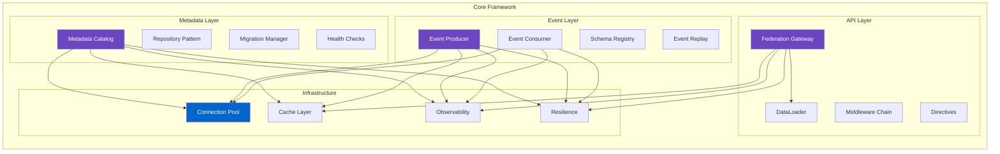
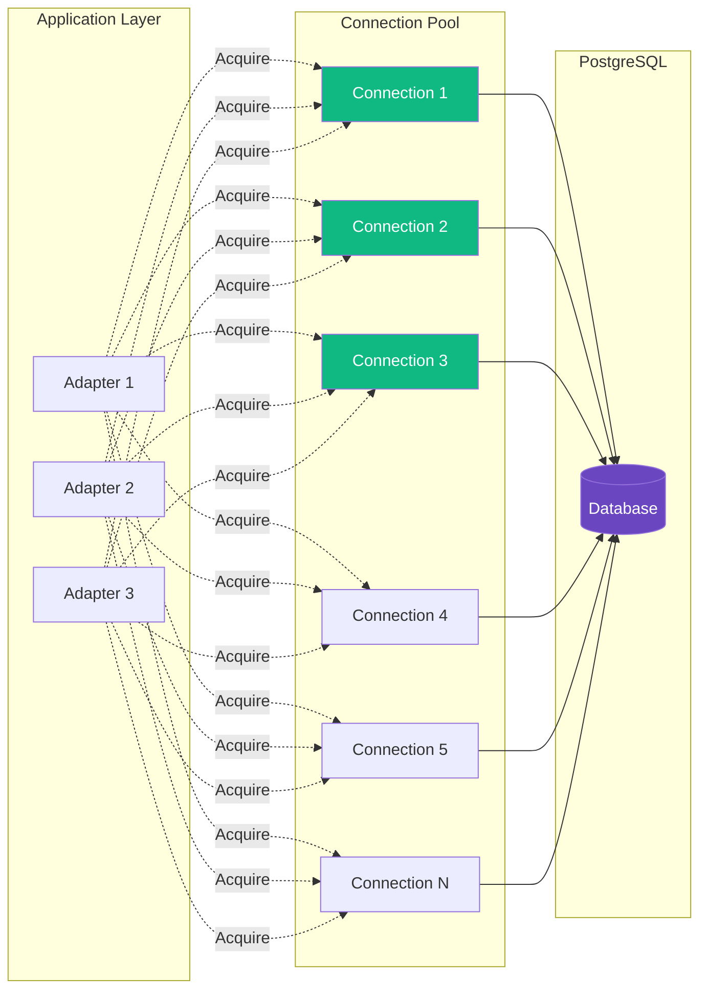
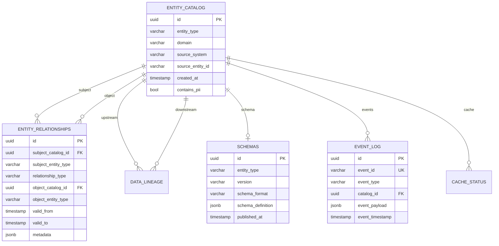
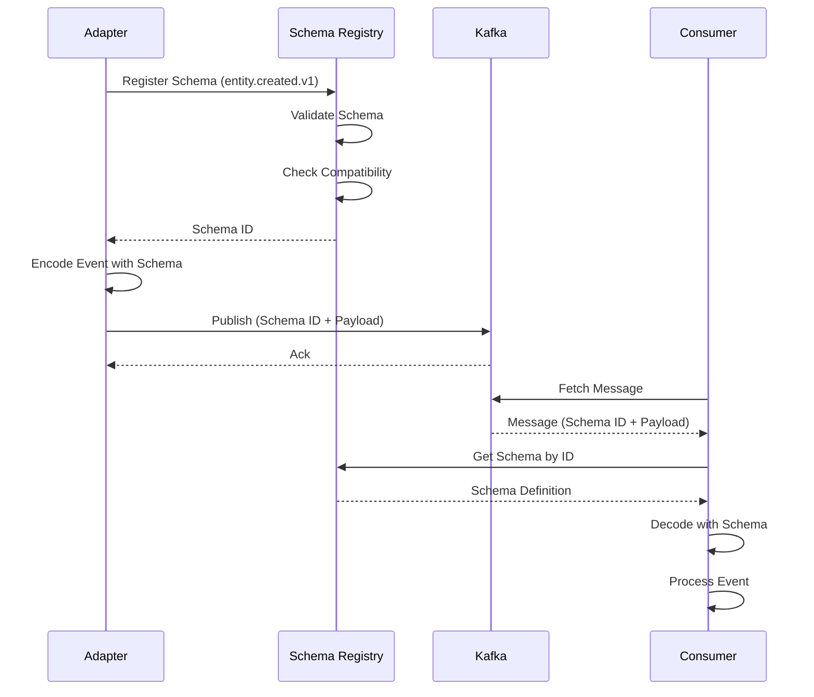
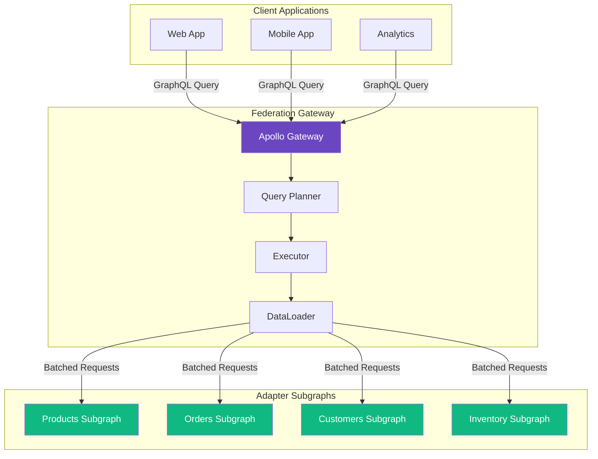
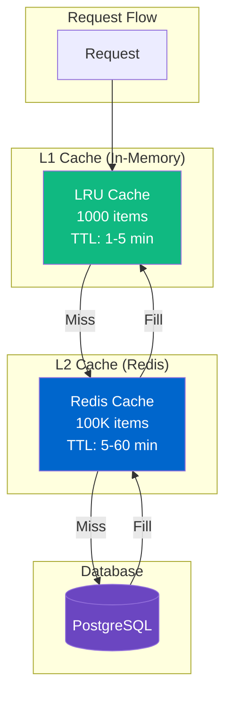

<!--
SPDX-License-Identifier: AGPL-3.0-or-later
Copyright (C) 2025 Controle Digital Ltda
-->

---
sidebar_position: 2
---

# Core Framework

The DictaMesh core framework provides the foundational infrastructure that all adapters depend on. This document explores the internal architecture, implementation details, and design patterns of the core framework components.

## Framework Components



## Database Infrastructure

### Connection Management

DictaMesh uses a dual-pool strategy for optimal performance:

```go
// SPDX-License-Identifier: AGPL-3.0-or-later
// Copyright (C) 2025 Controle Digital Ltda

package database

import (
    "github.com/jackc/pgx/v5/pgxpool"
    "gorm.io/gorm"
)

type Database struct {
    // High-performance pool for raw queries
    pool *pgxpool.Pool

    // ORM for complex operations
    gormDB *gorm.DB

    // Standard DB for compatibility
    stdDB *sql.DB

    // Configuration
    config *Config
    logger *zap.Logger
}

// Pool returns pgx pool for performance-critical paths
func (db *Database) Pool() *pgxpool.Pool {
    return db.pool
}

// GORM returns ORM for complex queries
func (db *Database) GORM() *gorm.DB {
    return db.gormDB
}
```

**Design Rationale**:
- **pgx Pool**: Low-level, high-performance queries (bulk inserts, vector search)
- **GORM**: Complex queries with joins, relationships, migrations
- **Dual Strategy**: Choose the right tool for each operation

### Connection Pool Configuration



**Pool Settings**:
```go
config := &Config{
    MaxOpenConns:    100,  // Maximum connections
    MaxIdleConns:    25,   // Idle connections
    ConnMaxLifetime: 1*time.Hour,
    ConnMaxIdleTime: 10*time.Minute,
    StatementTimeout: 30*time.Second,
    IdleInTxTimeout:  60*time.Second,
}
```

### Transaction Management

```go
// GORM Transaction
err := db.WithTransaction(ctx, func(tx *gorm.DB) error {
    // Create entity
    if err := tx.Create(&entity).Error; err != nil {
        return err
    }

    // Create relationships
    if err := tx.Create(&relationships).Error; err != nil {
        return err
    }

    // Publish event (within transaction)
    if err := tx.Create(&eventLog).Error; err != nil {
        return err
    }

    return nil // Commit
})

// pgx Transaction for performance-critical operations
err := db.WithPgxTransaction(ctx, func(tx pgx.Tx) error {
    // Bulk insert 10,000 entities
    _, err := tx.CopyFrom(ctx,
        pgx.Identifier{"dictamesh_entity_catalog"},
        columns,
        pgx.CopyFromRows(entities),
    )
    return err
})
```

**Transaction Patterns**:
- **GORM Transactions**: Complex operations with ORM convenience
- **pgx Transactions**: Bulk operations (CopyFrom) for maximum performance
- **Savepoints**: Nested transactions for complex workflows
- **Isolation Levels**: Configurable (Read Committed, Repeatable Read, Serializable)

## Metadata Catalog

### Data Models

The metadata catalog uses PostgreSQL with JSONB for flexible schema evolution:

```go
// Entity Catalog - Core entity registry
type EntityCatalog struct {
    ID               string    `gorm:"type:uuid;primary_key"`
    EntityType       string    `gorm:"type:varchar(100);not null;index"`
    Domain           string    `gorm:"type:varchar(100);not null;index"`
    SourceSystem     string    `gorm:"type:varchar(100);not null;index"`
    SourceEntityID   string    `gorm:"type:varchar(255);not null"`

    // API Discovery
    APIBaseURL       string    `gorm:"type:text;not null"`
    APIPathTemplate  string    `gorm:"type:text;not null"`
    APIMethod        string    `gorm:"type:varchar(10);default:'GET'"`
    APIAuthType      string    `gorm:"type:varchar(50)"`

    // Schema Management
    SchemaID         *string   `gorm:"type:uuid"`
    SchemaVersion    *string   `gorm:"type:varchar(50)"`

    // Lifecycle
    CreatedAt        time.Time `gorm:"default:CURRENT_TIMESTAMP"`
    UpdatedAt        time.Time `gorm:"default:CURRENT_TIMESTAMP"`
    LastSeenAt       time.Time `gorm:"default:CURRENT_TIMESTAMP"`
    Status           string    `gorm:"type:varchar(50);default:'active'"`

    // Quality Metrics
    AvailabilitySLA  *float64  `gorm:"type:decimal(5,4)"`
    LatencyP99Ms     *int      `gorm:"type:integer"`
    FreshnessSLA     *int      `gorm:"type:integer"`

    // Governance
    ContainsPII      bool      `gorm:"default:false;index"`
    DataClassification *string `gorm:"type:varchar(50)"`
    RetentionDays    *int      `gorm:"type:integer"`
}

func (EntityCatalog) TableName() string {
    return "dictamesh_entity_catalog"
}
```

**Database Naming Convention**: All tables use `dictamesh_` prefix for namespace isolation.

### Entity Relationships



### Repository Pattern

The framework uses the repository pattern for data access:

```go
package repository

type CatalogRepository interface {
    // CRUD operations
    Create(ctx context.Context, entity *models.EntityCatalog) error
    Get(ctx context.Context, id string) (*models.EntityCatalog, error)
    Update(ctx context.Context, entity *models.EntityCatalog) error
    Delete(ctx context.Context, id string) error

    // Querying
    List(ctx context.Context, opts ListOptions) ([]*models.EntityCatalog, error)
    Search(ctx context.Context, query SearchQuery) ([]*models.EntityCatalog, error)

    // Relationships
    CreateRelationship(ctx context.Context, rel *models.EntityRelationship) error
    GetRelationships(ctx context.Context, entityID string, relType string) ([]*models.EntityRelationship, error)

    // Lineage
    TrackLineage(ctx context.Context, lineage *models.DataLineage) error
    GetUpstream(ctx context.Context, entityID string) ([]*models.DataLineage, error)
    GetDownstream(ctx context.Context, entityID string) ([]*models.DataLineage, error)

    // Schemas
    RegisterSchema(ctx context.Context, schema *models.Schema) error
    GetSchema(ctx context.Context, entityType string, version string) (*models.Schema, error)
}
```

**Implementation Example**:
```go
type postgresRepository struct {
    db     *gorm.DB
    cache  cache.Cache
    logger *zap.Logger
}

func (r *postgresRepository) Create(ctx context.Context, entity *models.EntityCatalog) error {
    ctx, span := tracer.Start(ctx, "repository.Create")
    defer span.End()

    start := time.Now()

    // Create in database
    if err := r.db.WithContext(ctx).Create(entity).Error; err != nil {
        r.metrics.CreateErrors.Inc()
        return fmt.Errorf("failed to create entity: %w", err)
    }

    // Update metrics
    r.metrics.CreateDuration.Observe(time.Since(start).Seconds())
    r.metrics.CreateCount.Inc()

    // Invalidate cache
    r.cache.Delete(ctx, "entity:"+entity.ID)

    return nil
}
```

### Indexing Strategy

```sql
-- Entity type queries (most common)
CREATE INDEX idx_dictamesh_entity_type
    ON dictamesh_entity_catalog(entity_type);

-- Domain filtering
CREATE INDEX idx_dictamesh_domain
    ON dictamesh_entity_catalog(domain);

-- Source system queries
CREATE INDEX idx_dictamesh_source_system
    ON dictamesh_entity_catalog(source_system);

-- PII compliance queries (partial index)
CREATE INDEX idx_dictamesh_contains_pii
    ON dictamesh_entity_catalog(contains_pii)
    WHERE contains_pii = true;

-- Composite index for common queries
CREATE INDEX idx_dictamesh_type_domain_status
    ON dictamesh_entity_catalog(entity_type, domain, status);

-- Full-text search
CREATE INDEX idx_dictamesh_entity_fts
    ON dictamesh_entity_catalog
    USING gin(to_tsvector('english',
        coalesce(source_entity_id, '') || ' ' ||
        coalesce(entity_type, '')
    ));
```

## Event Bus Integration

### Event Producer

```go
package events

type Producer struct {
    writer    *kafka.Writer
    schemaReg *schemaregistry.Client
    logger    *zap.Logger
    tracer    trace.Tracer
}

type Event struct {
    EventID        string                 `json:"event_id"`
    EventType      string                 `json:"event_type"`
    Timestamp      time.Time              `json:"timestamp"`
    Source         string                 `json:"source"`
    SourceEntityID string                 `json:"source_entity_id"`
    Payload        map[string]interface{} `json:"payload"`
    TraceID        string                 `json:"trace_id"`
    SpanID         string                 `json:"span_id"`
}

func (p *Producer) Publish(ctx context.Context, event *Event) error {
    ctx, span := p.tracer.Start(ctx, "events.Publish")
    defer span.End()

    // Inject trace context
    event.TraceID = span.SpanContext().TraceID().String()
    event.SpanID = span.SpanContext().SpanID().String()

    // Get Avro schema
    schema, err := p.schemaReg.GetLatestSchema(event.EventType)
    if err != nil {
        return fmt.Errorf("schema not found: %w", err)
    }

    // Encode with Avro
    encoded, err := schema.Encode(event)
    if err != nil {
        return fmt.Errorf("failed to encode: %w", err)
    }

    // Publish to Kafka
    topic := "dictamesh.events." + event.EventType
    msg := kafka.Message{
        Topic: topic,
        Key:   []byte(event.SourceEntityID),
        Value: encoded,
        Headers: []kafka.Header{
            {Key: "event-type", Value: []byte(event.EventType)},
            {Key: "trace-id", Value: []byte(event.TraceID)},
        },
    }

    if err := p.writer.WriteMessages(ctx, msg); err != nil {
        return fmt.Errorf("failed to write message: %w", err)
    }

    span.SetAttributes(
        attribute.String("event.id", event.EventID),
        attribute.String("event.type", event.EventType),
        attribute.String("topic", topic),
    )

    return nil
}
```

### Event Consumer

```go
type Consumer struct {
    reader *kafka.Reader
    handlers map[string]EventHandler
    logger *zap.Logger
}

type EventHandler func(ctx context.Context, event *Event) error

func (c *Consumer) Subscribe(eventType string, handler EventHandler) {
    c.handlers[eventType] = handler
}

func (c *Consumer) Start(ctx context.Context) error {
    for {
        msg, err := c.reader.FetchMessage(ctx)
        if err != nil {
            return err
        }

        // Extract trace context
        traceID := extractHeader(msg.Headers, "trace-id")
        ctx := trace.ContextWithRemoteSpanContext(ctx, traceID)

        // Decode event
        event, err := c.decode(msg.Value)
        if err != nil {
            c.logger.Error("failed to decode event", zap.Error(err))
            continue
        }

        // Route to handler
        handler, ok := c.handlers[event.EventType]
        if !ok {
            c.logger.Warn("no handler for event type",
                zap.String("type", event.EventType))
            continue
        }

        // Process with retry
        err = retry.Do(func() error {
            return handler(ctx, event)
        }, retry.Attempts(3), retry.Delay(1*time.Second))

        if err != nil {
            c.logger.Error("handler failed", zap.Error(err))
            // DLQ handling here
            continue
        }

        // Commit offset
        if err := c.reader.CommitMessages(ctx, msg); err != nil {
            c.logger.Error("failed to commit", zap.Error(err))
        }
    }
}
```

### Event Schema Management



**Avro Schema Example**:
```json
{
  "type": "record",
  "name": "EntityCreated",
  "namespace": "com.dictamesh.events",
  "doc": "Published when a new entity is registered in the catalog",
  "fields": [
    {
      "name": "event_id",
      "type": "string",
      "doc": "Unique event identifier (UUID)"
    },
    {
      "name": "entity_id",
      "type": "string",
      "doc": "Entity catalog ID"
    },
    {
      "name": "entity_type",
      "type": "string",
      "doc": "Type of entity (product, order, customer)"
    },
    {
      "name": "timestamp",
      "type": "long",
      "logicalType": "timestamp-millis",
      "doc": "Event timestamp in milliseconds since epoch"
    },
    {
      "name": "source_adapter",
      "type": "string",
      "doc": "Adapter that created the entity"
    },
    {
      "name": "data",
      "type": "string",
      "doc": "JSON-encoded entity data"
    },
    {
      "name": "trace_id",
      "type": ["null", "string"],
      "default": null,
      "doc": "OpenTelemetry trace ID"
    }
  ]
}
```

## GraphQL Federation

### Federation Architecture



### Subgraph Registration

```go
// products-adapter/graphql/schema.graphql
extend schema
  @link(url: "https://specs.apollo.dev/federation/v2.0",
        import: ["@key", "@external", "@requires", "@provides"])

type Product @key(fields: "id") {
  id: ID!
  name: String!
  description: String
  price: Float!
  category: Category!
  sku: String!

  # Extended by reviews-adapter
  reviews: [Review!] @external

  # Extended by inventory-adapter
  inventory: Inventory @external
}

type Category @key(fields: "id") {
  id: ID!
  name: String!
  products: [Product!]!
}

extend type Query {
  product(id: ID!): Product
  products(limit: Int, offset: Int): [Product!]!
  searchProducts(query: String!): [Product!]!
}
```

### Reference Resolvers

```go
// Enable federation across adapters
type productResolver struct {
    catalog repository.CatalogRepository
    cache   cache.Cache
}

// __resolveReference enables federation
func (r *productResolver) __resolveReference(ctx context.Context,
    rep map[string]interface{}) (*Product, error) {

    id, ok := rep["id"].(string)
    if !ok {
        return nil, fmt.Errorf("invalid product reference")
    }

    // Check cache
    if cached, ok := r.cache.Get(ctx, "product:"+id); ok {
        return cached.(*Product), nil
    }

    // Fetch from catalog
    entity, err := r.catalog.Get(ctx, id)
    if err != nil {
        return nil, err
    }

    product := &Product{
        ID:          entity.ID,
        Name:        entity.Attributes["name"].(string),
        Price:       entity.Attributes["price"].(float64),
        // ... other fields
    }

    // Cache result
    r.cache.Set(ctx, "product:"+id, product, 5*time.Minute)

    return product, nil
}
```

### DataLoader Pattern

Prevents N+1 queries by batching requests:

```go
package dataloader

type ProductLoader struct {
    catalog repository.CatalogRepository
    loader  *dataloader.Loader
}

func NewProductLoader(catalog repository.CatalogRepository) *ProductLoader {
    return &ProductLoader{
        catalog: catalog,
        loader: dataloader.NewBatchedLoader(
            func(ctx context.Context, keys []string) []*dataloader.Result {
                return batchLoadProducts(ctx, catalog, keys)
            },
            dataloader.WithWait(10*time.Millisecond),
            dataloader.WithBatchCapacity(100),
        ),
    }
}

func (l *ProductLoader) Load(ctx context.Context, id string) (*Product, error) {
    thunk := l.loader.Load(ctx, id)
    result, err := thunk()
    if err != nil {
        return nil, err
    }
    return result.(*Product), nil
}

func batchLoadProducts(ctx context.Context, catalog repository.CatalogRepository,
    ids []string) []*dataloader.Result {

    // Single query for all IDs
    products, err := catalog.GetMany(ctx, ids)
    if err != nil {
        // Return error for all
        result := &dataloader.Result{Error: err}
        return repeat(result, len(ids))
    }

    // Map results back to original order
    productMap := make(map[string]*Product)
    for _, p := range products {
        productMap[p.ID] = p
    }

    results := make([]*dataloader.Result, len(ids))
    for i, id := range ids {
        if product, ok := productMap[id]; ok {
            results[i] = &dataloader.Result{Data: product}
        } else {
            results[i] = &dataloader.Result{Error: fmt.Errorf("not found")}
        }
    }

    return results
}
```

**Performance Impact**:
- Without DataLoader: 100 products = 100+ database queries
- With DataLoader: 100 products = 1-2 database queries (batched within 10ms window)

## Caching Strategy

### Multi-Level Cache



### Cache Implementation

```go
package cache

type MultiLevelCache struct {
    l1     *lru.Cache      // In-memory
    l2     *redis.Client   // Redis
    metrics *CacheMetrics
    logger *zap.Logger
}

func (c *MultiLevelCache) Get(ctx context.Context, key string) (interface{}, bool) {
    // Try L1 first
    if val, ok := c.l1.Get(key); ok {
        c.metrics.L1Hits.Inc()
        return val, true
    }
    c.metrics.L1Misses.Inc()

    // Try L2
    val, err := c.l2.Get(ctx, key).Result()
    if err == nil {
        c.metrics.L2Hits.Inc()

        // Populate L1
        var decoded interface{}
        json.Unmarshal([]byte(val), &decoded)
        c.l1.Add(key, decoded)

        return decoded, true
    }
    c.metrics.L2Misses.Inc()

    return nil, false
}

func (c *MultiLevelCache) Set(ctx context.Context, key string,
    value interface{}, ttl time.Duration) error {

    // Set in L1
    c.l1.Add(key, value)

    // Set in L2
    encoded, _ := json.Marshal(value)
    return c.l2.Set(ctx, key, encoded, ttl).Err()
}

func (c *MultiLevelCache) Delete(ctx context.Context, key string) error {
    // Delete from both levels
    c.l1.Remove(key)
    return c.l2.Del(ctx, key).Err()
}
```

### Cache Invalidation

```go
// Event-driven cache invalidation
consumer.Subscribe("entity.updated", func(ctx context.Context, event *Event) error {
    entityID := event.SourceEntityID

    // Invalidate entity cache
    cache.Delete(ctx, "entity:"+entityID)

    // Invalidate related queries
    entityType := event.Payload["entity_type"].(string)
    cache.DeletePattern(ctx, "list:"+entityType+":*")

    return nil
})
```

## Resilience Patterns

### Circuit Breaker

```go
package resilience

type CircuitBreaker struct {
    state           State // Closed, Open, HalfOpen
    failureCount    int
    successCount    int
    failureThreshold int
    successThreshold int
    timeout         time.Duration
    lastFailure     time.Time
    mu              sync.RWMutex
}

func (cb *CircuitBreaker) Execute(fn func() (interface{}, error)) (interface{}, error) {
    cb.mu.RLock()
    state := cb.state
    cb.mu.RUnlock()

    switch state {
    case Open:
        // Check if timeout expired
        if time.Since(cb.lastFailure) > cb.timeout {
            cb.setState(HalfOpen)
            return cb.tryExecute(fn)
        }
        return nil, ErrCircuitOpen

    case HalfOpen:
        return cb.tryExecute(fn)

    case Closed:
        return cb.tryExecute(fn)
    }

    return nil, ErrInvalidState
}

func (cb *CircuitBreaker) tryExecute(fn func() (interface{}, error)) (interface{}, error) {
    result, err := fn()

    cb.mu.Lock()
    defer cb.mu.Unlock()

    if err != nil {
        cb.failureCount++
        cb.lastFailure = time.Now()

        if cb.failureCount >= cb.failureThreshold {
            cb.state = Open
            cb.failureCount = 0
        }

        return nil, err
    }

    if cb.state == HalfOpen {
        cb.successCount++
        if cb.successCount >= cb.successThreshold {
            cb.state = Closed
            cb.successCount = 0
        }
    }

    return result, nil
}
```

### Retry with Exponential Backoff

```go
type RetryPolicy struct {
    MaxAttempts int
    InitialDelay time.Duration
    MaxDelay    time.Duration
    Multiplier  float64
    Jitter      bool
}

func (r *RetryPolicy) Do(fn func() error) error {
    var err error
    delay := r.InitialDelay

    for attempt := 0; attempt < r.MaxAttempts; attempt++ {
        err = fn()
        if err == nil {
            return nil
        }

        // Check if retryable
        if !IsRetryable(err) {
            return err
        }

        // Wait before retry
        if attempt < r.MaxAttempts-1 {
            if r.Jitter {
                delay = r.addJitter(delay)
            }
            time.Sleep(delay)
            delay = time.Duration(float64(delay) * r.Multiplier)
            if delay > r.MaxDelay {
                delay = r.MaxDelay
            }
        }
    }

    return fmt.Errorf("max attempts exceeded: %w", err)
}
```

## Observability

### Distributed Tracing

```go
package observability

func InitTracing(serviceName string) (*trace.TracerProvider, error) {
    exporter, err := jaeger.New(jaeger.WithCollectorEndpoint(
        jaeger.WithEndpoint("http://jaeger:14268/api/traces"),
    ))
    if err != nil {
        return nil, err
    }

    tp := trace.NewTracerProvider(
        trace.WithBatcher(exporter),
        trace.WithResource(resource.NewWithAttributes(
            semconv.SchemaURL,
            semconv.ServiceNameKey.String(serviceName),
            semconv.ServiceVersionKey.String(version),
        )),
        trace.WithSampler(trace.AlwaysSample()),
    )

    otel.SetTracerProvider(tp)
    otel.SetTextMapPropagator(propagation.TraceContext{})

    return tp, nil
}

// Usage in adapter
func (a *Adapter) GetEntity(ctx context.Context, id string) (*Entity, error) {
    ctx, span := tracer.Start(ctx, "adapter.GetEntity",
        trace.WithAttributes(
            attribute.String("entity.id", id),
            attribute.String("entity.type", "product"),
        ))
    defer span.End()

    // Fetch from cache
    ctx, cacheSpan := tracer.Start(ctx, "cache.get")
    entity, ok := cache.Get(ctx, "entity:"+id)
    cacheSpan.End()

    if ok {
        span.SetAttributes(attribute.Bool("cache.hit", true))
        return entity.(*Entity), nil
    }

    // Fetch from source
    ctx, sourceSpan := tracer.Start(ctx, "source.fetch")
    entity, err := a.client.Get(ctx, id)
    sourceSpan.End()

    if err != nil {
        span.RecordError(err)
        span.SetStatus(codes.Error, err.Error())
        return nil, err
    }

    return entity.(*Entity), nil
}
```

### Metrics Collection

```go
var (
    requestsTotal = promauto.NewCounterVec(
        prometheus.CounterOpts{
            Name: "dictamesh_requests_total",
            Help: "Total number of requests",
        },
        []string{"adapter", "method", "status"},
    )

    requestDuration = promauto.NewHistogramVec(
        prometheus.HistogramOpts{
            Name:    "dictamesh_request_duration_seconds",
            Help:    "Request duration in seconds",
            Buckets: prometheus.DefBuckets,
        },
        []string{"adapter", "method"},
    )

    cacheHitRate = promauto.NewGaugeVec(
        prometheus.GaugeOpts{
            Name: "dictamesh_cache_hit_rate",
            Help: "Cache hit rate percentage",
        },
        []string{"cache_layer"},
    )
)

// Instrument adapter methods
func (a *Adapter) GetEntity(ctx context.Context, id string) (*Entity, error) {
    start := time.Now()
    defer func() {
        duration := time.Since(start).Seconds()
        requestDuration.WithLabelValues(a.name, "GetEntity").Observe(duration)
    }()

    entity, err := a.getEntity(ctx, id)

    status := "success"
    if err != nil {
        status = "error"
    }
    requestsTotal.WithLabelValues(a.name, "GetEntity", status).Inc()

    return entity, err
}
```

## Next Steps

- **[Connectors](./connectors.md)** - Learn about connector implementations
- **[Adapters](./adapters.md)** - Build domain-specific adapters
- **[Event-Driven Integration](./event-driven-integration.md)** - Event patterns and schemas
- **[Metadata Catalog](./metadata-catalog.md)** - Deep dive into catalog architecture

---

**Previous**: [← Architecture Overview](./overview.md) | **Next**: [Connectors →](./connectors.md)
