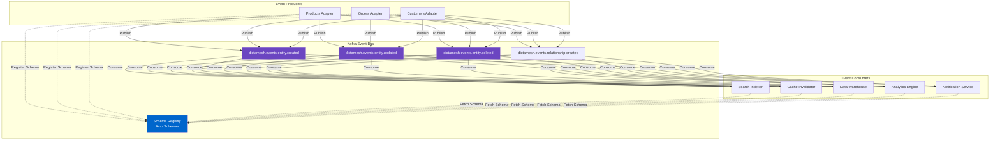

<!--
SPDX-License-Identifier: AGPL-3.0-or-later
Copyright (C) 2025 Controle Digital Ltda
-->

---
sidebar_position: 6
---

# Event-Driven Integration

Event-driven architecture is the backbone of DictaMesh, enabling real-time data synchronization, decoupled communication, and eventual consistency across the data mesh. This document explores event patterns, Kafka integration, schema evolution, and processing strategies.

## Event Architecture



## Event Types

### Core Event Types

DictaMesh defines standard event types for entity lifecycle:

```go
// SPDX-License-Identifier: AGPL-3.0-or-later
// Copyright (C) 2025 Controle Digital Ltda

package events

const (
    // Entity Lifecycle Events
    EventEntityCreated  = "entity.created"
    EventEntityUpdated  = "entity.updated"
    EventEntityDeleted  = "entity.deleted"

    // Relationship Events
    EventRelationshipCreated = "relationship.created"
    EventRelationshipDeleted = "relationship.deleted"

    // Schema Events
    EventSchemaRegistered  = "schema.registered"
    EventSchemaDeprecated  = "schema.deprecated"

    // Sync Events
    EventSyncStarted   = "sync.started"
    EventSyncCompleted = "sync.completed"
    EventSyncFailed    = "sync.failed"

    // System Events
    EventAdapterStarted = "adapter.started"
    EventAdapterStopped = "adapter.stopped"
    EventHealthCheck    = "health.check"
)

// Event represents a domain event
type Event struct {
    // Event Identification
    EventID        string    `json:"event_id" avro:"event_id"`
    EventType      string    `json:"event_type" avro:"event_type"`
    EventVersion   string    `json:"event_version" avro:"event_version"`

    // Timestamp
    Timestamp      time.Time `json:"timestamp" avro:"timestamp"`

    // Source Information
    Source         string    `json:"source" avro:"source"`
    SourceEntityID string    `json:"source_entity_id" avro:"source_entity_id"`

    // Payload
    Payload        map[string]interface{} `json:"payload" avro:"payload"`

    // Metadata
    Metadata       EventMetadata `json:"metadata" avro:"metadata"`

    // Tracing
    TraceID        string    `json:"trace_id,omitempty" avro:"trace_id"`
    SpanID         string    `json:"span_id,omitempty" avro:"span_id"`
}

type EventMetadata struct {
    CorrelationID  string            `json:"correlation_id,omitempty"`
    CausationID    string            `json:"causation_id,omitempty"` // ID of event that caused this
    UserID         string            `json:"user_id,omitempty"`
    SessionID      string            `json:"session_id,omitempty"`
    Tags           map[string]string `json:"tags,omitempty"`
}
```

### Event Schemas

Events use Avro for schema evolution and type safety:

```json
{
  "type": "record",
  "name": "EntityCreatedEvent",
  "namespace": "com.dictamesh.events.v1",
  "doc": "Published when a new entity is registered in the catalog",
  "fields": [
    {
      "name": "event_id",
      "type": "string",
      "doc": "Unique event identifier (UUID v4)"
    },
    {
      "name": "event_type",
      "type": "string",
      "default": "entity.created",
      "doc": "Event type identifier"
    },
    {
      "name": "event_version",
      "type": "string",
      "default": "1.0.0",
      "doc": "Event schema version"
    },
    {
      "name": "timestamp",
      "type": "long",
      "logicalType": "timestamp-millis",
      "doc": "Event timestamp in milliseconds since epoch"
    },
    {
      "name": "source",
      "type": "string",
      "doc": "Source adapter that emitted the event"
    },
    {
      "name": "source_entity_id",
      "type": "string",
      "doc": "Entity ID in the source system"
    },
    {
      "name": "entity_id",
      "type": "string",
      "doc": "Catalog entity ID (canonical)"
    },
    {
      "name": "entity_type",
      "type": "string",
      "doc": "Type of entity (product, order, customer, etc.)"
    },
    {
      "name": "domain",
      "type": "string",
      "doc": "Domain the entity belongs to"
    },
    {
      "name": "schema_version",
      "type": "string",
      "doc": "Entity schema version"
    },
    {
      "name": "data",
      "type": "string",
      "doc": "JSON-encoded entity data"
    },
    {
      "name": "metadata",
      "type": {
        "type": "record",
        "name": "EventMetadata",
        "fields": [
          {"name": "correlation_id", "type": ["null", "string"], "default": null},
          {"name": "causation_id", "type": ["null", "string"], "default": null},
          {"name": "user_id", "type": ["null", "string"], "default": null}
        ]
      }
    },
    {
      "name": "trace_id",
      "type": ["null", "string"],
      "default": null,
      "doc": "OpenTelemetry trace ID"
    },
    {
      "name": "span_id",
      "type": ["null", "string"],
      "default": null,
      "doc": "OpenTelemetry span ID"
    }
  ]
}
```

## Event Producer

### Producer Implementation

```go
package events

import (
    "context"
    "encoding/json"
    "fmt"

    "github.com/confluentinc/confluent-kafka-go/v2/kafka"
    "github.com/linkedin/goavro/v2"
    "go.opentelemetry.io/otel/trace"
    "go.uber.org/zap"
)

type Producer struct {
    writer       *kafka.Producer
    schemaReg    *SchemaRegistry
    logger       *zap.Logger
    tracer       trace.Tracer
    config       *ProducerConfig
    metrics      *ProducerMetrics
}

type ProducerConfig struct {
    Brokers       []string
    ClientID      string
    Compression   string // "none", "gzip", "snappy", "lz4", "zstd"
    Idempotent    bool
    MaxRetries    int
    RetryBackoff  time.Duration
}

func NewProducer(config *ProducerConfig, logger *zap.Logger) (*Producer, error) {
    kafkaConfig := &kafka.ConfigMap{
        "bootstrap.servers": strings.Join(config.Brokers, ","),
        "client.id":         config.ClientID,
        "compression.type":  config.Compression,
        "enable.idempotence": config.Idempotent,
        "max.in.flight.requests.per.connection": 5,
        "retries":           config.MaxRetries,
        "retry.backoff.ms":  config.RetryBackoff.Milliseconds(),

        // Batching for throughput
        "linger.ms":       10,
        "batch.size":      16384,
        "buffer.memory":   33554432,

        // Reliability
        "acks": "all",
        "request.timeout.ms": 30000,
    }

    writer, err := kafka.NewProducer(kafkaConfig)
    if err != nil {
        return nil, fmt.Errorf("failed to create producer: %w", err)
    }

    return &Producer{
        writer:    writer,
        schemaReg: NewSchemaRegistry(config.SchemaRegistryURL),
        logger:    logger,
        tracer:    otel.Tracer("events.producer"),
        config:    config,
        metrics:   NewProducerMetrics(),
    }, nil
}

func (p *Producer) Publish(ctx context.Context, event *Event) error {
    ctx, span := p.tracer.Start(ctx, "events.Publish",
        trace.WithAttributes(
            attribute.String("event.type", event.EventType),
            attribute.String("event.id", event.EventID),
        ))
    defer span.End()

    start := time.Now()

    // Inject trace context
    event.TraceID = span.SpanContext().TraceID().String()
    event.SpanID = span.SpanContext().SpanID().String()

    // Get Avro schema
    schema, err := p.schemaReg.GetLatestSchema(event.EventType, event.EventVersion)
    if err != nil {
        p.metrics.PublishErrors.Inc()
        return fmt.Errorf("schema not found: %w", err)
    }

    // Encode with Avro
    codec, err := goavro.NewCodec(schema.Definition)
    if err != nil {
        return fmt.Errorf("invalid schema: %w", err)
    }

    // Convert to Avro-compatible format
    avroData, err := p.toAvroData(event)
    if err != nil {
        return fmt.Errorf("failed to convert to Avro: %w", err)
    }

    // Encode
    encoded, err := codec.BinaryFromNative(nil, avroData)
    if err != nil {
        p.metrics.PublishErrors.Inc()
        return fmt.Errorf("failed to encode: %w", err)
    }

    // Build Kafka message
    topic := p.buildTopicName(event.EventType)
    msg := &kafka.Message{
        TopicPartition: kafka.TopicPartition{
            Topic:     &topic,
            Partition: kafka.PartitionAny,
        },
        Key:   []byte(event.SourceEntityID),
        Value: encoded,
        Headers: []kafka.Header{
            {Key: "event-type", Value: []byte(event.EventType)},
            {Key: "event-version", Value: []byte(event.EventVersion)},
            {Key: "trace-id", Value: []byte(event.TraceID)},
            {Key: "span-id", Value: []byte(event.SpanID)},
        },
    }

    // Publish
    deliveryChan := make(chan kafka.Event, 1)
    err = p.writer.Produce(msg, deliveryChan)
    if err != nil {
        p.metrics.PublishErrors.Inc()
        return fmt.Errorf("failed to produce: %w", err)
    }

    // Wait for delivery
    select {
    case e := <-deliveryChan:
        m := e.(*kafka.Message)
        if m.TopicPartition.Error != nil {
            p.metrics.PublishErrors.Inc()
            return fmt.Errorf("delivery failed: %w", m.TopicPartition.Error)
        }

        // Record metrics
        duration := time.Since(start)
        p.metrics.PublishDuration.Observe(duration.Seconds())
        p.metrics.PublishSuccess.Inc()

        p.logger.Debug("event published",
            zap.String("event_id", event.EventID),
            zap.String("topic", topic),
            zap.Int32("partition", m.TopicPartition.Partition),
            zap.Int64("offset", int64(m.TopicPartition.Offset)),
            zap.Duration("duration", duration))

        span.SetAttributes(
            attribute.String("kafka.topic", topic),
            attribute.Int("kafka.partition", int(m.TopicPartition.Partition)),
            attribute.Int("kafka.offset", int(m.TopicPartition.Offset)),
        )

        return nil

    case <-ctx.Done():
        p.metrics.PublishErrors.Inc()
        return ctx.Err()
    }
}

func (p *Producer) PublishBatch(ctx context.Context, events []*Event) error {
    ctx, span := p.tracer.Start(ctx, "events.PublishBatch",
        trace.WithAttributes(
            attribute.Int("batch.size", len(events)),
        ))
    defer span.End()

    errChan := make(chan error, len(events))
    var wg sync.WaitGroup

    for _, event := range events {
        wg.Add(1)
        go func(e *Event) {
            defer wg.Done()
            if err := p.Publish(ctx, e); err != nil {
                errChan <- err
            }
        }(event)
    }

    wg.Wait()
    close(errChan)

    // Collect errors
    var errors []error
    for err := range errChan {
        errors = append(errors, err)
    }

    if len(errors) > 0 {
        return fmt.Errorf("batch publish errors: %v", errors)
    }

    return nil
}

func (p *Producer) buildTopicName(eventType string) string {
    // Topic naming: dictamesh.events.{event_type}
    return fmt.Sprintf("dictamesh.events.%s", eventType)
}

func (p *Producer) Close() error {
    // Flush pending messages
    p.writer.Flush(30000) // 30 seconds
    p.writer.Close()
    return nil
}
```

## Event Consumer

### Consumer Implementation

```go
package events

type Consumer struct {
    reader      *kafka.Consumer
    schemaReg   *SchemaRegistry
    handlers    map[string][]EventHandler
    logger      *zap.Logger
    tracer      trace.Tracer
    metrics     *ConsumerMetrics
    mu          sync.RWMutex
}

type EventHandler func(ctx context.Context, event *Event) error

type ConsumerConfig struct {
    Brokers       []string
    GroupID       string
    Topics        []string
    AutoCommit    bool
    CommitInterval time.Duration
    SessionTimeout time.Duration
    MaxPollRecords int
}

func NewConsumer(config *ConsumerConfig, logger *zap.Logger) (*Consumer, error) {
    kafkaConfig := &kafka.ConfigMap{
        "bootstrap.servers":     strings.Join(config.Brokers, ","),
        "group.id":              config.GroupID,
        "auto.offset.reset":     "earliest",
        "enable.auto.commit":    config.AutoCommit,
        "auto.commit.interval.ms": config.CommitInterval.Milliseconds(),
        "session.timeout.ms":    config.SessionTimeout.Milliseconds(),
        "max.poll.records":      config.MaxPollRecords,

        // Performance tuning
        "fetch.min.bytes":       1,
        "fetch.max.wait.ms":     500,
        "max.partition.fetch.bytes": 1048576,
    }

    reader, err := kafka.NewConsumer(kafkaConfig)
    if err != nil {
        return nil, fmt.Errorf("failed to create consumer: %w", err)
    }

    // Subscribe to topics
    err = reader.SubscribeTopics(config.Topics, nil)
    if err != nil {
        return nil, fmt.Errorf("failed to subscribe: %w", err)
    }

    return &Consumer{
        reader:    reader,
        schemaReg: NewSchemaRegistry(config.SchemaRegistryURL),
        handlers:  make(map[string][]EventHandler),
        logger:    logger,
        tracer:    otel.Tracer("events.consumer"),
        metrics:   NewConsumerMetrics(),
    }, nil
}

func (c *Consumer) Subscribe(eventType string, handler EventHandler) {
    c.mu.Lock()
    defer c.mu.Unlock()

    c.handlers[eventType] = append(c.handlers[eventType], handler)
}

func (c *Consumer) SubscribeBatch(eventType string, batchSize int,
    maxWait time.Duration, handler func(context.Context, []*Event) error) {

    c.Subscribe(eventType, func(ctx context.Context, event *Event) error {
        // Batch handler implemented using buffering
        return c.batchHandler(ctx, event, batchSize, maxWait, handler)
    })
}

func (c *Consumer) Start(ctx context.Context) error {
    c.logger.Info("starting consumer",
        zap.String("group_id", c.reader.GetMetadata().OriginatingBrokerName))

    for {
        select {
        case <-ctx.Done():
            return ctx.Err()

        default:
            msg, err := c.reader.ReadMessage(100 * time.Millisecond)
            if err != nil {
                if err.(kafka.Error).Code() == kafka.ErrTimedOut {
                    continue
                }
                c.logger.Error("read error", zap.Error(err))
                continue
            }

            if err := c.processMessage(ctx, msg); err != nil {
                c.logger.Error("process error",
                    zap.Error(err),
                    zap.String("topic", *msg.TopicPartition.Topic),
                    zap.Int32("partition", msg.TopicPartition.Partition),
                    zap.Int64("offset", int64(msg.TopicPartition.Offset)))

                // Send to DLQ
                c.sendToDLQ(msg, err)
                continue
            }

            // Commit offset
            _, err = c.reader.CommitMessage(msg)
            if err != nil {
                c.logger.Error("commit error", zap.Error(err))
            }
        }
    }
}

func (c *Consumer) processMessage(ctx context.Context, msg *kafka.Message) error {
    ctx, span := c.tracer.Start(ctx, "events.ProcessMessage",
        trace.WithAttributes(
            attribute.String("kafka.topic", *msg.TopicPartition.Topic),
            attribute.Int("kafka.partition", int(msg.TopicPartition.Partition)),
            attribute.Int("kafka.offset", int(msg.TopicPartition.Offset)),
        ))
    defer span.End()

    start := time.Now()

    // Extract event type from headers
    eventType := string(extractHeader(msg.Headers, "event-type"))
    eventVersion := string(extractHeader(msg.Headers, "event-version"))
    traceID := string(extractHeader(msg.Headers, "trace-id"))

    // Get schema
    schema, err := c.schemaReg.GetSchema(eventType, eventVersion)
    if err != nil {
        return fmt.Errorf("schema not found: %w", err)
    }

    // Decode Avro
    codec, err := goavro.NewCodec(schema.Definition)
    if err != nil {
        return fmt.Errorf("invalid schema: %w", err)
    }

    native, _, err := codec.NativeFromBinary(msg.Value)
    if err != nil {
        return fmt.Errorf("decode error: %w", err)
    }

    // Convert to Event
    event, err := c.fromAvroData(native)
    if err != nil {
        return fmt.Errorf("conversion error: %w", err)
    }

    // Propagate trace context
    if traceID != "" {
        ctx = trace.ContextWithRemoteSpanContext(ctx, parseTraceContext(traceID))
    }

    span.SetAttributes(
        attribute.String("event.type", event.EventType),
        attribute.String("event.id", event.EventID),
    )

    // Route to handlers
    c.mu.RLock()
    handlers := c.handlers[eventType]
    c.mu.RUnlock()

    if len(handlers) == 0 {
        c.logger.Warn("no handlers for event type",
            zap.String("event_type", eventType))
        return nil
    }

    // Execute handlers
    for _, handler := range handlers {
        if err := handler(ctx, event); err != nil {
            c.metrics.HandlerErrors.Inc()
            return fmt.Errorf("handler error: %w", err)
        }
    }

    // Record metrics
    duration := time.Since(start)
    c.metrics.ProcessDuration.Observe(duration.Seconds())
    c.metrics.ProcessSuccess.Inc()

    return nil
}

func (c *Consumer) Close() error {
    return c.reader.Close()
}
```

## Event Patterns

### 1. Event Sourcing

Store all state changes as events:

```go
type EventStore struct {
    catalog repository.CatalogRepository
    consumer *Consumer
}

func (es *EventStore) ReplayEvents(ctx context.Context, entityID string) (*Entity, error) {
    // Fetch all events for entity
    events, err := es.catalog.GetEventLog(ctx, entityID)
    if err != nil {
        return nil, err
    }

    // Sort by timestamp
    sort.Slice(events, func(i, j int) bool {
        return events[i].Timestamp.Before(events[j].Timestamp)
    })

    // Rebuild state by replaying events
    var entity *Entity
    for _, event := range events {
        switch event.EventType {
        case EventEntityCreated:
            entity = &Entity{
                ID:   event.Payload["entity_id"].(string),
                Type: event.Payload["entity_type"].(string),
            }

        case EventEntityUpdated:
            // Apply updates
            for field, value := range event.Payload["data"].(map[string]interface{}) {
                entity.Attributes[field] = value
            }

        case EventEntityDeleted:
            entity = nil
        }
    }

    return entity, nil
}
```

### 2. CQRS (Command Query Responsibility Segregation)

Separate write and read models:

```go
// Write side: Command Handler
type CommandHandler struct {
    eventBus *Producer
    catalog  repository.CatalogRepository
}

func (h *CommandHandler) CreateProduct(ctx context.Context, cmd *CreateProductCommand) error {
    // Validate command
    if err := cmd.Validate(); err != nil {
        return err
    }

    // Create entity
    entity := &Entity{
        ID:   uuid.New().String(),
        Type: "product",
        Attributes: cmd.Attributes,
    }

    // Store in catalog (write model)
    if err := h.catalog.Create(ctx, entity); err != nil {
        return err
    }

    // Publish event
    event := &Event{
        EventID:   uuid.New().String(),
        EventType: EventEntityCreated,
        Payload: map[string]interface{}{
            "entity_id":   entity.ID,
            "entity_type": entity.Type,
            "data":        entity.Attributes,
        },
    }

    return h.eventBus.Publish(ctx, event)
}

// Read side: Query Handler
type QueryHandler struct {
    readModel *ReadModel
}

func (h *QueryHandler) GetProduct(ctx context.Context, id string) (*Product, error) {
    // Query optimized read model
    return h.readModel.GetProduct(ctx, id)
}

// Read Model Updater (consumes events)
type ReadModelUpdater struct {
    consumer  *Consumer
    searchIndex *search.Index
    cache     cache.Cache
}

func (u *ReadModelUpdater) Start(ctx context.Context) error {
    u.consumer.Subscribe(EventEntityCreated, u.handleCreated)
    u.consumer.Subscribe(EventEntityUpdated, u.handleUpdated)
    u.consumer.Subscribe(EventEntityDeleted, u.handleDeleted)

    return u.consumer.Start(ctx)
}

func (u *ReadModelUpdater) handleCreated(ctx context.Context, event *Event) error {
    // Update search index
    product := extractProduct(event.Payload)
    if err := u.searchIndex.Index(ctx, product); err != nil {
        return err
    }

    // Warm cache
    u.cache.Set(ctx, "product:"+product.ID, product, 5*time.Minute)

    return nil
}
```

### 3. Saga Pattern

Coordinate distributed transactions:

```go
type OrderSaga struct {
    eventBus  *Producer
    consumer  *Consumer
    state     *SagaState
}

type SagaState struct {
    SagaID          string
    OrderID         string
    Status          string // "pending", "completed", "compensating", "failed"
    CompletedSteps  []string
    CompensateSteps []string
}

func (s *OrderSaga) Start(ctx context.Context, orderID string) error {
    sagaID := uuid.New().String()

    state := &SagaState{
        SagaID:  sagaID,
        OrderID: orderID,
        Status:  "pending",
    }

    // Step 1: Reserve inventory
    event := &Event{
        EventID:   uuid.New().String(),
        EventType: "saga.inventory.reserve",
        Payload: map[string]interface{}{
            "saga_id":  sagaID,
            "order_id": orderID,
        },
        Metadata: EventMetadata{
            CorrelationID: sagaID,
        },
    }

    return s.eventBus.Publish(ctx, event)
}

func (s *OrderSaga) handleInventoryReserved(ctx context.Context, event *Event) error {
    sagaID := event.Metadata.CorrelationID

    // Step 2: Charge payment
    chargeEvent := &Event{
        EventID:   uuid.New().String(),
        EventType: "saga.payment.charge",
        Payload: map[string]interface{}{
            "saga_id":  sagaID,
            "order_id": event.Payload["order_id"],
        },
        Metadata: EventMetadata{
            CorrelationID: sagaID,
            CausationID:   event.EventID,
        },
    }

    return s.eventBus.Publish(ctx, chargeEvent)
}

func (s *OrderSaga) handlePaymentFailed(ctx context.Context, event *Event) error {
    sagaID := event.Metadata.CorrelationID

    // Compensate: Release inventory
    compensateEvent := &Event{
        EventID:   uuid.New().String(),
        EventType: "saga.inventory.release",
        Payload: map[string]interface{}{
            "saga_id":  sagaID,
            "order_id": event.Payload["order_id"],
        },
        Metadata: EventMetadata{
            CorrelationID: sagaID,
            CausationID:   event.EventID,
        },
    }

    return s.eventBus.Publish(ctx, compensateEvent)
}
```

### 4. Event Replay

Rebuild state from event log:

```go
type EventReplayer struct {
    catalog   repository.CatalogRepository
    consumer  *Consumer
    checkpoint *Checkpoint
}

func (r *EventReplayer) Replay(ctx context.Context, from time.Time, to time.Time) error {
    // Get events in time range
    events, err := r.catalog.GetEventsByTimeRange(ctx, from, to)
    if err != nil {
        return err
    }

    r.logger.Info("replaying events",
        zap.Int("count", len(events)),
        zap.Time("from", from),
        zap.Time("to", to))

    // Process events in order
    for _, event := range events {
        if err := r.processEvent(ctx, event); err != nil {
            r.logger.Error("replay failed",
                zap.String("event_id", event.ID),
                zap.Error(err))
            return err
        }

        // Save checkpoint
        r.checkpoint.Save(event.Timestamp)
    }

    return nil
}
```

## Schema Evolution

### Backward Compatible Changes

```json
{
  "type": "record",
  "name": "EntityCreatedEvent",
  "namespace": "com.dictamesh.events.v2",
  "fields": [
    {"name": "event_id", "type": "string"},
    {"name": "entity_id", "type": "string"},

    // New optional field (backward compatible)
    {
      "name": "tags",
      "type": ["null", {"type": "array", "items": "string"}],
      "default": null
    },

    // Field with default (backward compatible)
    {
      "name": "priority",
      "type": "string",
      "default": "normal"
    }
  ]
}
```

### Version Management

```go
type SchemaRegistry struct {
    client *http.Client
    url    string
    cache  map[string]*Schema
    mu     sync.RWMutex
}

func (sr *SchemaRegistry) RegisterSchema(schema *Schema) error {
    // Validate compatibility
    existing, err := sr.GetLatestSchema(schema.EventType, "")
    if err == nil {
        if !sr.isBackwardCompatible(existing, schema) {
            return fmt.Errorf("schema is not backward compatible")
        }
    }

    // Register new version
    version := sr.nextVersion(schema.EventType)
    schema.Version = version

    // POST to schema registry
    resp, err := sr.client.Post(
        sr.url+"/schemas",
        "application/json",
        toJSON(schema),
    )

    if err != nil {
        return err
    }

    if resp.StatusCode != http.StatusCreated {
        return fmt.Errorf("registration failed: %d", resp.StatusCode)
    }

    // Cache schema
    sr.mu.Lock()
    sr.cache[schema.EventType+":"+version] = schema
    sr.mu.Unlock()

    return nil
}

func (sr *SchemaRegistry) isBackwardCompatible(old, new *Schema) bool {
    // Parse schemas
    oldCodec, _ := goavro.NewCodec(old.Definition)
    newCodec, _ := goavro.NewCodec(new.Definition)

    // Check if old data can be read with new schema
    // (simplified - real implementation is more complex)
    return newCodec.CanonicalSchema() == oldCodec.CanonicalSchema()
}
```

## Dead Letter Queue

Handle failed messages:

```go
type DLQHandler struct {
    producer *Producer
    storage  storage.Storage
}

func (h *DLQHandler) SendToDLQ(msg *kafka.Message, err error) error {
    dlqEvent := &Event{
        EventID:   uuid.New().String(),
        EventType: "dlq.message",
        Timestamp: time.Now(),
        Payload: map[string]interface{}{
            "original_topic":     *msg.TopicPartition.Topic,
            "original_partition": msg.TopicPartition.Partition,
            "original_offset":    msg.TopicPartition.Offset,
            "error":              err.Error(),
            "message":            base64.StdEncoding.EncodeToString(msg.Value),
        },
    }

    // Publish to DLQ topic
    return h.producer.Publish(context.Background(), dlqEvent)
}

func (h *DLQHandler) RetryFromDLQ(ctx context.Context, eventID string) error {
    // Fetch from DLQ
    event, err := h.storage.Get(ctx, eventID)
    if err != nil {
        return err
    }

    // Decode original message
    originalMsg, err := base64.StdEncoding.DecodeString(
        event.Payload["message"].(string))
    if err != nil {
        return err
    }

    // Retry original topic
    topic := event.Payload["original_topic"].(string)
    return h.producer.Publish(ctx, &Event{
        EventType: extractEventType(originalMsg),
        Payload:   decodePayload(originalMsg),
    })
}
```

## Performance Optimization

### Batching

```go
type BatchProducer struct {
    producer   *Producer
    batch      []*Event
    batchSize  int
    flushInterval time.Duration
    mu         sync.Mutex
}

func (bp *BatchProducer) Publish(ctx context.Context, event *Event) error {
    bp.mu.Lock()
    bp.batch = append(bp.batch, event)
    shouldFlush := len(bp.batch) >= bp.batchSize
    bp.mu.Unlock()

    if shouldFlush {
        return bp.Flush(ctx)
    }

    return nil
}

func (bp *BatchProducer) Flush(ctx context.Context) error {
    bp.mu.Lock()
    batch := bp.batch
    bp.batch = make([]*Event, 0, bp.batchSize)
    bp.mu.Unlock()

    if len(batch) == 0 {
        return nil
    }

    return bp.producer.PublishBatch(ctx, batch)
}

func (bp *BatchProducer) Start(ctx context.Context) {
    ticker := time.NewTicker(bp.flushInterval)
    defer ticker.Stop()

    for {
        select {
        case <-ctx.Done():
            bp.Flush(ctx)
            return
        case <-ticker.C:
            bp.Flush(ctx)
        }
    }
}
```

### Compression

Enable compression for bandwidth optimization:

```go
config := &ProducerConfig{
    Compression: "zstd", // Best compression ratio
    // or "lz4" for best speed
    // or "snappy" for balance
}
```

## Best Practices

### 1. Event Design

```go
// Good: Immutable, self-contained events
type ProductCreatedEvent struct {
    ProductID   string
    Name        string
    Price       float64
    CategoryID  string
    CreatedAt   time.Time
}

// Bad: Mutable references
type ProductCreatedEvent struct {
    ProductID string // Only ID - requires lookup
}
```

### 2. Idempotency

```go
func (h *EventHandler) Handle(ctx context.Context, event *Event) error {
    // Check if already processed
    processed, err := h.processedEvents.Contains(ctx, event.EventID)
    if err != nil {
        return err
    }
    if processed {
        return nil // Skip
    }

    // Process event
    if err := h.doHandle(ctx, event); err != nil {
        return err
    }

    // Mark as processed
    return h.processedEvents.Add(ctx, event.EventID)
}
```

### 3. Ordering Guarantees

```go
// Use entity ID as partition key for ordering
msg := &kafka.Message{
    Key: []byte(event.SourceEntityID), // Same entity -> same partition
    Value: encoded,
}
```

### 4. Monitoring

```go
// Track event lag
lag := currentOffset - committedOffset

// Alert if lag exceeds threshold
if lag > 10000 {
    alerting.Send("High consumer lag", map[string]interface{}{
        "consumer_group": groupID,
        "topic":          topic,
        "lag":            lag,
    })
}
```

## Next Steps

- **[Metadata Catalog](./metadata-catalog.md)** - Event logging and lineage tracking
- **[Core Framework](./core-framework.md)** - Event bus implementation details
- **[Building Adapters](../guides/building-adapters.md)** - Integrate events in adapters

---

**Previous**: [← Services](./services.md) | **Next**: [Metadata Catalog →](./metadata-catalog.md)
