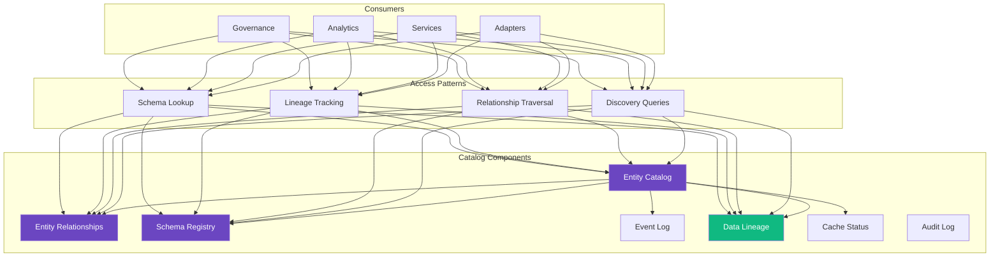

<!--
SPDX-License-Identifier: AGPL-3.0-or-later
Copyright (C) 2025 Controle Digital Ltda
-->

---
sidebar_position: 7
---

# Metadata Catalog

The metadata catalog is the central registry and source of truth for all entities, schemas, relationships, and lineage in the DictaMesh data mesh. Built on PostgreSQL, it provides discovery, governance, and observability capabilities across the entire mesh.

## Catalog Architecture



## Data Models

### Entity Catalog

The core registry for all entities in the mesh:

```sql
-- SPDX-License-Identifier: AGPL-3.0-or-later
-- Copyright (C) 2025 Controle Digital Ltda

-- DictaMesh: All table names use dictamesh_ prefix for namespace isolation

CREATE TABLE dictamesh_entity_catalog (
    -- Identity
    id                  UUID PRIMARY KEY DEFAULT gen_random_uuid(),
    entity_type         VARCHAR(100) NOT NULL,
    domain              VARCHAR(100) NOT NULL,
    source_system       VARCHAR(100) NOT NULL,
    source_entity_id    VARCHAR(255) NOT NULL,

    -- API Discovery
    api_base_url        TEXT NOT NULL,
    api_path_template   TEXT NOT NULL,
    api_method          VARCHAR(10) DEFAULT 'GET',
    api_auth_type       VARCHAR(50),

    -- Schema Management
    schema_id           UUID REFERENCES dictamesh_schemas(id),
    schema_version      VARCHAR(50),

    -- Lifecycle
    created_at          TIMESTAMP DEFAULT CURRENT_TIMESTAMP,
    updated_at          TIMESTAMP DEFAULT CURRENT_TIMESTAMP,
    last_seen_at        TIMESTAMP DEFAULT CURRENT_TIMESTAMP,
    status              VARCHAR(50) DEFAULT 'active',

    -- Quality Metrics
    availability_sla    DECIMAL(5,4),  -- 0.9999 = 99.99%
    latency_p99_ms      INTEGER,
    freshness_sla       INTEGER,       -- Seconds

    -- Governance
    contains_pii        BOOLEAN DEFAULT FALSE,
    data_classification VARCHAR(50),
    retention_days      INTEGER,

    -- Constraints
    UNIQUE(source_system, source_entity_id)
);

-- Indexes for common queries
CREATE INDEX idx_dictamesh_entity_type
    ON dictamesh_entity_catalog(entity_type);

CREATE INDEX idx_dictamesh_domain
    ON dictamesh_entity_catalog(domain);

CREATE INDEX idx_dictamesh_source_system
    ON dictamesh_entity_catalog(source_system);

CREATE INDEX idx_dictamesh_status
    ON dictamesh_entity_catalog(status);

-- Partial index for PII compliance
CREATE INDEX idx_dictamesh_contains_pii
    ON dictamesh_entity_catalog(contains_pii)
    WHERE contains_pii = true;

-- Composite index for common queries
CREATE INDEX idx_dictamesh_type_domain_status
    ON dictamesh_entity_catalog(entity_type, domain, status);

-- Full-text search
CREATE INDEX idx_dictamesh_entity_fts
    ON dictamesh_entity_catalog
    USING gin(to_tsvector('english',
        coalesce(source_entity_id, '') || ' ' ||
        coalesce(entity_type, '')
    ));

COMMENT ON TABLE dictamesh_entity_catalog IS
    'DictaMesh: Central registry of all entities in the data mesh';
```

### Entity Relationships

Track connections between entities:

```sql
CREATE TABLE dictamesh_entity_relationships (
    -- Identity
    id                       UUID PRIMARY KEY DEFAULT gen_random_uuid(),

    -- Subject (source of relationship)
    subject_catalog_id       UUID NOT NULL REFERENCES dictamesh_entity_catalog(id),
    subject_entity_type      VARCHAR(100) NOT NULL,
    subject_entity_id        VARCHAR(255) NOT NULL,

    -- Relationship
    relationship_type        VARCHAR(100) NOT NULL,
    relationship_cardinality VARCHAR(20),  -- 'one', 'many'

    -- Object (target of relationship)
    object_catalog_id        UUID NOT NULL REFERENCES dictamesh_entity_catalog(id),
    object_entity_type       VARCHAR(100) NOT NULL,
    object_entity_id         VARCHAR(255) NOT NULL,

    -- Temporal validity
    valid_from               TIMESTAMP NOT NULL DEFAULT CURRENT_TIMESTAMP,
    valid_to                 TIMESTAMP,

    -- Display
    subject_display_name     VARCHAR(255),
    object_display_name      VARCHAR(255),

    -- Metadata
    relationship_metadata    JSONB,
    created_by_event_id      VARCHAR(255),
    created_at               TIMESTAMP DEFAULT CURRENT_TIMESTAMP
);

-- Indexes
CREATE INDEX idx_dictamesh_subject
    ON dictamesh_entity_relationships(subject_entity_type, subject_entity_id);

CREATE INDEX idx_dictamesh_object
    ON dictamesh_entity_relationships(object_entity_type, object_entity_id);

CREATE INDEX idx_dictamesh_relationship_type
    ON dictamesh_entity_relationships(relationship_type);

-- Temporal index
CREATE INDEX idx_dictamesh_temporal
    ON dictamesh_entity_relationships(valid_from, valid_to)
    WHERE valid_to IS NULL;

COMMENT ON TABLE dictamesh_entity_relationships IS
    'DictaMesh: Relationships between entities with temporal tracking';
```

### Schema Registry

Versioned schemas for entities and events:

```sql
CREATE TABLE dictamesh_schemas (
    -- Identity
    id                  UUID PRIMARY KEY DEFAULT gen_random_uuid(),
    entity_type         VARCHAR(100) NOT NULL,
    version             VARCHAR(50) NOT NULL,

    -- Schema Definition
    schema_format       VARCHAR(50) NOT NULL,  -- 'jsonschema', 'avro', 'protobuf'
    schema_definition   JSONB NOT NULL,

    -- Compatibility
    backward_compatible BOOLEAN DEFAULT TRUE,
    forward_compatible  BOOLEAN DEFAULT FALSE,

    -- Lifecycle
    published_at        TIMESTAMP DEFAULT CURRENT_TIMESTAMP,
    deprecated_at       TIMESTAMP,
    retired_at          TIMESTAMP,

    UNIQUE(entity_type, version)
);

CREATE INDEX idx_dictamesh_schema_entity_version
    ON dictamesh_schemas(entity_type, version);

COMMENT ON TABLE dictamesh_schemas IS
    'DictaMesh: Versioned schemas for entities and events';
```

### Event Log

Audit trail of all entity changes:

```sql
CREATE TABLE dictamesh_event_log (
    -- Identity
    id               UUID PRIMARY KEY DEFAULT gen_random_uuid(),
    event_id         VARCHAR(255) UNIQUE NOT NULL,
    event_type       VARCHAR(100) NOT NULL,

    -- Entity Reference
    catalog_id       UUID REFERENCES dictamesh_entity_catalog(id),
    entity_type      VARCHAR(100),
    entity_id        VARCHAR(255),

    -- Change Tracking
    changed_fields   TEXT[],
    event_payload    JSONB,

    -- Tracing
    trace_id         VARCHAR(64),
    span_id          VARCHAR(16),

    -- Timestamp
    event_timestamp  TIMESTAMP NOT NULL,
    ingested_at      TIMESTAMP DEFAULT CURRENT_TIMESTAMP
);

CREATE INDEX idx_dictamesh_event_type
    ON dictamesh_event_log(event_type);

CREATE INDEX idx_dictamesh_event_catalog
    ON dictamesh_event_log(catalog_id);

CREATE INDEX idx_dictamesh_event_timestamp
    ON dictamesh_event_log(event_timestamp DESC);

CREATE INDEX idx_dictamesh_trace
    ON dictamesh_event_log(trace_id);

-- Partition by month for time-series data
CREATE TABLE dictamesh_event_log_y2025m01 PARTITION OF dictamesh_event_log
    FOR VALUES FROM ('2025-01-01') TO ('2025-02-01');

COMMENT ON TABLE dictamesh_event_log IS
    'DictaMesh: Event log for audit trail and replay';
```

### Data Lineage

Track data flow and transformations:

```sql
CREATE TABLE dictamesh_data_lineage (
    -- Identity
    id                    UUID PRIMARY KEY DEFAULT gen_random_uuid(),

    -- Upstream (source)
    upstream_catalog_id   UUID NOT NULL REFERENCES dictamesh_entity_catalog(id),
    upstream_system       VARCHAR(100),

    -- Downstream (target)
    downstream_catalog_id UUID NOT NULL REFERENCES dictamesh_entity_catalog(id),
    downstream_system     VARCHAR(100),

    -- Transformation
    transformation_type   VARCHAR(50),  -- 'copy', 'aggregate', 'join', 'filter'
    transformation_logic  TEXT,

    -- Flow Metrics
    data_flow_active      BOOLEAN DEFAULT TRUE,
    last_flow_at          TIMESTAMP,
    average_latency_ms    INTEGER,

    created_at            TIMESTAMP DEFAULT CURRENT_TIMESTAMP
);

CREATE INDEX idx_dictamesh_lineage_upstream
    ON dictamesh_data_lineage(upstream_catalog_id);

CREATE INDEX idx_dictamesh_lineage_downstream
    ON dictamesh_data_lineage(downstream_catalog_id);

CREATE INDEX idx_dictamesh_lineage_active
    ON dictamesh_data_lineage(data_flow_active)
    WHERE data_flow_active = true;

COMMENT ON TABLE dictamesh_data_lineage IS
    'DictaMesh: Data lineage and transformation tracking';
```

## Repository Pattern

### Repository Interface

```go
// SPDX-License-Identifier: AGPL-3.0-or-later
// Copyright (C) 2025 Controle Digital Ltda

package repository

import (
    "context"
    "github.com/dictamesh/dictamesh/pkg/database/models"
)

type CatalogRepository interface {
    // Entity CRUD
    Create(ctx context.Context, entity *models.EntityCatalog) error
    Get(ctx context.Context, id string) (*models.EntityCatalog, error)
    Update(ctx context.Context, entity *models.EntityCatalog) error
    Delete(ctx context.Context, id string) error

    // Querying
    List(ctx context.Context, opts ListOptions) ([]*models.EntityCatalog, error)
    Search(ctx context.Context, query SearchQuery) (*SearchResults, error)
    Count(ctx context.Context, filter map[string]interface{}) (int64, error)

    // Relationships
    CreateRelationship(ctx context.Context, rel *models.EntityRelationship) error
    GetRelationships(ctx context.Context, entityID string, relType string) ([]*models.EntityRelationship, error)
    DeleteRelationship(ctx context.Context, id string) error

    // Lineage
    TrackLineage(ctx context.Context, lineage *models.DataLineage) error
    GetUpstreamLineage(ctx context.Context, entityID string) ([]*models.DataLineage, error)
    GetDownstreamLineage(ctx context.Context, entityID string) ([]*models.DataLineage, error)
    GetFullLineage(ctx context.Context, entityID string, depth int) (*LineageGraph, error)

    // Schemas
    RegisterSchema(ctx context.Context, schema *models.Schema) error
    GetSchema(ctx context.Context, entityType string, version string) (*models.Schema, error)
    ListSchemas(ctx context.Context, entityType string) ([]*models.Schema, error)

    // Event Log
    LogEvent(ctx context.Context, event *models.EventLog) error
    GetEventLog(ctx context.Context, entityID string) ([]*models.EventLog, error)
    GetEventsByTimeRange(ctx context.Context, from, to time.Time) ([]*models.EventLog, error)

    // Health
    Ping(ctx context.Context) error
}

type ListOptions struct {
    Pagination Pagination
    Filters    map[string]interface{}
    Sort       []SortField
}

type SearchQuery struct {
    Query      string
    Filters    map[string]interface{}
    Pagination Pagination
    Facets     []string
}

type SearchResults struct {
    Entities    []*models.EntityCatalog
    TotalCount  int64
    Facets      map[string][]FacetValue
}

type LineageGraph struct {
    Root      *models.EntityCatalog
    Upstream  []*LineageNode
    Downstream []*LineageNode
}

type LineageNode struct {
    Entity       *models.EntityCatalog
    Relationship *models.DataLineage
    Children     []*LineageNode
}
```

### PostgreSQL Implementation

```go
package repository

import (
    "context"
    "fmt"

    "github.com/dictamesh/dictamesh/pkg/database/models"
    "go.opentelemetry.io/otel/trace"
    "go.uber.org/zap"
    "gorm.io/gorm"
)

type postgresRepository struct {
    db      *gorm.DB
    logger  *zap.Logger
    tracer  trace.Tracer
    metrics *Metrics
}

func NewPostgresRepository(db *gorm.DB, logger *zap.Logger) CatalogRepository {
    return &postgresRepository{
        db:      db,
        logger:  logger,
        tracer:  otel.Tracer("catalog.repository"),
        metrics: NewMetrics(),
    }
}

func (r *postgresRepository) Create(ctx context.Context, entity *models.EntityCatalog) error {
    ctx, span := r.tracer.Start(ctx, "repository.Create")
    defer span.End()

    start := time.Now()
    defer func() {
        r.metrics.QueryDuration.WithLabelValues("create").Observe(time.Since(start).Seconds())
    }()

    if err := r.db.WithContext(ctx).Create(entity).Error; err != nil {
        r.metrics.QueryErrors.WithLabelValues("create").Inc()
        span.RecordError(err)
        return fmt.Errorf("failed to create entity: %w", err)
    }

    r.metrics.QuerySuccess.WithLabelValues("create").Inc()
    return nil
}

func (r *postgresRepository) Get(ctx context.Context, id string) (*models.EntityCatalog, error) {
    ctx, span := r.tracer.Start(ctx, "repository.Get",
        trace.WithAttributes(
            attribute.String("entity.id", id),
        ))
    defer span.End()

    var entity models.EntityCatalog
    err := r.db.WithContext(ctx).
        Where("id = ?", id).
        First(&entity).Error

    if err != nil {
        if err == gorm.ErrRecordNotFound {
            return nil, ErrNotFound
        }
        r.metrics.QueryErrors.WithLabelValues("get").Inc()
        return nil, fmt.Errorf("failed to get entity: %w", err)
    }

    r.metrics.QuerySuccess.WithLabelValues("get").Inc()
    return &entity, nil
}

func (r *postgresRepository) Search(ctx context.Context, query SearchQuery) (*SearchResults, error) {
    ctx, span := r.tracer.Start(ctx, "repository.Search")
    defer span.End()

    var entities []*models.EntityCatalog

    db := r.db.WithContext(ctx)

    // Full-text search
    if query.Query != "" {
        db = db.Where(
            "to_tsvector('english', source_entity_id || ' ' || entity_type) @@ plainto_tsquery('english', ?)",
            query.Query,
        )
    }

    // Apply filters
    for field, value := range query.Filters {
        db = db.Where(fmt.Sprintf("%s = ?", field), value)
    }

    // Count total
    var total int64
    if err := db.Model(&models.EntityCatalog{}).Count(&total).Error; err != nil {
        return nil, err
    }

    // Apply pagination
    db = db.Offset(query.Pagination.Offset).
        Limit(query.Pagination.Limit)

    // Execute query
    if err := db.Find(&entities).Error; err != nil {
        r.metrics.QueryErrors.WithLabelValues("search").Inc()
        return nil, err
    }

    // Build facets
    facets := make(map[string][]FacetValue)
    for _, facetField := range query.Facets {
        facetValues, err := r.computeFacet(ctx, facetField, query.Filters)
        if err != nil {
            r.logger.Warn("facet computation failed",
                zap.String("field", facetField),
                zap.Error(err))
            continue
        }
        facets[facetField] = facetValues
    }

    r.metrics.QuerySuccess.WithLabelValues("search").Inc()

    return &SearchResults{
        Entities:   entities,
        TotalCount: total,
        Facets:     facets,
    }, nil
}

func (r *postgresRepository) GetFullLineage(ctx context.Context, entityID string, depth int) (*LineageGraph, error) {
    ctx, span := r.tracer.Start(ctx, "repository.GetFullLineage",
        trace.WithAttributes(
            attribute.String("entity.id", entityID),
            attribute.Int("depth", depth),
        ))
    defer span.End()

    // Get root entity
    root, err := r.Get(ctx, entityID)
    if err != nil {
        return nil, err
    }

    // Build lineage graph using recursive CTE
    query := `
        WITH RECURSIVE upstream AS (
            -- Base case: direct upstream
            SELECT
                l.upstream_catalog_id AS catalog_id,
                l.transformation_type,
                1 AS level
            FROM dictamesh_data_lineage l
            WHERE l.downstream_catalog_id = $1
              AND l.data_flow_active = true

            UNION ALL

            -- Recursive case: upstream of upstream
            SELECT
                l.upstream_catalog_id,
                l.transformation_type,
                u.level + 1
            FROM dictamesh_data_lineage l
            JOIN upstream u ON l.downstream_catalog_id = u.catalog_id
            WHERE u.level < $2
        ),
        downstream AS (
            -- Base case: direct downstream
            SELECT
                l.downstream_catalog_id AS catalog_id,
                l.transformation_type,
                1 AS level
            FROM dictamesh_data_lineage l
            WHERE l.upstream_catalog_id = $1
              AND l.data_flow_active = true

            UNION ALL

            -- Recursive case: downstream of downstream
            SELECT
                l.downstream_catalog_id,
                l.transformation_type,
                d.level + 1
            FROM dictamesh_data_lineage l
            JOIN downstream d ON l.upstream_catalog_id = d.catalog_id
            WHERE d.level < $2
        )
        SELECT 'upstream' AS direction, * FROM upstream
        UNION ALL
        SELECT 'downstream' AS direction, * FROM downstream
    `

    var lineageRows []struct {
        Direction          string
        CatalogID          string
        TransformationType string
        Level              int
    }

    err = r.db.WithContext(ctx).Raw(query, entityID, depth).Scan(&lineageRows).Error
    if err != nil {
        return nil, fmt.Errorf("lineage query failed: %w", err)
    }

    // Build graph structure
    graph := &LineageGraph{
        Root:       root,
        Upstream:   make([]*LineageNode, 0),
        Downstream: make([]*LineageNode, 0),
    }

    // Populate upstream and downstream nodes
    for _, row := range lineageRows {
        entity, err := r.Get(ctx, row.CatalogID)
        if err != nil {
            r.logger.Warn("failed to load lineage entity",
                zap.String("id", row.CatalogID),
                zap.Error(err))
            continue
        }

        node := &LineageNode{
            Entity: entity,
            Relationship: &models.DataLineage{
                TransformationType: &row.TransformationType,
            },
        }

        if row.Direction == "upstream" {
            graph.Upstream = append(graph.Upstream, node)
        } else {
            graph.Downstream = append(graph.Downstream, node)
        }
    }

    return graph, nil
}
```

## Discovery Patterns

### Entity Discovery

```go
package catalog

type Discoverer struct {
    repo CatalogRepository
}

func (d *Discoverer) DiscoverByDomain(ctx context.Context, domain string) ([]*models.EntityCatalog, error) {
    return d.repo.List(ctx, ListOptions{
        Filters: map[string]interface{}{
            "domain": domain,
            "status": "active",
        },
        Sort: []SortField{
            {Field: "entity_type", Direction: "ASC"},
        },
    })
}

func (d *Discoverer) DiscoverByCapability(ctx context.Context, capability string) ([]*models.EntityCatalog, error) {
    // Query entities that support specific capabilities
    query := `
        SELECT DISTINCT ec.*
        FROM dictamesh_entity_catalog ec
        JOIN dictamesh_schemas s ON ec.schema_id = s.id
        WHERE s.schema_definition->>'capabilities' @> $1
    `

    capabilityJSON := fmt.Sprintf(`{"%s": true}`, capability)

    var entities []*models.EntityCatalog
    err := d.repo.db.Raw(query, capabilityJSON).Scan(&entities).Error
    return entities, err
}

func (d *Discoverer) DiscoverPII(ctx context.Context) ([]*models.EntityCatalog, error) {
    return d.repo.List(ctx, ListOptions{
        Filters: map[string]interface{}{
            "contains_pii": true,
        },
    })
}
```

### Relationship Traversal

```go
func (d *Discoverer) GetRelatedEntities(ctx context.Context, entityID string,
    relationshipType string, depth int) ([]*models.EntityCatalog, error) {

    visited := make(map[string]bool)
    var entities []*models.EntityCatalog

    var traverse func(string, int) error
    traverse = func(id string, currentDepth int) error {
        if currentDepth > depth || visited[id] {
            return nil
        }
        visited[id] = true

        // Get relationships
        rels, err := d.repo.GetRelationships(ctx, id, relationshipType)
        if err != nil {
            return err
        }

        // Load related entities
        for _, rel := range rels {
            entity, err := d.repo.Get(ctx, rel.ObjectCatalogID)
            if err != nil {
                continue
            }

            entities = append(entities, entity)

            // Recurse
            if err := traverse(entity.ID, currentDepth+1); err != nil {
                return err
            }
        }

        return nil
    }

    if err := traverse(entityID, 0); err != nil {
        return nil, err
    }

    return entities, nil
}
```

## Lineage Visualization

```go
package lineage

type LineageVisualizer struct {
    repo CatalogRepository
}

func (v *LineageVisualizer) GenerateMermaidDiagram(ctx context.Context, entityID string) (string, error) {
    graph, err := v.repo.GetFullLineage(ctx, entityID, 3)
    if err != nil {
        return "", err
    }

    var sb strings.Builder
    sb.WriteString("graph TB\n")

    // Root node
    rootID := sanitizeID(graph.Root.ID)
    sb.WriteString(fmt.Sprintf("    %s[\"%s\"]\n", rootID, graph.Root.EntityType))

    // Upstream nodes
    for _, node := range graph.Upstream {
        nodeID := sanitizeID(node.Entity.ID)
        sb.WriteString(fmt.Sprintf("    %s[\"%s\"]\n", nodeID, node.Entity.EntityType))
        sb.WriteString(fmt.Sprintf("    %s -->|%s| %s\n",
            nodeID,
            *node.Relationship.TransformationType,
            rootID))
    }

    // Downstream nodes
    for _, node := range graph.Downstream {
        nodeID := sanitizeID(node.Entity.ID)
        sb.WriteString(fmt.Sprintf("    %s[\"%s\"]\n", nodeID, node.Entity.EntityType))
        sb.WriteString(fmt.Sprintf("    %s -->|%s| %s\n",
            rootID,
            *node.Relationship.TransformationType,
            nodeID))
    }

    return sb.String(), nil
}
```

## Governance

### Compliance Queries

```go
package governance

type ComplianceChecker struct {
    repo CatalogRepository
}

func (c *ComplianceChecker) FindPIIEntities(ctx context.Context) ([]*models.EntityCatalog, error) {
    return c.repo.List(ctx, ListOptions{
        Filters: map[string]interface{}{
            "contains_pii": true,
        },
    })
}

func (c *ComplianceChecker) CheckRetentionCompliance(ctx context.Context) ([]*RetentionViolation, error) {
    query := `
        SELECT
            ec.id,
            ec.entity_type,
            ec.retention_days,
            ec.created_at,
            EXTRACT(DAY FROM NOW() - ec.created_at) AS age_days
        FROM dictamesh_entity_catalog ec
        WHERE ec.retention_days IS NOT NULL
          AND EXTRACT(DAY FROM NOW() - ec.created_at) > ec.retention_days
          AND ec.status = 'active'
    `

    var violations []*RetentionViolation
    err := c.repo.db.Raw(query).Scan(&violations).Error
    return violations, err
}

func (c *ComplianceChecker) AuditDataAccess(ctx context.Context, entityID string,
    startTime, endTime time.Time) ([]*AccessLog, error) {

    query := `
        SELECT
            el.event_id,
            el.event_type,
            el.event_timestamp,
            el.trace_id,
            el.event_payload->>'user_id' AS user_id
        FROM dictamesh_event_log el
        WHERE el.catalog_id = $1
          AND el.event_type IN ('entity.read', 'entity.accessed')
          AND el.event_timestamp BETWEEN $2 AND $3
        ORDER BY el.event_timestamp DESC
    `

    var logs []*AccessLog
    err := c.repo.db.Raw(query, entityID, startTime, endTime).Scan(&logs).Error
    return logs, err
}
```

### Data Quality Metrics

```go
func (c *ComplianceChecker) ComputeQualityMetrics(ctx context.Context, entityType string) (*QualityMetrics, error) {
    query := `
        SELECT
            COUNT(*) AS total_entities,
            AVG(availability_sla) AS avg_availability,
            AVG(latency_p99_ms) AS avg_latency_p99,
            COUNT(*) FILTER (WHERE status = 'active') AS active_count,
            COUNT(*) FILTER (WHERE contains_pii = true) AS pii_count,
            COUNT(*) FILTER (WHERE schema_id IS NULL) AS unschematized_count
        FROM dictamesh_entity_catalog
        WHERE entity_type = $1
    `

    var metrics QualityMetrics
    err := c.repo.db.Raw(query, entityType).Scan(&metrics).Error
    return &metrics, err
}
```

## Caching Strategy

### Cache Integration

```go
package catalog

type CachedRepository struct {
    repo  CatalogRepository
    cache cache.Cache
    ttl   time.Duration
}

func (r *CachedRepository) Get(ctx context.Context, id string) (*models.EntityCatalog, error) {
    // Try cache
    cacheKey := "entity:" + id
    if cached, ok := r.cache.Get(ctx, cacheKey); ok {
        return cached.(*models.EntityCatalog), nil
    }

    // Fetch from database
    entity, err := r.repo.Get(ctx, id)
    if err != nil {
        return nil, err
    }

    // Cache result
    r.cache.Set(ctx, cacheKey, entity, r.ttl)

    return entity, nil
}

func (r *CachedRepository) Update(ctx context.Context, entity *models.EntityCatalog) error {
    // Update database
    if err := r.repo.Update(ctx, entity); err != nil {
        return err
    }

    // Invalidate cache
    cacheKey := "entity:" + entity.ID
    r.cache.Delete(ctx, cacheKey)

    return nil
}
```

## Performance Optimization

### Database Optimization

```sql
-- Materialized view for frequently queried aggregations
CREATE MATERIALIZED VIEW dictamesh_entity_stats AS
SELECT
    entity_type,
    domain,
    COUNT(*) AS entity_count,
    COUNT(*) FILTER (WHERE contains_pii = true) AS pii_count,
    AVG(availability_sla) AS avg_availability
FROM dictamesh_entity_catalog
WHERE status = 'active'
GROUP BY entity_type, domain;

CREATE UNIQUE INDEX ON dictamesh_entity_stats (entity_type, domain);

-- Refresh periodically
REFRESH MATERIALIZED VIEW CONCURRENTLY dictamesh_entity_stats;
```

### Query Optimization

```go
func (r *postgresRepository) ListWithPrefetch(ctx context.Context, opts ListOptions) ([]*models.EntityCatalog, error) {
    var entities []*models.EntityCatalog

    // Prefetch related data
    err := r.db.WithContext(ctx).
        Preload("Schema").
        Preload("Relationships").
        Where(opts.Filters).
        Offset(opts.Pagination.Offset).
        Limit(opts.Pagination.Limit).
        Find(&entities).Error

    return entities, err
}
```

## Monitoring

### Catalog Metrics

```go
var (
    catalogSize = prometheus.NewGaugeVec(
        prometheus.GaugeOpts{
            Name: "dictamesh_catalog_size",
            Help: "Number of entities in catalog",
        },
        []string{"entity_type", "domain"},
    )

    catalogQueryDuration = prometheus.NewHistogramVec(
        prometheus.HistogramOpts{
            Name:    "dictamesh_catalog_query_duration_seconds",
            Help:    "Catalog query duration",
            Buckets: prometheus.DefBuckets,
        },
        []string{"operation"},
    )
)

func (r *postgresRepository) UpdateMetrics(ctx context.Context) {
    // Count entities by type and domain
    query := `
        SELECT entity_type, domain, COUNT(*) AS count
        FROM dictamesh_entity_catalog
        WHERE status = 'active'
        GROUP BY entity_type, domain
    `

    var stats []struct {
        EntityType string
        Domain     string
        Count      int64
    }

    r.db.Raw(query).Scan(&stats)

    for _, stat := range stats {
        catalogSize.WithLabelValues(stat.EntityType, stat.Domain).Set(float64(stat.Count))
    }
}
```

## Best Practices

### 1. Use Batch Operations

```go
func (r *postgresRepository) CreateBatch(ctx context.Context, entities []*models.EntityCatalog) error {
    return r.db.WithContext(ctx).CreateInBatches(entities, 100).Error
}
```

### 2. Implement Soft Deletes

```go
func (r *postgresRepository) Delete(ctx context.Context, id string) error {
    // Soft delete: mark as inactive
    return r.db.WithContext(ctx).
        Model(&models.EntityCatalog{}).
        Where("id = ?", id).
        Update("status", "inactive").
        Error
}
```

### 3. Version Schemas Properly

```go
func (r *postgresRepository) RegisterSchema(ctx context.Context, schema *models.Schema) error {
    // Check backward compatibility
    latest, err := r.GetSchema(ctx, schema.EntityType, "latest")
    if err == nil {
        if !isBackwardCompatible(latest, schema) {
            return fmt.Errorf("schema not backward compatible")
        }
    }

    return r.db.WithContext(ctx).Create(schema).Error
}
```

### 4. Monitor Catalog Health

```go
func (r *postgresRepository) HealthCheck(ctx context.Context) error {
    // Check database connectivity
    if err := r.db.WithContext(ctx).Exec("SELECT 1").Error; err != nil {
        return err
    }

    // Check catalog size
    var count int64
    if err := r.db.WithContext(ctx).
        Model(&models.EntityCatalog{}).
        Count(&count).Error; err != nil {
        return err
    }

    if count == 0 {
        return fmt.Errorf("catalog is empty")
    }

    return nil
}
```

## Next Steps

- **[Core Framework](./core-framework.md)** - Catalog infrastructure details
- **[Adapters](./adapters.md)** - Register entities in the catalog
- **[Event-Driven Integration](./event-driven-integration.md)** - Event logging
- **[Building Adapters](../guides/building-adapters.md)** - Use catalog in adapters

---

**Previous**: [← Event-Driven Integration](./event-driven-integration.md) | **Next**: [Building Adapters →](../guides/building-adapters.md)
