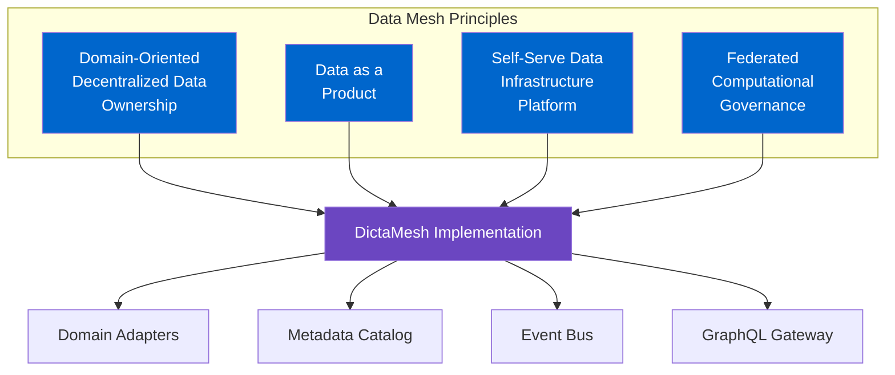
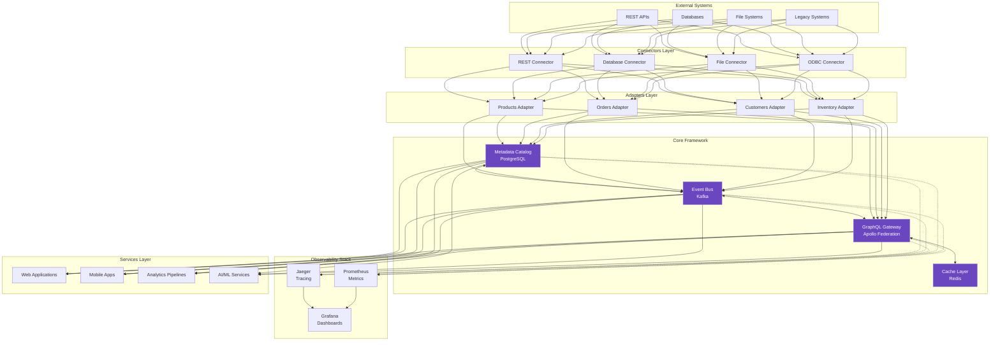
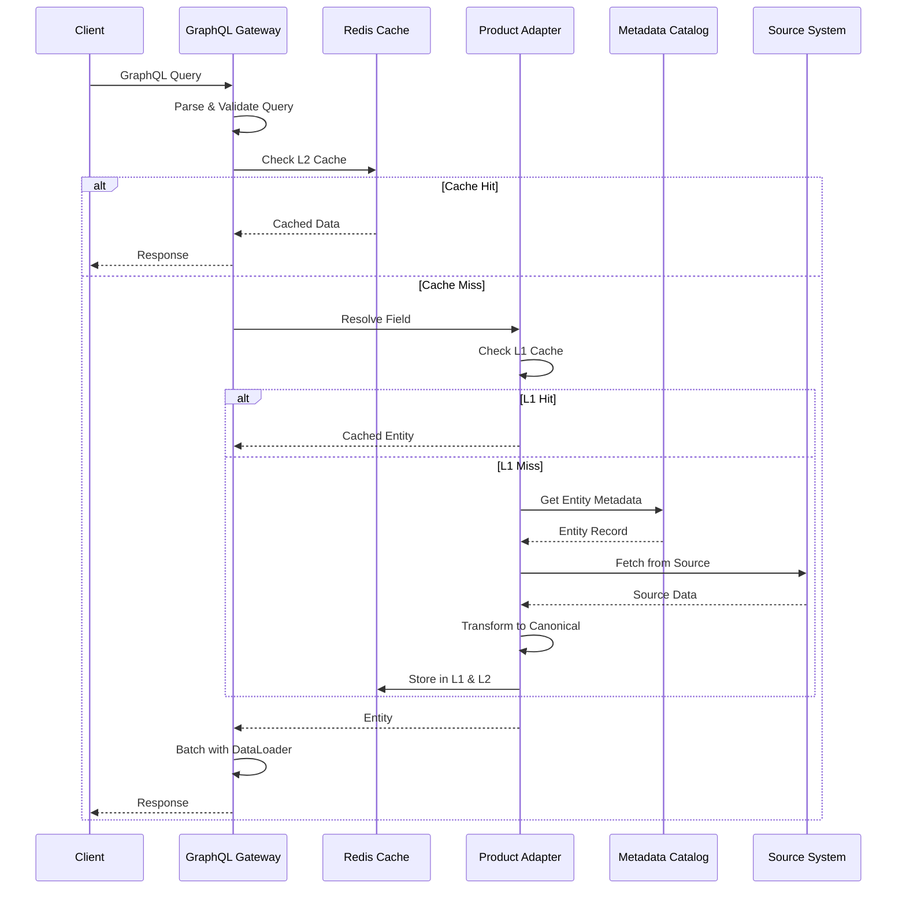
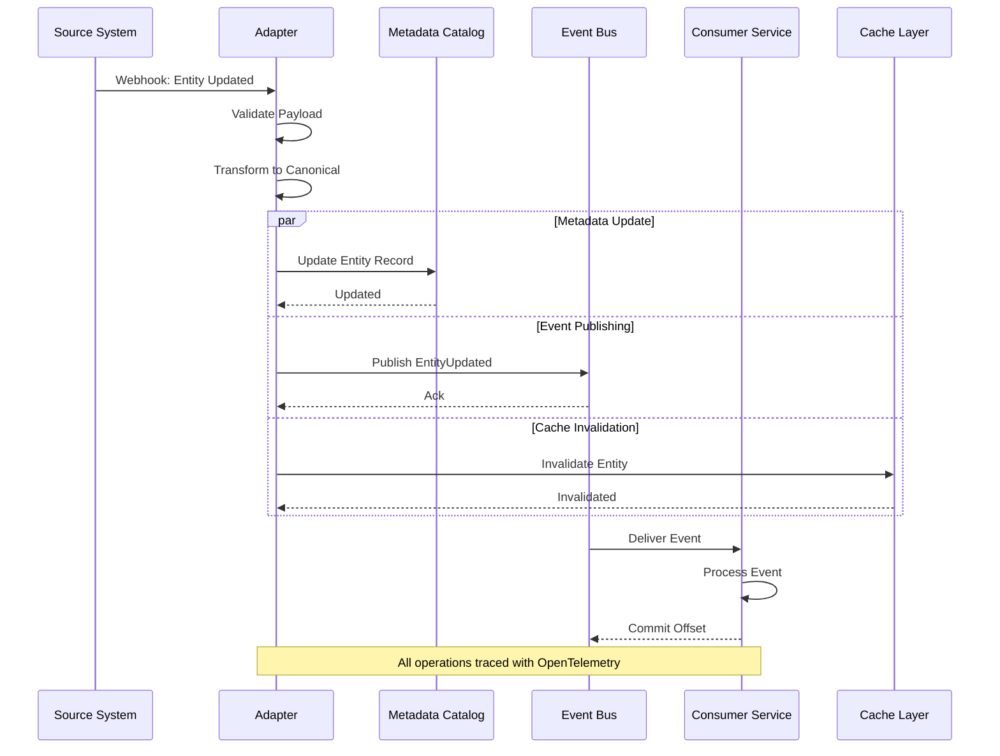
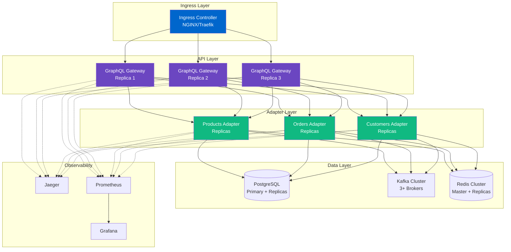
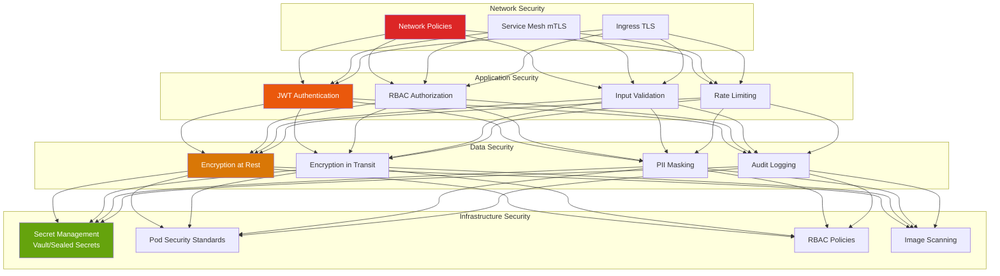

<!--
SPDX-License-Identifier: AGPL-3.0-or-later
Copyright (C) 2025 Controle Digital Ltda
-->

---
sidebar_position: 1
---

# Architecture Overview

DictaMesh is a production-grade data mesh adapter framework built on event-driven architecture principles. This document provides a comprehensive overview of the system architecture, design decisions, and the rationale behind key technical choices.

## Design Philosophy

### Data Mesh Principles

DictaMesh implements the four core data mesh principles:



1. **Domain-Oriented Decentralized Data Ownership**: Each team builds and maintains adapters for their domain
2. **Data as a Product**: Adapters expose SLAs, schemas, and quality metrics
3. **Self-Serve Data Infrastructure**: DictaMesh provides reusable components and patterns
4. **Federated Computational Governance**: Centralized policies with decentralized implementation

### Architectural Principles

**1. Event-Driven First**
- All state changes propagate through events
- Enables loose coupling and real-time synchronization
- Foundation for eventual consistency across domains

**2. Polyglot Persistence**
- PostgreSQL for structured metadata and relationships
- Kafka for event streaming and temporal queries
- Redis for multi-level caching
- Vector stores for semantic search

**3. Observability by Design**
- Distributed tracing with OpenTelemetry
- Prometheus metrics at every layer
- Structured logging for correlation
- Built-in profiling and debugging tools

**4. Resilience Patterns**
- Circuit breakers prevent cascade failures
- Exponential backoff for transient errors
- Rate limiting protects upstream systems
- Graceful degradation under load

**5. Schema-Driven Development**
- All events use versioned Avro schemas
- GraphQL schemas define API contracts
- JSON Schema validates configurations
- Backward compatibility enforced

## System Architecture

### High-Level Architecture



### Layer Responsibilities

#### 1. External Systems Layer
Source systems containing business data:
- SaaS applications with REST/GraphQL APIs
- Enterprise databases (PostgreSQL, MySQL, Oracle, MongoDB)
- File systems (S3, NFS, local storage)
- Legacy systems (SOAP, FTP, mainframes)

#### 2. Connectors Layer
Low-level protocol adapters:
- Handle authentication and connection management
- Implement retry and timeout logic
- Transform protocol-specific responses
- Provide consistent error handling

#### 3. Adapters Layer
Domain-specific business logic:
- Implement `DataProductAdapter` interface
- Transform source data to canonical models
- Validate data quality and completeness
- Publish events for state changes
- Register metadata in catalog
- Expose GraphQL subgraphs

#### 4. Core Framework Layer
Shared infrastructure services:
- **Metadata Catalog**: Entity registry, schema management, lineage tracking
- **Event Bus**: Event publishing, consumption, replay capabilities
- **GraphQL Gateway**: Schema federation, query routing, DataLoader batching
- **Cache Layer**: Multi-level caching (L1 in-memory, L2 Redis)

#### 5. Observability Stack
Production monitoring:
- **Distributed Tracing**: Request flows across adapters
- **Metrics Collection**: Performance and business metrics
- **Dashboards**: Real-time visibility and alerting

#### 6. Services Layer
Applications consuming the data mesh:
- Customer-facing web/mobile applications
- Internal analytics and reporting
- Data science and ML pipelines
- Workflow automation engines

## Data Flow Patterns

### Synchronous Query Flow



**Key Points**:
- Multi-level caching reduces latency and load
- DataLoader batches requests within 10ms window
- Circuit breakers prevent cascade failures
- Tracing spans track entire request path

### Asynchronous Event Flow



**Key Points**:
- Webhooks enable near-real-time updates
- Parallel operations (metadata, events, cache) improve throughput
- Kafka guarantees at-least-once delivery
- Consumers handle idempotency for exactly-once semantics

## Technology Stack

### Core Technologies

| Component | Technology | Rationale |
|-----------|-----------|-----------|
| **Language** | Go 1.21+ | Performance, concurrency, strong typing, excellent tooling |
| **Event Bus** | Apache Kafka 3.6+ | Industry standard, proven at scale, strong guarantees |
| **Metadata Store** | PostgreSQL 15+ | ACID transactions, JSONB support, full-text search, pgvector |
| **Cache** | Redis 7+ | High-performance, persistence options, pub/sub |
| **API Gateway** | Apollo Federation | GraphQL federation, automatic schema composition |
| **Schema Format** | Avro | Schema evolution, compact binary format, strong typing |
| **Tracing** | OpenTelemetry | Vendor-neutral, comprehensive instrumentation |
| **Metrics** | Prometheus | Pull-based, flexible queries, alerting |
| **Orchestration** | Kubernetes | Industry standard, declarative, self-healing |

### Go Package Architecture

```
dictamesh/
├── pkg/
│   ├── database/           # Metadata catalog implementation
│   │   ├── models/         # GORM models
│   │   ├── repository/     # Repository pattern
│   │   ├── migrations/     # Schema migrations
│   │   ├── cache/          # Cache integration
│   │   ├── audit/          # Audit logging
│   │   └── health/         # Health checks
│   │
│   ├── events/             # Event bus abstraction
│   │   ├── producer/       # Event publishing
│   │   ├── consumer/       # Event consumption
│   │   ├── schemas/        # Avro schemas
│   │   └── replay/         # Event replay
│   │
│   ├── graphql/            # GraphQL gateway
│   │   ├── federation/     # Apollo Federation setup
│   │   ├── dataloader/     # Batching and caching
│   │   ├── directives/     # Custom directives
│   │   └── middleware/     # Auth, logging, tracing
│   │
│   ├── connectors/         # Low-level connectors
│   │   ├── rest/           # REST API connector
│   │   ├── database/       # Database connector
│   │   ├── file/           # File system connector
│   │   └── legacy/         # Legacy system connectors
│   │
│   ├── adapter/            # Adapter framework
│   │   ├── interface.go    # DataProductAdapter interface
│   │   ├── base.go         # Base implementation
│   │   ├── lifecycle.go    # Lifecycle management
│   │   └── registry.go     # Adapter registration
│   │
│   ├── resilience/         # Resilience patterns
│   │   ├── circuitbreaker/ # Circuit breaker
│   │   ├── retry/          # Retry logic
│   │   ├── ratelimit/      # Rate limiting
│   │   └── timeout/        # Timeout handling
│   │
│   ├── observability/      # Observability
│   │   ├── tracing/        # OpenTelemetry tracing
│   │   ├── metrics/        # Prometheus metrics
│   │   └── logging/        # Structured logging
│   │
│   └── security/           # Security
│       ├── auth/           # Authentication
│       ├── authz/          # Authorization (RBAC)
│       └── encryption/     # Data encryption
│
├── examples/               # Reference implementations
│   ├── products-adapter/   # E-commerce products
│   ├── orders-adapter/     # Order management
│   └── inventory-adapter/  # Inventory tracking
│
└── deployments/            # Kubernetes manifests
    ├── helm/               # Helm charts
    ├── argocd/             # GitOps applications
    └── monitoring/         # Grafana dashboards
```

## Design Decisions and Trade-offs

### Why Go?

**Decision**: Use Go as the primary implementation language

**Rationale**:
- **Performance**: Native compilation, efficient concurrency with goroutines
- **Productivity**: Fast compilation, excellent tooling (gofmt, golint, go vet)
- **Concurrency**: Built-in concurrency primitives ideal for event-driven systems
- **Ecosystem**: Rich libraries for Kafka, gRPC, PostgreSQL, Redis
- **Deployment**: Single binary deployment simplifies operations

**Trade-offs**:
- ❌ Less expressive than languages with generics (pre-1.18)
- ❌ Verbose error handling
- ✅ Extremely fast execution and startup time
- ✅ Predictable memory usage and GC behavior

### Why PostgreSQL for Metadata?

**Decision**: Use PostgreSQL instead of NoSQL for metadata catalog

**Rationale**:
- **ACID Transactions**: Critical for maintaining consistency in entity relationships
- **JSONB**: Flexible schema while maintaining query performance
- **Full-Text Search**: Native support for entity discovery
- **pgvector**: Vector search for semantic entity matching
- **Mature Ecosystem**: Proven at scale with excellent tooling

**Trade-offs**:
- ❌ Vertical scaling limits (mitigated by read replicas)
- ❌ More complex sharding than NoSQL
- ✅ Strong consistency guarantees
- ✅ Complex queries with joins and aggregations
- ✅ Battle-tested reliability

### Why Kafka for Events?

**Decision**: Use Apache Kafka instead of other message queues

**Rationale**:
- **Event Sourcing**: Kafka's log-based architecture enables event replay
- **Scalability**: Horizontally scalable to millions of events per second
- **Durability**: Configurable replication and retention
- **Ecosystem**: Rich connector ecosystem, Kafka Streams, ksqlDB
- **Industry Standard**: Widely adopted with strong community

**Trade-offs**:
- ❌ Higher operational complexity than managed queues
- ❌ Requires ZooKeeper (or KRaft in newer versions)
- ✅ Event replay and time-travel queries
- ✅ Exactly-once semantics with transactions
- ✅ Massive throughput and horizontal scaling

### Why Apollo Federation?

**Decision**: Use Apollo Federation instead of schema stitching or monolithic GraphQL

**Rationale**:
- **Decentralized Schemas**: Each adapter owns its GraphQL schema
- **Type Extension**: Federate types across adapters (e.g., Product with Reviews)
- **Automatic Composition**: Gateway automatically merges subgraphs
- **Performance**: DataLoader batching prevents N+1 queries
- **Ecosystem**: Excellent tooling, documentation, community

**Trade-offs**:
- ❌ Requires @key directives and reference resolvers
- ❌ Gateway is a potential single point of failure (mitigated by replicas)
- ✅ Domain teams fully own their schemas
- ✅ No coordination needed for schema changes
- ✅ Excellent developer experience

## Deployment Architecture

### Kubernetes Deployment



**Key Features**:
- Horizontal scaling of all stateless components
- StatefulSets for Kafka and PostgreSQL
- Persistent volumes for data durability
- Service mesh (Istio/Linkerd) for mTLS and traffic management
- HPA (Horizontal Pod Autoscaler) based on CPU/memory/custom metrics

### High Availability Configuration

| Component | HA Strategy | RPO | RTO |
|-----------|-------------|-----|-----|
| **GraphQL Gateway** | 3+ replicas, load balanced | 0 (stateless) | < 1 min |
| **Adapters** | 2+ replicas per adapter | 0 (stateless) | < 1 min |
| **PostgreSQL** | Primary + 2 sync replicas | < 1 sec | < 5 min |
| **Kafka** | 3+ brokers, RF=3, min.isr=2 | < 1 sec | < 5 min |
| **Redis** | Sentinel with 3+ nodes | < 1 sec | < 2 min |

## Security Architecture

### Defense in Depth



## Performance Characteristics

### Throughput

- **GraphQL Queries**: 10,000+ queries/sec per gateway replica
- **Event Publishing**: 100,000+ events/sec per Kafka partition
- **Metadata Writes**: 5,000+ writes/sec to PostgreSQL
- **Cache Hits**: Sub-millisecond latency for L1, < 5ms for L2

### Latency (p99)

- **GraphQL Query (cached)**: < 10ms
- **GraphQL Query (uncached)**: < 100ms
- **Event Publishing**: < 50ms
- **Metadata Catalog Query**: < 20ms
- **Full Adapter Round-trip**: < 200ms

### Scalability Limits

- **Adapters**: 100+ adapters per cluster
- **Entities**: 100M+ entities in catalog
- **Events**: 10B+ events per day
- **Concurrent Queries**: 50,000+ concurrent requests

## Next Steps

Explore detailed architecture for each layer:

- **[Core Framework](./core-framework.md)** - Deep dive into metadata catalog, event bus, and GraphQL gateway internals
- **[Connectors](./connectors.md)** - Connector patterns and implementations for various data sources
- **[Adapters](./adapters.md)** - Adapter architecture, lifecycle, and best practices
- **[Services](./services.md)** - Building services that consume the data mesh
- **[Event-Driven Integration](./event-driven-integration.md)** - Event patterns, schemas, and processing
- **[Metadata Catalog](./metadata-catalog.md)** - Metadata model, querying, and lineage tracking

---

**Previous**: [← Core Concepts](../getting-started/core-concepts.md) | **Next**: [Core Framework →](./core-framework.md)
