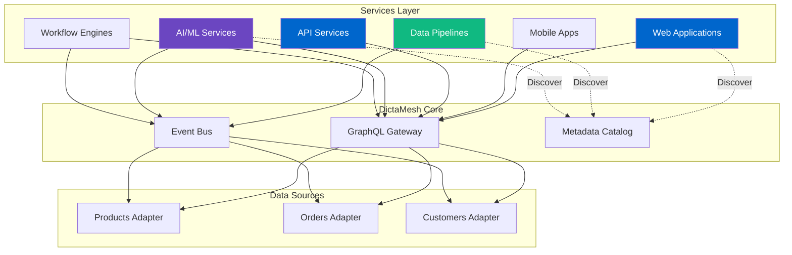

<!--
SPDX-License-Identifier: AGPL-3.0-or-later
Copyright (C) 2025 Controle Digital Ltda
-->

---
sidebar_position: 5
---

# Services Layer

The services layer represents applications and workloads that consume data from the DictaMesh data mesh. Services leverage the unified GraphQL API, event streams, and metadata catalog to build powerful data-driven applications.

## Services Architecture



## Service Types

### 1. API Services

REST or GraphQL APIs that aggregate data mesh entities for external consumption.

```go
// SPDX-License-Identifier: AGPL-3.0-or-later
// Copyright (C) 2025 Controle Digital Ltda

package apiservice

import (
    "context"
    "encoding/json"
    "net/http"

    "github.com/gorilla/mux"
    "go.opentelemetry.io/otel/trace"
)

type APIService struct {
    graphql    *graphql.Client
    catalog    repository.CatalogRepository
    cache      cache.Cache
    logger     *zap.Logger
    tracer     trace.Tracer
}

func NewAPIService(config *Config) *APIService {
    return &APIService{
        graphql: graphql.NewClient(config.GraphQLEndpoint),
        catalog: config.CatalogRepository,
        cache:   config.Cache,
        logger:  config.Logger,
        tracer:  config.Tracer,
    }
}

func (s *APIService) RegisterRoutes(r *mux.Router) {
    // Public API routes
    r.HandleFunc("/api/v1/products", s.ListProducts).Methods("GET")
    r.HandleFunc("/api/v1/products/{id}", s.GetProduct).Methods("GET")
    r.HandleFunc("/api/v1/search", s.Search).Methods("GET")

    // Aggregated endpoints
    r.HandleFunc("/api/v1/catalog", s.GetCatalog).Methods("GET")
    r.HandleFunc("/api/v1/recommendations", s.GetRecommendations).Methods("GET")
}

func (s *APIService) GetProduct(w http.ResponseWriter, r *http.Request) {
    ctx, span := s.tracer.Start(r.Context(), "api.GetProduct")
    defer span.End()

    vars := mux.Vars(r)
    id := vars["id"]

    // Check cache first
    cacheKey := "product:" + id
    if cached, ok := s.cache.Get(ctx, cacheKey); ok {
        s.respondJSON(w, http.StatusOK, cached)
        return
    }

    // Query GraphQL
    query := `
        query GetProduct($id: ID!) {
            product(id: $id) {
                id
                name
                description
                price
                currency
                sku
                category {
                    id
                    name
                }
                inventory {
                    quantity
                    warehouse
                }
                reviews {
                    rating
                    comment
                    author
                }
            }
        }
    `

    var response struct {
        Product *Product `json:"product"`
    }

    err := s.graphql.Query(ctx, query, map[string]interface{}{
        "id": id,
    }, &response)

    if err != nil {
        s.respondError(w, http.StatusInternalServerError, err)
        return
    }

    if response.Product == nil {
        s.respondError(w, http.StatusNotFound, fmt.Errorf("product not found"))
        return
    }

    // Cache result
    s.cache.Set(ctx, cacheKey, response.Product, 5*time.Minute)

    s.respondJSON(w, http.StatusOK, response.Product)
}

func (s *APIService) Search(w http.ResponseWriter, r *http.Request) {
    ctx, span := s.tracer.Start(r.Context(), "api.Search")
    defer span.End()

    query := r.URL.Query().Get("q")
    if query == "" {
        s.respondError(w, http.StatusBadRequest, fmt.Errorf("query parameter required"))
        return
    }

    // Search across multiple entity types using GraphQL
    gqlQuery := `
        query Search($query: String!) {
            products: searchProducts(query: $query, limit: 10) {
                edges {
                    node {
                        id
                        name
                        price
                    }
                }
            }
            categories: searchCategories(query: $query, limit: 5) {
                edges {
                    node {
                        id
                        name
                    }
                }
            }
        }
    `

    var response struct {
        Products   ProductConnection   `json:"products"`
        Categories CategoryConnection `json:"categories"`
    }

    err := s.graphql.Query(ctx, gqlQuery, map[string]interface{}{
        "query": query,
    }, &response)

    if err != nil {
        s.respondError(w, http.StatusInternalServerError, err)
        return
    }

    result := map[string]interface{}{
        "products":   response.Products.Edges,
        "categories": response.Categories.Edges,
    }

    s.respondJSON(w, http.StatusOK, result)
}

func (s *APIService) respondJSON(w http.ResponseWriter, status int, data interface{}) {
    w.Header().Set("Content-Type", "application/json")
    w.WriteHeader(status)
    json.NewEncoder(w).Encode(data)
}
```

### 2. Data Pipelines (ETL)

Event-driven data synchronization and transformation pipelines.

```go
package pipeline

type DataPipeline struct {
    consumer   *events.Consumer
    producer   *events.Producer
    catalog    repository.CatalogRepository
    warehouse  *warehouse.Client
    logger     *zap.Logger
}

func NewDataPipeline(config *Config) *DataPipeline {
    return &DataPipeline{
        consumer:  events.NewConsumer(config.KafkaConfig),
        producer:  events.NewProducer(config.KafkaConfig),
        catalog:   config.CatalogRepository,
        warehouse: warehouse.NewClient(config.WarehouseConfig),
        logger:    config.Logger,
    }
}

func (p *DataPipeline) Start(ctx context.Context) error {
    // Subscribe to entity events
    p.consumer.Subscribe("entity.created", p.handleEntityCreated)
    p.consumer.Subscribe("entity.updated", p.handleEntityUpdated)
    p.consumer.Subscribe("entity.deleted", p.handleEntityDeleted)

    // Start batch processor
    go p.batchProcessor(ctx)

    return p.consumer.Start(ctx)
}

func (p *DataPipeline) handleEntityCreated(ctx context.Context, event *events.Event) error {
    ctx, span := tracer.Start(ctx, "pipeline.EntityCreated")
    defer span.End()

    entityType := event.Payload["entity_type"].(string)
    entityData := event.Payload["data"].(map[string]interface{})

    // Transform for warehouse
    warehouseRecord := p.transformForWarehouse(entityType, entityData)

    // Load into warehouse
    err := p.warehouse.Insert(ctx, entityType, warehouseRecord)
    if err != nil {
        p.logger.Error("failed to insert into warehouse",
            zap.String("entity_type", entityType),
            zap.Error(err))
        return err
    }

    // Emit transformation event
    transformEvent := &events.Event{
        EventID:   uuid.New().String(),
        EventType: "data.transformed",
        Source:    "etl-pipeline",
        Timestamp: time.Now(),
        Payload: map[string]interface{}{
            "source_event_id": event.EventID,
            "entity_type":     entityType,
            "destination":     "warehouse",
        },
    }

    return p.producer.Publish(ctx, transformEvent)
}

func (p *DataPipeline) batchProcessor(ctx context.Context) {
    ticker := time.NewTicker(5 * time.Minute)
    defer ticker.Stop()

    batch := make([]*events.Event, 0, 1000)

    for {
        select {
        case <-ctx.Done():
            // Flush remaining batch
            if len(batch) > 0 {
                p.processBatch(ctx, batch)
            }
            return

        case <-ticker.C:
            // Process accumulated batch
            if len(batch) > 0 {
                p.processBatch(ctx, batch)
                batch = batch[:0] // Reset
            }
        }
    }
}

func (p *DataPipeline) processBatch(ctx context.Context, events []*events.Event) error {
    ctx, span := tracer.Start(ctx, "pipeline.ProcessBatch",
        trace.WithAttributes(
            attribute.Int("batch.size", len(events)),
        ))
    defer span.End()

    // Group by entity type
    byType := make(map[string][]*events.Event)
    for _, event := range events {
        entityType := event.Payload["entity_type"].(string)
        byType[entityType] = append(byType[entityType], event)
    }

    // Bulk load each type
    for entityType, typeEvents := range byType {
        records := make([]map[string]interface{}, len(typeEvents))
        for i, event := range typeEvents {
            records[i] = p.transformForWarehouse(entityType, event.Payload["data"].(map[string]interface{}))
        }

        err := p.warehouse.BulkInsert(ctx, entityType, records)
        if err != nil {
            p.logger.Error("bulk insert failed",
                zap.String("entity_type", entityType),
                zap.Int("count", len(records)),
                zap.Error(err))
            continue
        }

        p.logger.Info("batch processed",
            zap.String("entity_type", entityType),
            zap.Int("count", len(records)))
    }

    return nil
}
```

### 3. AI/ML Services

Machine learning services that consume data mesh for training and inference.

```go
package mlservice

type RecommendationService struct {
    graphql *graphql.Client
    model   *ml.Model
    cache   cache.Cache
    logger  *zap.Logger
}

func (s *RecommendationService) GetRecommendations(ctx context.Context, userID string, limit int) ([]*Product, error) {
    ctx, span := tracer.Start(ctx, "ml.GetRecommendations")
    defer span.End()

    // Check cache
    cacheKey := fmt.Sprintf("recommendations:%s:%d", userID, limit)
    if cached, ok := s.cache.Get(ctx, cacheKey); ok {
        return cached.([]*Product), nil
    }

    // Get user's purchase history via GraphQL
    query := `
        query UserHistory($userId: ID!) {
            user(id: $userId) {
                orders {
                    items {
                        product {
                            id
                            name
                            category {
                                id
                                name
                            }
                        }
                    }
                }
            }
        }
    `

    var response struct {
        User *User `json:"user"`
    }

    err := s.graphql.Query(ctx, query, map[string]interface{}{
        "userId": userID,
    }, &response)

    if err != nil {
        return nil, err
    }

    // Extract features for ML model
    features := s.extractFeatures(response.User)

    // Get recommendations from model
    scores, err := s.model.Predict(ctx, features)
    if err != nil {
        return nil, err
    }

    // Fetch top products
    productIDs := s.topNProductIDs(scores, limit)
    products, err := s.fetchProducts(ctx, productIDs)
    if err != nil {
        return nil, err
    }

    // Cache results
    s.cache.Set(ctx, cacheKey, products, 1*time.Hour)

    return products, nil
}

func (s *RecommendationService) TrainModel(ctx context.Context) error {
    ctx, span := tracer.Start(ctx, "ml.TrainModel")
    defer span.End()

    // Fetch training data from warehouse
    query := `
        SELECT
            u.user_id,
            p.product_id,
            p.category_id,
            COUNT(o.order_id) as purchase_count,
            AVG(r.rating) as avg_rating
        FROM users u
        JOIN orders o ON u.user_id = o.user_id
        JOIN order_items oi ON o.order_id = oi.order_id
        JOIN products p ON oi.product_id = p.product_id
        LEFT JOIN reviews r ON p.product_id = r.product_id
        GROUP BY u.user_id, p.product_id, p.category_id
    `

    rows, err := s.warehouse.Query(ctx, query)
    if err != nil {
        return err
    }
    defer rows.Close()

    // Build training dataset
    dataset := s.buildDataset(rows)

    // Train model
    err = s.model.Train(ctx, dataset)
    if err != nil {
        return err
    }

    // Evaluate model
    metrics := s.model.Evaluate(ctx, dataset.TestSet())
    s.logger.Info("model trained",
        zap.Float64("accuracy", metrics.Accuracy),
        zap.Float64("precision", metrics.Precision),
        zap.Float64("recall", metrics.Recall))

    // Save model
    return s.model.Save(ctx, "models/recommendations/latest")
}
```

### 4. Workflow Engines

Orchestrate complex business processes across multiple domains.

```go
package workflow

type WorkflowEngine struct {
    graphql  *graphql.Client
    events   *events.Producer
    executor *Executor
    logger   *zap.Logger
}

type Workflow struct {
    ID          string
    Name        string
    Steps       []Step
    Triggers    []Trigger
    ErrorPolicy ErrorPolicy
}

type Step struct {
    Name       string
    Type       StepType // "graphql", "event", "function"
    Config     map[string]interface{}
    DependsOn  []string
    Retry      *RetryPolicy
}

func (e *WorkflowEngine) ExecuteWorkflow(ctx context.Context, workflow *Workflow, input map[string]interface{}) error {
    ctx, span := tracer.Start(ctx, "workflow.Execute",
        trace.WithAttributes(
            attribute.String("workflow.id", workflow.ID),
            attribute.String("workflow.name", workflow.Name),
        ))
    defer span.End()

    execution := &Execution{
        ID:         uuid.New().String(),
        WorkflowID: workflow.ID,
        StartedAt:  time.Now(),
        Status:     "running",
        Input:      input,
        StepResults: make(map[string]interface{}),
    }

    // Execute steps in dependency order
    for _, step := range workflow.Steps {
        // Wait for dependencies
        if err := e.waitForDependencies(ctx, step, execution); err != nil {
            return e.handleError(ctx, workflow, execution, err)
        }

        // Execute step
        result, err := e.executeStep(ctx, step, execution)
        if err != nil {
            return e.handleError(ctx, workflow, execution, err)
        }

        execution.StepResults[step.Name] = result
    }

    execution.CompletedAt = time.Now()
    execution.Status = "completed"

    e.logger.Info("workflow completed",
        zap.String("workflow_id", workflow.ID),
        zap.String("execution_id", execution.ID),
        zap.Duration("duration", execution.CompletedAt.Sub(execution.StartedAt)))

    return nil
}

func (e *WorkflowEngine) executeStep(ctx context.Context, step Step, execution *Execution) (interface{}, error) {
    ctx, span := tracer.Start(ctx, "workflow.ExecuteStep",
        trace.WithAttributes(
            attribute.String("step.name", step.Name),
            attribute.String("step.type", string(step.Type)),
        ))
    defer span.End()

    switch step.Type {
    case "graphql":
        return e.executeGraphQLStep(ctx, step, execution)

    case "event":
        return e.executeEventStep(ctx, step, execution)

    case "function":
        return e.executeFunctionStep(ctx, step, execution)

    default:
        return nil, fmt.Errorf("unknown step type: %s", step.Type)
    }
}

func (e *WorkflowEngine) executeGraphQLStep(ctx context.Context, step Step, execution *Execution) (interface{}, error) {
    query := step.Config["query"].(string)
    variables := e.resolveVariables(step.Config["variables"], execution)

    var result interface{}
    err := e.graphql.Query(ctx, query, variables, &result)
    return result, err
}

// Example workflow: Order Fulfillment
func OrderFulfillmentWorkflow() *Workflow {
    return &Workflow{
        ID:   "order-fulfillment",
        Name: "Order Fulfillment Process",
        Steps: []Step{
            {
                Name: "validate_order",
                Type: "graphql",
                Config: map[string]interface{}{
                    "query": `
                        query ValidateOrder($orderId: ID!) {
                            order(id: $orderId) {
                                id
                                items {
                                    product {
                                        id
                                        inventory {
                                            quantity
                                        }
                                    }
                                    quantity
                                }
                            }
                        }
                    `,
                    "variables": map[string]string{
                        "orderId": "{{.input.order_id}}",
                    },
                },
            },
            {
                Name:      "reserve_inventory",
                Type:      "event",
                DependsOn: []string{"validate_order"},
                Config: map[string]interface{}{
                    "event_type": "inventory.reserve",
                    "payload": map[string]interface{}{
                        "order_id": "{{.input.order_id}}",
                        "items":    "{{.steps.validate_order.items}}",
                    },
                },
            },
            {
                Name:      "charge_payment",
                Type:      "function",
                DependsOn: []string{"reserve_inventory"},
                Config: map[string]interface{}{
                    "function": "payment.charge",
                    "args": map[string]interface{}{
                        "order_id": "{{.input.order_id}}",
                        "amount":   "{{.steps.validate_order.total}}",
                    },
                },
            },
            {
                Name:      "create_shipment",
                Type:      "event",
                DependsOn: []string{"charge_payment"},
                Config: map[string]interface{}{
                    "event_type": "shipment.create",
                    "payload": map[string]interface{}{
                        "order_id": "{{.input.order_id}}",
                    },
                },
            },
        },
        ErrorPolicy: ErrorPolicy{
            Retry: &RetryPolicy{
                MaxAttempts: 3,
                Backoff:     "exponential",
            },
            Compensate: true, // Rollback on failure
        },
    }
}
```

### 5. Real-Time Analytics

Stream processing for real-time metrics and dashboards.

```go
package analytics

type AnalyticsService struct {
    consumer  *events.Consumer
    timeseries *timeseries.Client
    aggregator *Aggregator
    logger    *zap.Logger
}

func (s *AnalyticsService) Start(ctx context.Context) error {
    // Subscribe to all entity events
    s.consumer.SubscribeBatch("entity.*", 1000, 10*time.Second,
        s.handleEventBatch)

    return s.consumer.Start(ctx)
}

func (s *AnalyticsService) handleEventBatch(ctx context.Context, events []*events.Event) error {
    ctx, span := tracer.Start(ctx, "analytics.HandleBatch",
        trace.WithAttributes(
            attribute.Int("batch.size", len(events)),
        ))
    defer span.End()

    // Group events by type and time window
    windows := s.aggregator.WindowEvents(events, 1*time.Minute)

    for window, windowEvents := range windows {
        metrics := s.computeMetrics(windowEvents)

        // Write to time series database
        for metric, value := range metrics {
            point := &timeseries.DataPoint{
                Metric:    metric,
                Value:     value,
                Timestamp: window,
                Tags: map[string]string{
                    "window": "1m",
                },
            }

            if err := s.timeseries.Write(ctx, point); err != nil {
                s.logger.Error("failed to write metric",
                    zap.String("metric", metric),
                    zap.Error(err))
            }
        }
    }

    return nil
}

func (s *AnalyticsService) computeMetrics(events []*events.Event) map[string]float64 {
    metrics := make(map[string]float64)

    // Count by event type
    eventTypeCounts := make(map[string]int)
    for _, event := range events {
        eventTypeCounts[event.EventType]++
    }

    for eventType, count := range eventTypeCounts {
        metrics[fmt.Sprintf("events.%s.count", eventType)] = float64(count)
    }

    // Entity-specific metrics
    for _, event := range events {
        if event.EventType == "entity.created" {
            entityType := event.Payload["entity_type"].(string)
            key := fmt.Sprintf("entities.%s.created", entityType)
            metrics[key]++
        }
    }

    return metrics
}

func (s *AnalyticsService) GetMetrics(ctx context.Context, query MetricsQuery) (*MetricsResponse, error) {
    points, err := s.timeseries.Query(ctx, &timeseries.Query{
        Metrics:   query.Metrics,
        StartTime: query.StartTime,
        EndTime:   query.EndTime,
        Aggregation: query.Aggregation,
    })

    if err != nil {
        return nil, err
    }

    return &MetricsResponse{
        DataPoints: points,
    }, nil
}
```

## Service Patterns

### 1. GraphQL Client Pattern

```go
package client

type GraphQLClient struct {
    endpoint string
    client   *http.Client
    logger   *zap.Logger
}

func (c *GraphQLClient) Query(ctx context.Context, query string,
    variables map[string]interface{}, result interface{}) error {

    ctx, span := tracer.Start(ctx, "graphql.Query")
    defer span.End()

    request := map[string]interface{}{
        "query":     query,
        "variables": variables,
    }

    body, err := json.Marshal(request)
    if err != nil {
        return err
    }

    req, err := http.NewRequestWithContext(ctx, "POST", c.endpoint, bytes.NewReader(body))
    if err != nil {
        return err
    }

    req.Header.Set("Content-Type", "application/json")

    resp, err := c.client.Do(req)
    if err != nil {
        return err
    }
    defer resp.Body.Close()

    var response struct {
        Data   json.RawMessage        `json:"data"`
        Errors []GraphQLError         `json:"errors"`
    }

    if err := json.NewDecoder(resp.Body).Decode(&response); err != nil {
        return err
    }

    if len(response.Errors) > 0 {
        return &GraphQLErrors{Errors: response.Errors}
    }

    return json.Unmarshal(response.Data, result)
}
```

### 2. Event Subscription Pattern

```go
type EventSubscriber struct {
    consumer *events.Consumer
    handlers map[string][]EventHandler
    mu       sync.RWMutex
}

func (s *EventSubscriber) Subscribe(pattern string, handler EventHandler) {
    s.mu.Lock()
    defer s.mu.Unlock()

    s.handlers[pattern] = append(s.handlers[pattern], handler)
}

func (s *EventSubscriber) Start(ctx context.Context) error {
    // Subscribe to all patterns
    for pattern := range s.handlers {
        s.consumer.Subscribe(pattern, s.routeEvent)
    }

    return s.consumer.Start(ctx)
}

func (s *EventSubscriber) routeEvent(ctx context.Context, event *events.Event) error {
    s.mu.RLock()
    defer s.mu.RUnlock()

    // Find matching handlers
    var handlers []EventHandler
    for pattern, patternHandlers := range s.handlers {
        if s.matchPattern(pattern, event.EventType) {
            handlers = append(handlers, patternHandlers...)
        }
    }

    // Execute handlers in parallel
    var wg sync.WaitGroup
    errChan := make(chan error, len(handlers))

    for _, handler := range handlers {
        wg.Add(1)
        go func(h EventHandler) {
            defer wg.Done()
            if err := h(ctx, event); err != nil {
                errChan <- err
            }
        }(handler)
    }

    wg.Wait()
    close(errChan)

    // Collect errors
    var errors []error
    for err := range errChan {
        errors = append(errors, err)
    }

    if len(errors) > 0 {
        return fmt.Errorf("handler errors: %v", errors)
    }

    return nil
}
```

### 3. Caching Pattern

```go
type CachingService struct {
    cache   cache.Cache
    backend Backend
    ttl     time.Duration
}

func (s *CachingService) Get(ctx context.Context, key string) (interface{}, error) {
    // Try cache first
    if cached, ok := s.cache.Get(ctx, key); ok {
        return cached, nil
    }

    // Fetch from backend
    value, err := s.backend.Get(ctx, key)
    if err != nil {
        return nil, err
    }

    // Cache result
    s.cache.Set(ctx, key, value, s.ttl)

    return value, nil
}

func (s *CachingService) Invalidate(ctx context.Context, keys ...string) error {
    for _, key := range keys {
        if err := s.cache.Delete(ctx, key); err != nil {
            return err
        }
    }
    return nil
}
```

## Service Discovery

```go
package discovery

type ServiceRegistry struct {
    catalog repository.CatalogRepository
    cache   cache.Cache
}

func (r *ServiceRegistry) Discover(ctx context.Context, criteria DiscoveryCriteria) ([]*Service, error) {
    // Query metadata catalog for adapters
    adapters, err := r.catalog.SearchAdapters(ctx, criteria)
    if err != nil {
        return nil, err
    }

    services := make([]*Service, len(adapters))
    for i, adapter := range adapters {
        services[i] = &Service{
            Name:        adapter.Name,
            Version:     adapter.Version,
            Endpoint:    adapter.GraphQLEndpoint,
            EntityTypes: adapter.EntityTypes,
            Capabilities: adapter.Capabilities,
        }
    }

    return services, nil
}

func (r *ServiceRegistry) GetSchema(ctx context.Context, entityType string) (*Schema, error) {
    cacheKey := "schema:" + entityType

    if cached, ok := r.cache.Get(ctx, cacheKey); ok {
        return cached.(*Schema), nil
    }

    schema, err := r.catalog.GetSchema(ctx, entityType, "latest")
    if err != nil {
        return nil, err
    }

    r.cache.Set(ctx, cacheKey, schema, 1*time.Hour)

    return schema, nil
}
```

## Testing Services

```go
package service_test

func TestAPIService_GetProduct(t *testing.T) {
    // Setup test server
    ts := httptest.NewServer(http.HandlerFunc(func(w http.ResponseWriter, r *http.Request) {
        // Mock GraphQL response
        response := map[string]interface{}{
            "data": map[string]interface{}{
                "product": map[string]interface{}{
                    "id":    "123",
                    "name":  "Test Product",
                    "price": 29.99,
                },
            },
        }
        json.NewEncoder(w).Encode(response)
    }))
    defer ts.Close()

    // Create service with mock client
    service := NewAPIService(&Config{
        GraphQLEndpoint: ts.URL,
        Cache:           cache.NewMockCache(),
    })

    // Test request
    req := httptest.NewRequest("GET", "/api/v1/products/123", nil)
    w := httptest.NewRecorder()

    service.GetProduct(w, req)

    // Assert response
    assert.Equal(t, http.StatusOK, w.Code)

    var product Product
    json.NewDecoder(w.Body).Decode(&product)
    assert.Equal(t, "123", product.ID)
    assert.Equal(t, "Test Product", product.Name)
}
```

## Best Practices

### 1. Use GraphQL for Complex Queries

GraphQL provides efficient data fetching across multiple adapters:

```go
// Good: Single GraphQL query
query := `
    query GetOrderDetails($orderId: ID!) {
        order(id: $orderId) {
            id
            customer {
                name
                email
            }
            items {
                product {
                    name
                    price
                }
                quantity
            }
            shipment {
                trackingNumber
                status
            }
        }
    }
`

// Bad: Multiple REST calls
customer := fetchCustomer(order.CustomerID)
for _, item := range order.Items {
    product := fetchProduct(item.ProductID)
}
shipment := fetchShipment(order.ShipmentID)
```

### 2. Implement Event-Driven Updates

React to changes in real-time:

```go
consumer.Subscribe("entity.updated.product", func(ctx context.Context, event *Event) error {
    productID := event.Payload["entity_id"].(string)

    // Invalidate cache
    cache.Delete(ctx, "product:"+productID)

    // Update search index
    searchIndex.Update(ctx, productID)

    // Notify websocket clients
    websocket.Broadcast("product.updated", productID)

    return nil
})
```

### 3. Cache Aggressively

Reduce load on adapters:

```go
// Layer caching
type CacheLayer struct {
    l1 *lru.Cache      // In-memory
    l2 *redis.Client   // Distributed
}

// TTL based on data volatility
func determineTTL(entityType string) time.Duration {
    switch entityType {
    case "product":
        return 5 * time.Minute  // Products change frequently
    case "category":
        return 1 * time.Hour    // Categories are stable
    case "user":
        return 30 * time.Minute // User data is moderately volatile
    default:
        return 5 * time.Minute
    }
}
```

### 4. Handle Failures Gracefully

Implement circuit breakers and fallbacks:

```go
func (s *Service) GetData(ctx context.Context, id string) (*Data, error) {
    // Try primary source
    data, err := s.circuitBreaker.Execute(func() (interface{}, error) {
        return s.graphql.Query(ctx, query, variables)
    })

    if err != nil {
        // Fallback to cache
        if cached, ok := s.cache.Get(ctx, "fallback:"+id); ok {
            return cached.(*Data), nil
        }

        // Return degraded response
        return s.getDegradedResponse(id), nil
    }

    return data.(*Data), nil
}
```

## Next Steps

- **[Event-Driven Integration](./event-driven-integration.md)** - Advanced event patterns
- **[Metadata Catalog](./metadata-catalog.md)** - Service discovery and metadata
- **[Building Adapters](../guides/building-adapters.md)** - Create adapters for services

---

**Previous**: [← Adapters](./adapters.md) | **Next**: [Event-Driven Integration →](./event-driven-integration.md)
