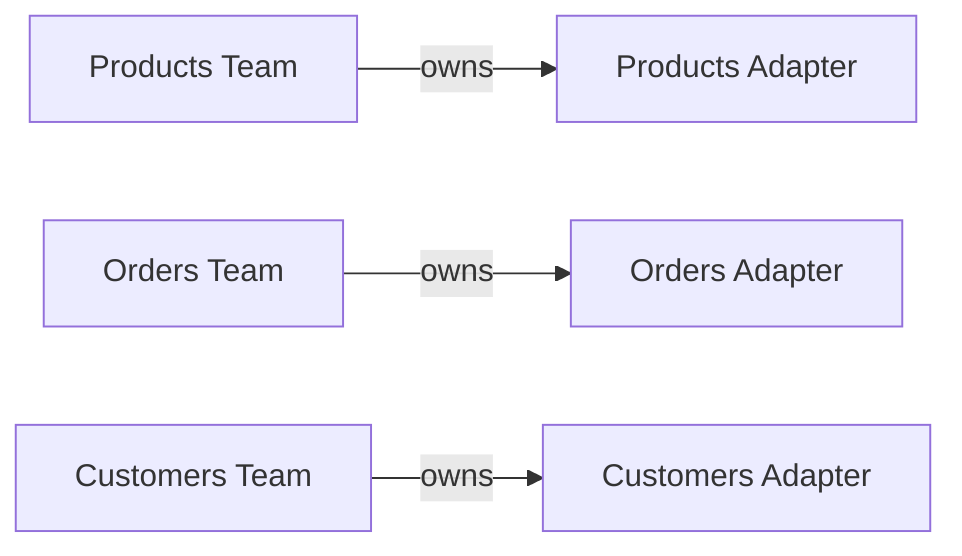
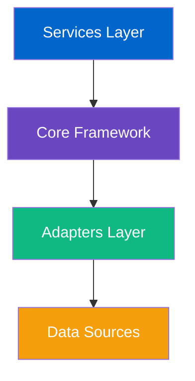
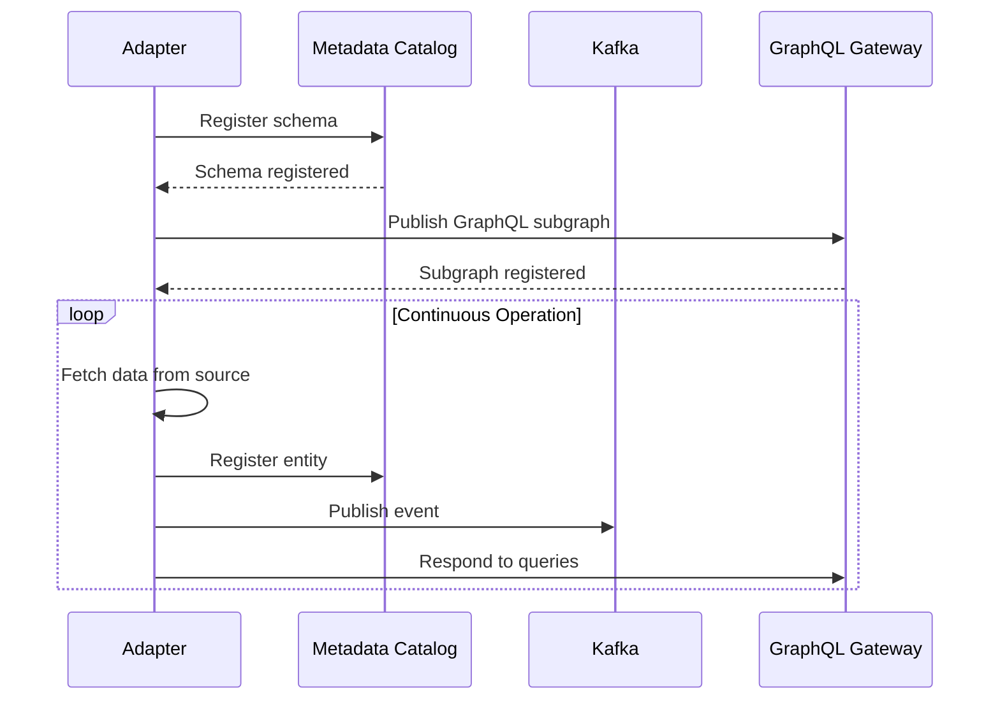
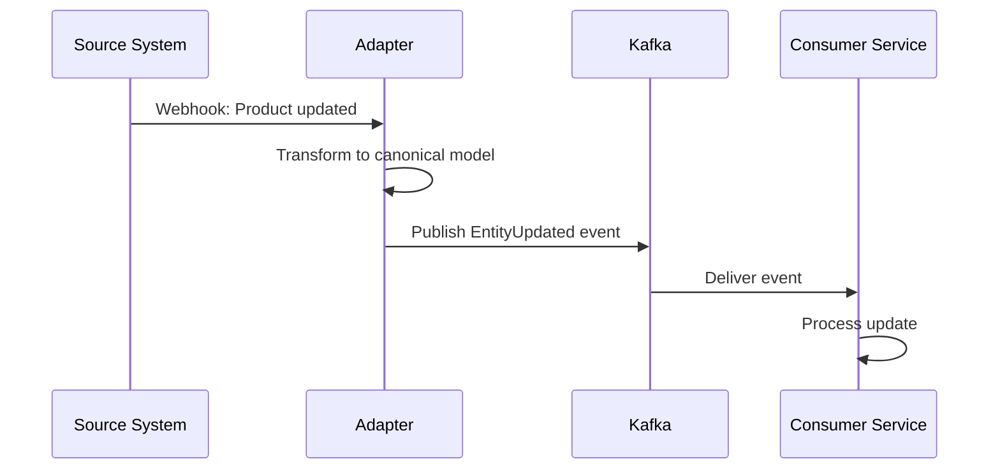

# Core Concepts

Understanding these core concepts will help you build effective data mesh integrations with DictaMesh.

## Data Mesh Principles

DictaMesh is built on data mesh principles:

### 1. Domain Ownership
Each team owns their domain's data products and adapters.



### 2. Data as a Product
Each adapter treats data as a product with SLAs, documentation, and quality guarantees.

### 3. Self-Serve Infrastructure
DictaMesh provides the platform - teams build their own adapters using standard interfaces.

### 4. Federated Governance
Centralized policies with decentralized implementation.

---

## Architecture Layers

DictaMesh has four conceptual layers:



### Layer 1: Data Sources
External systems you want to integrate:
- REST APIs
- Databases (PostgreSQL, MySQL, MongoDB)
- File systems
- Legacy systems

### Layer 2: Adapters
Your implementation that transforms source data to canonical models:
- Implements `DataProductAdapter` interface
- Handles authentication, pagination, error handling
- Publishes events and registers metadata

### Layer 3: Core Framework
DictaMesh infrastructure (provided):
- Metadata Catalog
- Event Bus
- GraphQL Gateway
- Observability Stack

### Layer 4: Services
Applications consuming the unified data mesh:
- Web applications
- Mobile apps
- Analytics pipelines
- AI/ML services

---

## Key Components

### Metadata Catalog

The metadata catalog is the central registry for all entities in your data mesh.

**Purpose**:
- Discover what data exists across all sources
- Track relationships between entities
- Store schemas and lineage
- Enable search and exploration

**Example**:
```json
{
  "entity_id": "prod-12345",
  "entity_type": "product",
  "source_adapter": "shopify-adapter",
  "schema_version": "1.0.0",
  "attributes": {
    "name": "Blue Widget",
    "price": 29.99,
    "category": "widgets"
  },
  "relationships": [
    {
      "type": "belongs_to",
      "target_entity": "cat-789",
      "target_type": "category"
    }
  ]
}
```

### Event Bus

Kafka-based event streaming for real-time data synchronization.

**Event Types**:
1. **EntityCreated** - New entity added
2. **EntityUpdated** - Existing entity modified
3. **EntityDeleted** - Entity removed
4. **RelationshipCreated** - New relationship established
5. **RelationshipDeleted** - Relationship removed

**Example Event**:
```json
{
  "event_id": "evt-abc123",
  "event_type": "entity.created",
  "timestamp": "2025-11-08T10:30:00Z",
  "source": "products-adapter",
  "payload": {
    "entity_id": "prod-12345",
    "entity_type": "product",
    "data": { ... }
  }
}
```

### GraphQL Gateway

Apollo Federation gateway that composes a unified API from all adapters.

**How it works**:
1. Each adapter exposes a GraphQL subgraph
2. Gateway automatically merges schemas
3. Queries can span multiple adapters
4. DataLoader batches requests for efficiency

**Example Query**:
```graphql
query GetProductWithReviews {
  # From products-adapter
  product(id: "prod-123") {
    id
    name
    price

    # From reviews-adapter (federated)
    reviews {
      rating
      comment
      author
    }

    # From inventory-adapter (federated)
    inventory {
      quantity
      warehouse
    }
  }
}
```

---

## Adapters

Adapters are the bridge between your data sources and DictaMesh.

### Adapter Interface

Every adapter implements this interface:

```go
type DataProductAdapter interface {
    // Fetch single entity
    GetEntity(ctx context.Context, id string) (*Entity, error)

    // List entities with pagination
    ListEntities(ctx context.Context, opts ListOptions) ([]*Entity, error)

    // Search entities
    SearchEntities(ctx context.Context, query SearchQuery) ([]*Entity, error)

    // Get adapter metadata
    GetSchema() Schema

    // Health check
    HealthCheck(ctx context.Context) error
}
```

### Adapter Lifecycle



### Example Adapter Structure

```
products-adapter/
├── cmd/server/main.go          # Entry point
├── internal/
│   ├── adapter/
│   │   └── adapter.go          # Implements DataProductAdapter
│   ├── client/
│   │   └── client.go           # Source system client
│   ├── transformer/
│   │   └── transformer.go      # Data transformation
│   └── graphql/
│       ├── schema.graphql      # GraphQL schema
│       └── resolvers.go        # GraphQL resolvers
├── go.mod
└── Dockerfile
```

---

## Events and Streaming

### Event-Driven Integration

DictaMesh uses events for real-time data synchronization:



### Event Schema (Avro)

Events use Avro schemas for type safety:

```json
{
  "type": "record",
  "name": "EntityCreated",
  "namespace": "com.dictamesh.events",
  "fields": [
    {"name": "event_id", "type": "string"},
    {"name": "entity_id", "type": "string"},
    {"name": "entity_type", "type": "string"},
    {"name": "timestamp", "type": "long", "logicalType": "timestamp-millis"},
    {"name": "source_adapter", "type": "string"},
    {"name": "data", "type": "string"}
  ]
}
```

### Consumer Patterns

DictaMesh provides consumer utilities:

```go
// Simple consumer
consumer := events.NewConsumer(config)
consumer.Subscribe("entity.created", func(event *Event) error {
    log.Printf("New entity: %s", event.EntityID)
    return nil
})

// Batch consumer
consumer.SubscribeBatch("entity.*", 100, 5*time.Second,
    func(events []*Event) error {
        // Process batch
        return nil
    })
```

---

## Resilience Patterns

### Circuit Breaker

Prevents cascading failures when source systems are down:

```go
breaker := resilience.NewCircuitBreaker(
    resilience.WithFailureThreshold(5),
    resilience.WithSuccessThreshold(2),
    resilience.WithTimeout(30*time.Second),
)

result, err := breaker.Execute(func() (interface{}, error) {
    return client.GetProduct(ctx, id)
})
```

States:
- **Closed**: Normal operation
- **Open**: Too many failures, reject requests
- **Half-Open**: Test if source recovered

### Retry Logic

Exponential backoff for transient failures:

```go
retry := resilience.NewRetry(
    resilience.WithMaxAttempts(3),
    resilience.WithBackoff(retry.ExponentialBackoff),
)

err := retry.Do(func() error {
    return client.UpdateProduct(ctx, product)
})
```

### Rate Limiting

Respect source system rate limits:

```go
limiter := resilience.NewRateLimiter(
    resilience.WithRate(100),          // 100 requests
    resilience.WithInterval(time.Minute), // per minute
)

if limiter.Allow() {
    client.GetProduct(ctx, id)
} else {
    return ErrRateLimitExceeded
}
```

---

## Caching Strategy

### Multi-Level Cache

DictaMesh uses L1 (in-memory) and L2 (Redis) caching:

```go
cache := cache.NewMultiLevel(
    cache.NewL1(1000),           // 1000 items in memory
    cache.NewL2(redisClient),    // Redis for L2
)

// Get with cache
entity, err := cache.GetOrFetch(ctx, "product:123", 5*time.Minute,
    func() (interface{}, error) {
        return adapter.GetEntity(ctx, "123")
    })
```

### Cache Invalidation

Events trigger cache invalidation:

```go
// Listen for update events
consumer.Subscribe("entity.updated", func(event *Event) error {
    cache.Delete(ctx, "product:"+event.EntityID)
    return nil
})
```

---

## Observability

### Distributed Tracing

OpenTelemetry tracing across all components:

```go
ctx, span := tracer.Start(ctx, "adapter.GetEntity")
defer span.End()

span.SetAttributes(
    attribute.String("entity.id", id),
    attribute.String("entity.type", "product"),
)

entity, err := client.GetProduct(ctx, id)
if err != nil {
    span.RecordError(err)
    span.SetStatus(codes.Error, err.Error())
}
```

### Metrics

Prometheus metrics for monitoring:

```go
// Counter
requestsTotal.WithLabelValues("adapter", "get_entity").Inc()

// Histogram
requestDuration.WithLabelValues("adapter", "get_entity").Observe(duration)

// Gauge
cacheSize.Set(float64(cache.Len()))
```

### Structured Logging

Consistent logging format:

```go
log.Info("Entity fetched",
    "entity_id", id,
    "entity_type", "product",
    "duration_ms", duration.Milliseconds(),
    "cache_hit", cacheHit,
)
```

---

## Security and Governance

### Authentication

Adapters handle authentication to source systems:

```go
// OAuth 2.0
auth := oauth.NewClient(clientID, clientSecret)
token, err := auth.GetToken(ctx)

// API Key
client := api.NewClient(
    api.WithAPIKey(apiKey),
)

// JWT
client := api.NewClient(
    api.WithJWT(jwtToken),
)
```

### Access Control

Role-based access control (RBAC):

```yaml
policies:
  - role: data-analyst
    permissions:
      - resource: entity:product
        actions: [read, search]

  - role: data-engineer
    permissions:
      - resource: entity:*
        actions: [read, write, delete]
```

### PII Handling

Mark sensitive fields:

```go
schema := Schema{
    Entity: "customer",
    Fields: []Field{
        {Name: "id", Type: "uuid"},
        {Name: "email", Type: "string", PII: true},
        {Name: "name", Type: "string", PII: true},
        {Name: "phone", Type: "string", PII: true, Encrypted: true},
    },
}
```

---

## Best Practices

### 1. Design for Failure
- Always use circuit breakers
- Implement retry logic
- Have fallback strategies

### 2. Cache Wisely
- Cache frequently accessed data
- Set appropriate TTLs
- Invalidate on updates

### 3. Emit Events
- Publish events for all changes
- Use structured event schemas
- Include metadata (timestamps, source)

### 4. Monitor Everything
- Add tracing to critical paths
- Collect metrics for SLAs
- Log structured data

### 5. Version Schemas
- Use semantic versioning
- Support multiple versions
- Plan migration paths

---

## Next Steps

- 🏗️ Build your first adapter: [Building Adapters Guide](../guides/building-adapters.md)
- 🏛️ Understand the architecture: [Architecture Overview](../architecture/overview.md)
- 📚 Explore API reference: [API Reference](../api-reference/rest-api.md)

---

**Previous**: [← Installation](./installation.md) | **Next**: [Building Adapters →](../guides/building-adapters.md)
