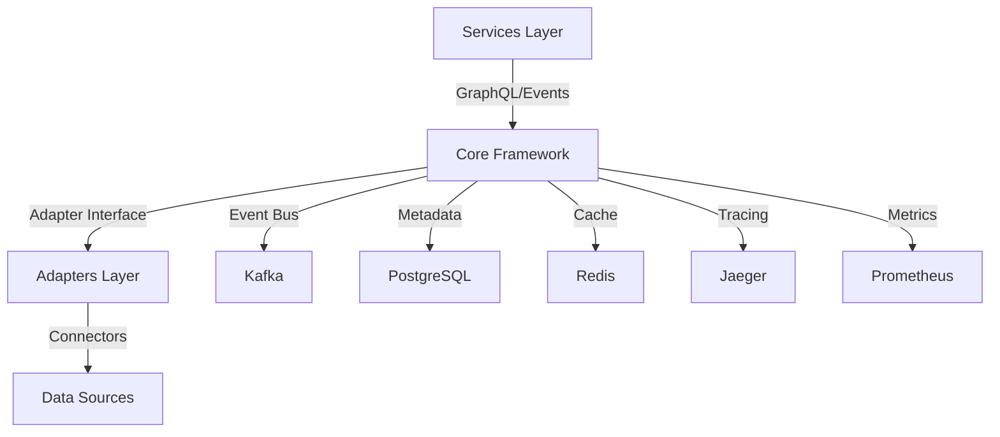

# Introduction to DictaMesh

Welcome to DictaMesh - the enterprise-grade data mesh adapter framework that provides the foundation for building federated data integrations.

## What is DictaMesh?

DictaMesh is a **comprehensive framework** that provides the foundational infrastructure for building data mesh adapters. It enables developers to integrate any type of data source (APIs, SDKs, databases, file systems) into a unified, event-driven data mesh architecture.

### This is NOT

❌ A specific implementation for particular systems (like specific CMS, e-commerce platforms, etc.)
❌ A pre-built integration tool for specific platforms
❌ A ready-to-run product for a specific use case

### This IS

✅ A **framework** that developers use to build their own data mesh integrations
✅ A set of **core components** (metadata catalog, event bus, GraphQL gateway)
✅ **Standard interfaces** and patterns for building adapters
✅ **Built-in observability, governance, and resilience** features
✅ **Example reference implementations** showing how to use the framework

## Core Components

DictaMesh provides four foundational layers:

### 1. Core Framework
The heart of DictaMesh - providing:
- **Adapter Interface** - Standard contract for all adapters
- **Event Bus** - Kafka integration with topic management
- **Metadata Catalog** - PostgreSQL-based entity registry
- **GraphQL Gateway** - Apollo Federation engine
- **Observability** - OpenTelemetry tracing, Prometheus metrics
- **Governance** - Access control, PII tracking, compliance
- **Resilience** - Circuit breakers, retry policies, rate limiters

### 2. Connectors
Low-level drivers for different data source types:
- Database connectors (PostgreSQL, MySQL, MongoDB, Oracle)
- API connectors (REST, GraphQL, gRPC, SOAP, OpenAPI 3.0)
- File system connectors (CSV, JSON, XML, Parquet)
- Message queue connectors (RabbitMQ, Redis, SQS)
- Legacy system connectors (ODBC, JDBC, FTP)

### 3. Adapters
Domain-specific implementations that use connectors:
- Implement DataProductAdapter interface
- Transform data to canonical models
- Handle business logic and validation
- Publish events and manage metadata

### 4. Services
Higher-level applications consuming the data mesh:
- API services (REST/GraphQL endpoints)
- Data pipelines (ETL, synchronization)
- Workflow engines (business processes)
- AI/ML services (recommendations, analytics)

## Key Features

### Event-Driven Integration
Built on Apache Kafka with:
- Structured event schemas (Avro)
- Automatic topic management
- Consumer patterns and utilities
- Real-time data propagation

### Federated GraphQL API
Apollo Federation provides:
- Unified API across all data sources
- Automatic schema composition
- Intelligent query batching (DataLoader)
- Cross-domain entity resolution

### Metadata Catalog
Centralized registry with:
- Entity discovery and search
- Relationship tracking
- Schema management
- Data lineage
- Audit trail

### Production-Ready Patterns
Out-of-the-box resilience:
- Adaptive circuit breakers
- Exponential backoff retries
- Rate limiting
- Multi-level caching (L1/L2)
- Graceful degradation

### Comprehensive Observability
Full visibility with:
- Distributed tracing (OpenTelemetry)
- Metrics collection (Prometheus)
- Structured logging
- Performance profiling
- Real-time monitoring

## Architecture Overview

## Why DictaMesh?

### For Organizations
- **Unified Data Access**: Single API across all your data sources
- **Decentralized Ownership**: Each team owns their domain's data
- **Event-Driven**: Real-time data synchronization
- **Governance**: Built-in compliance and audit trails
- **Scalable**: Battle-tested patterns for enterprise scale

### For Developers
- **Standard Interface**: Consistent patterns across all adapters
- **Quick Start**: Scaffold new adapters in minutes
- **Built-in Best Practices**: Resilience, observability, testing
- **Extensible**: Plugin system for custom functionality
- **Well Documented**: Comprehensive guides and API references

### For DevOps
- **Kubernetes Native**: Helm charts and manifests included
- **GitOps Ready**: ArgoCD application definitions
- **Observable**: Grafana dashboards and alert rules
- **Resilient**: Self-healing with health checks and auto-restart
- **Secure**: RBAC, network policies, secret management

## Getting Started

Ready to build your first adapter? Check out our [Quick Start Guide](./quickstart.md) to get up and running in minutes.

Or explore:
- [Installation Guide](./installation.md) - Set up DictaMesh infrastructure
- [Core Concepts](./core-concepts.md) - Understand key concepts
- [Architecture](../architecture/overview.md) - Deep dive into architecture
- [Building Adapters](../guides/building-adapters.md) - Create your first adapter

## License

DictaMesh is licensed under the **GNU Affero General Public License v3.0 or later (AGPL-3.0-or-later)**.

This means:
- ✅ Commercial use is permitted
- ✅ Modification and distribution allowed
- ⚠️ If you modify and provide as a network service, you must make source code available
- ⚠️ Must disclose source and use same license

See the [LICENSE](https://github.com/dictamesh/dictamesh/blob/main/LICENSE) file for complete terms.

## Community & Support

- 📖 [Documentation](https://docs.dictamesh.com)
- 💬 [GitHub Discussions](https://github.com/dictamesh/dictamesh/discussions)
- 🐛 [Issue Tracker](https://github.com/dictamesh/dictamesh/issues)
- 🤝 [Contributing Guide](../contributing/contributing.md)

---

**Next**: [Quick Start Guide](./quickstart.md) →
