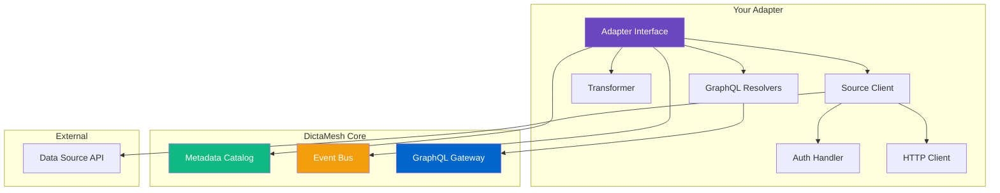

<!--
SPDX-License-Identifier: AGPL-3.0-or-later
Copyright (C) 2025 Controle Digital Ltda
-->

---
sidebar_position: 1
---

# Building Custom Adapters

Learn how to build production-ready data mesh adapters that integrate any data source into the DictaMesh ecosystem.

## Overview

An adapter is a bridge between your data source and DictaMesh. It implements the `DataProductAdapter` interface to provide standardized access to entities while handling source-specific concerns like authentication, pagination, and data transformation.

### What You'll Build

By the end of this guide, you'll have:
- ✅ A fully functional adapter implementation
- ✅ GraphQL schema and resolvers
- ✅ Event publishing integration
- ✅ Metadata catalog registration
- ✅ Resilience patterns (circuit breakers, retries)
- ✅ Comprehensive observability
- ✅ Production-ready deployment manifests

## Architecture



## Prerequisites

Before you start, ensure you have:
- Go 1.21 or later
- Docker and Docker Compose
- Access to your data source (API keys, credentials)
- Basic understanding of GraphQL and Kafka

## Project Structure

Create a new adapter project with this structure:

```
my-adapter/
├── cmd/
│   └── server/
│       └── main.go              # Entry point
├── internal/
│   ├── adapter/
│   │   ├── adapter.go           # Core adapter implementation
│   │   └── config.go            # Configuration
│   ├── client/
│   │   ├── client.go            # Data source client
│   │   └── auth.go              # Authentication
│   ├── models/
│   │   ├── entity.go            # Domain models
│   │   └── transformers.go     # Data transformations
│   └── graphql/
│       ├── schema.graphql       # GraphQL schema
│       ├── resolvers.go         # Resolvers
│       └── dataloaders.go       # DataLoader patterns
├── deployments/
│   ├── docker-compose.yml       # Local development
│   └── kubernetes/              # K8s manifests
├── go.mod
├── go.sum
├── Dockerfile
└── README.md
```

## Step 1: Define the Adapter Interface

First, implement the `DataProductAdapter` interface:

```go
// SPDX-License-Identifier: AGPL-3.0-or-later
// Copyright (C) 2025 Controle Digital Ltda

package adapter

import (
    "context"
    "fmt"

    "github.com/click2-run/dictamesh/pkg/core"
)

// ProductAdapter implements the DataProductAdapter interface
type ProductAdapter struct {
    client    *client.Client
    catalog   *catalog.Client
    events    *events.Publisher
    cache     cache.Cache
    logger    *logger.Logger
    metrics   *metrics.Collector
}

// NewProductAdapter creates a new adapter instance
func NewProductAdapter(cfg *Config) (*ProductAdapter, error) {
    client, err := client.New(cfg.SourceURL, cfg.APIKey)
    if err != nil {
        return nil, fmt.Errorf("failed to create client: %w", err)
    }

    return &ProductAdapter{
        client:  client,
        catalog: catalog.NewClient(cfg.CatalogURL),
        events:  events.NewPublisher(cfg.KafkaConfig),
        cache:   cache.NewMultiLevel(cfg.CacheConfig),
        logger:  logger.New("product-adapter"),
        metrics: metrics.NewCollector("product_adapter"),
    }, nil
}

// GetEntity fetches a single entity by ID
func (a *ProductAdapter) GetEntity(ctx context.Context, id string) (*core.Entity, error) {
    ctx, span := tracer.Start(ctx, "adapter.GetEntity")
    defer span.End()

    span.SetAttributes(
        attribute.String("entity.id", id),
        attribute.String("entity.type", "product"),
    )

    // Try cache first
    if cached, err := a.cache.Get(ctx, cacheKey(id)); err == nil {
        a.metrics.CacheHit("get_entity")
        return cached.(*core.Entity), nil
    }
    a.metrics.CacheMiss("get_entity")

    // Fetch from source with circuit breaker
    product, err := a.client.GetProduct(ctx, id)
    if err != nil {
        span.RecordError(err)
        return nil, fmt.Errorf("failed to fetch product: %w", err)
    }

    // Transform to canonical entity
    entity := a.transform(product)

    // Cache the result
    a.cache.Set(ctx, cacheKey(id), entity, 5*time.Minute)

    // Register in catalog
    if err := a.catalog.Register(ctx, entity); err != nil {
        a.logger.Warn("Failed to register entity", "error", err)
    }

    return entity, nil
}

// ListEntities lists entities with pagination
func (a *ProductAdapter) ListEntities(ctx context.Context, opts core.ListOptions) ([]*core.Entity, error) {
    ctx, span := tracer.Start(ctx, "adapter.ListEntities")
    defer span.End()

    products, err := a.client.ListProducts(ctx, &client.ListOptions{
        Limit:  opts.Limit,
        Offset: opts.Offset,
        Filters: opts.Filters,
    })
    if err != nil {
        return nil, fmt.Errorf("failed to list products: %w", err)
    }

    entities := make([]*core.Entity, len(products))
    for i, product := range products {
        entities[i] = a.transform(product)
    }

    return entities, nil
}

// SearchEntities searches entities using filters
func (a *ProductAdapter) SearchEntities(ctx context.Context, query core.SearchQuery) ([]*core.Entity, error) {
    ctx, span := tracer.Start(ctx, "adapter.SearchEntities")
    defer span.End()

    products, err := a.client.SearchProducts(ctx, query.Term, query.Filters)
    if err != nil {
        return nil, fmt.Errorf("failed to search products: %w", err)
    }

    entities := make([]*core.Entity, len(products))
    for i, product := range products {
        entities[i] = a.transform(product)
    }

    return entities, nil
}

// GetSchema returns the adapter's schema definition
func (a *ProductAdapter) GetSchema() core.Schema {
    return core.Schema{
        EntityType: "product",
        Version:    "1.0.0",
        Fields: []core.Field{
            {Name: "id", Type: "uuid", Required: true},
            {Name: "name", Type: "string", Required: true},
            {Name: "description", Type: "string"},
            {Name: "price", Type: "decimal", Required: true},
            {Name: "currency", Type: "string", Required: true},
            {Name: "sku", Type: "string", Indexed: true},
            {Name: "category_id", Type: "uuid"},
            {Name: "in_stock", Type: "boolean"},
            {Name: "created_at", Type: "timestamp"},
            {Name: "updated_at", Type: "timestamp"},
        },
        Relationships: []core.Relationship{
            {
                Type:        "belongs_to",
                Target:      "category",
                Cardinality: "many_to_one",
            },
            {
                Type:        "has_many",
                Target:      "review",
                Cardinality: "one_to_many",
            },
        },
    }
}

// HealthCheck verifies adapter health
func (a *ProductAdapter) HealthCheck(ctx context.Context) error {
    return a.client.Ping(ctx)
}

// transform converts source product to canonical entity
func (a *ProductAdapter) transform(product *models.Product) *core.Entity {
    return &core.Entity{
        ID:           product.ID,
        Type:         "product",
        SourceSystem: "ecommerce-api",
        SourceID:     product.ID,
        Attributes: map[string]interface{}{
            "name":        product.Name,
            "description": product.Description,
            "price":       product.Price,
            "currency":    product.Currency,
            "sku":         product.SKU,
            "category_id": product.CategoryID,
            "in_stock":    product.Inventory > 0,
            "created_at":  product.CreatedAt,
            "updated_at":  product.UpdatedAt,
        },
        Metadata: core.EntityMetadata{
            SchemaVersion: "1.0.0",
            LastSeen:      time.Now(),
            SLA: &core.SLAMetrics{
                Availability:   0.999,
                LatencyP99Ms:   100,
                FreshnessMins:  5,
            },
        },
    }
}

func cacheKey(id string) string {
    return fmt.Sprintf("product:%s", id)
}
```

## Step 2: Implement the Source Client

Create a client for your data source with resilience patterns:

```go
// SPDX-License-Identifier: AGPL-3.0-or-later
// Copyright (C) 2025 Controle Digital Ltda

package client

import (
    "context"
    "fmt"
    "net/http"
    "time"

    "github.com/click2-run/dictamesh/pkg/resilience"
)

// Client wraps the data source API
type Client struct {
    baseURL      string
    httpClient   *http.Client
    auth         *AuthHandler
    breaker      *resilience.CircuitBreaker
    retry        *resilience.RetryPolicy
    limiter      *resilience.RateLimiter
}

// New creates a new source client
func New(baseURL, apiKey string) (*Client, error) {
    breaker := resilience.NewCircuitBreaker(
        resilience.WithFailureThreshold(5),
        resilience.WithSuccessThreshold(2),
        resilience.WithTimeout(30 * time.Second),
    )

    retry := resilience.NewRetry(
        resilience.WithMaxAttempts(3),
        resilience.WithBackoff(resilience.ExponentialBackoff),
        resilience.WithRetryableErrors(
            resilience.ErrTimeout,
            resilience.ErrServiceUnavailable,
        ),
    )

    limiter := resilience.NewRateLimiter(
        resilience.WithRate(100),
        resilience.WithInterval(time.Minute),
    )

    return &Client{
        baseURL: baseURL,
        httpClient: &http.Client{
            Timeout: 30 * time.Second,
        },
        auth:    NewAuthHandler(apiKey),
        breaker: breaker,
        retry:   retry,
        limiter: limiter,
    }, nil
}

// GetProduct fetches a single product
func (c *Client) GetProduct(ctx context.Context, id string) (*Product, error) {
    if !c.limiter.Allow() {
        return nil, fmt.Errorf("rate limit exceeded")
    }

    var product *Product

    // Execute with circuit breaker
    result, err := c.breaker.Execute(func() (interface{}, error) {
        // Execute with retry
        return c.retry.Do(func() (interface{}, error) {
            req, err := c.newRequest(ctx, "GET", fmt.Sprintf("/products/%s", id), nil)
            if err != nil {
                return nil, err
            }

            var p Product
            if err := c.do(req, &p); err != nil {
                return nil, err
            }

            return &p, nil
        })
    })

    if err != nil {
        return nil, err
    }

    product = result.(*Product)
    return product, nil
}

// ListProducts lists products with pagination
func (c *Client) ListProducts(ctx context.Context, opts *ListOptions) ([]*Product, error) {
    if !c.limiter.Allow() {
        return nil, fmt.Errorf("rate limit exceeded")
    }

    url := fmt.Sprintf("/products?limit=%d&offset=%d", opts.Limit, opts.Offset)

    var response struct {
        Products []*Product `json:"products"`
        Total    int        `json:"total"`
    }

    result, err := c.breaker.Execute(func() (interface{}, error) {
        req, err := c.newRequest(ctx, "GET", url, nil)
        if err != nil {
            return nil, err
        }

        if err := c.do(req, &response); err != nil {
            return nil, err
        }

        return response.Products, nil
    })

    if err != nil {
        return nil, err
    }

    return result.([]*Product), nil
}

// Ping checks if the source is reachable
func (c *Client) Ping(ctx context.Context) error {
    req, err := c.newRequest(ctx, "GET", "/health", nil)
    if err != nil {
        return err
    }

    return c.do(req, nil)
}

func (c *Client) newRequest(ctx context.Context, method, path string, body interface{}) (*http.Request, error) {
    url := c.baseURL + path

    req, err := http.NewRequestWithContext(ctx, method, url, nil)
    if err != nil {
        return nil, err
    }

    // Add authentication
    if err := c.auth.Sign(req); err != nil {
        return nil, err
    }

    req.Header.Set("Content-Type", "application/json")
    req.Header.Set("User-Agent", "DictaMesh-Adapter/1.0")

    return req, nil
}

func (c *Client) do(req *http.Request, v interface{}) error {
    resp, err := c.httpClient.Do(req)
    if err != nil {
        return err
    }
    defer resp.Body.Close()

    if resp.StatusCode >= 400 {
        return fmt.Errorf("request failed with status %d", resp.StatusCode)
    }

    if v != nil {
        return json.NewDecoder(resp.Body).Decode(v)
    }

    return nil
}
```

## Step 3: Add Event Publishing

Publish events when entities change:

```go
// SPDX-License-Identifier: AGPL-3.0-or-later
// Copyright (C) 2025 Controle Digital Ltda

package adapter

import (
    "context"
    "time"

    "github.com/click2-run/dictamesh/pkg/events"
)

// PublishEntityCreated publishes an entity created event
func (a *ProductAdapter) PublishEntityCreated(ctx context.Context, entity *core.Entity) error {
    event := &events.EntityCreated{
        EventID:       generateEventID(),
        EntityID:      entity.ID,
        EntityType:    entity.Type,
        Timestamp:     time.Now(),
        SourceAdapter: "product-adapter",
        Data:          entity.Attributes,
    }

    return a.events.Publish(ctx, "entity.created", event)
}

// PublishEntityUpdated publishes an entity updated event
func (a *ProductAdapter) PublishEntityUpdated(ctx context.Context, entity *core.Entity, changedFields []string) error {
    event := &events.EntityUpdated{
        EventID:       generateEventID(),
        EntityID:      entity.ID,
        EntityType:    entity.Type,
        Timestamp:     time.Now(),
        SourceAdapter: "product-adapter",
        ChangedFields: changedFields,
        Data:          entity.Attributes,
    }

    return a.events.Publish(ctx, "entity.updated", event)
}

// PublishEntityDeleted publishes an entity deleted event
func (a *ProductAdapter) PublishEntityDeleted(ctx context.Context, entityID, entityType string) error {
    event := &events.EntityDeleted{
        EventID:       generateEventID(),
        EntityID:      entityID,
        EntityType:    entityType,
        Timestamp:     time.Now(),
        SourceAdapter: "product-adapter",
    }

    return a.events.Publish(ctx, "entity.deleted", event)
}

// SetupWebhook sets up a webhook to receive real-time updates
func (a *ProductAdapter) SetupWebhook(port int) error {
    http.HandleFunc("/webhook/products", func(w http.ResponseWriter, r *http.Request) {
        var webhook WebhookPayload
        if err := json.NewDecoder(r.Body).Decode(&webhook); err != nil {
            http.Error(w, err.Error(), http.StatusBadRequest)
            return
        }

        ctx := r.Context()

        switch webhook.EventType {
        case "product.created":
            entity, err := a.GetEntity(ctx, webhook.ProductID)
            if err != nil {
                a.logger.Error("Failed to fetch created product", "error", err)
                break
            }
            a.PublishEntityCreated(ctx, entity)

        case "product.updated":
            entity, err := a.GetEntity(ctx, webhook.ProductID)
            if err != nil {
                a.logger.Error("Failed to fetch updated product", "error", err)
                break
            }
            a.PublishEntityUpdated(ctx, entity, webhook.ChangedFields)

        case "product.deleted":
            a.PublishEntityDeleted(ctx, webhook.ProductID, "product")
        }

        w.WriteHeader(http.StatusOK)
    })

    return http.ListenAndServe(fmt.Sprintf(":%d", port), nil)
}
```

## Step 4: Create GraphQL Schema

Define your GraphQL schema for federation:

```graphql
# SPDX-License-Identifier: AGPL-3.0-or-later
# Copyright (C) 2025 Controle Digital Ltda

extend schema
  @link(url: "https://specs.apollo.dev/federation/v2.0", import: ["@key", "@shareable"])

type Product @key(fields: "id") {
  id: ID!
  name: String!
  description: String
  price: Decimal!
  currency: String!
  sku: String!
  inStock: Boolean!
  createdAt: DateTime!
  updatedAt: DateTime!

  # Federated relationships
  category: Category @requires(fields: "categoryId")
  reviews: [Review!]!
}

type Query {
  product(id: ID!): Product
  products(limit: Int = 20, offset: Int = 0): ProductConnection!
  searchProducts(query: String!, filters: ProductFilters): [Product!]!
}

type ProductConnection {
  nodes: [Product!]!
  totalCount: Int!
  pageInfo: PageInfo!
}

type PageInfo {
  hasNextPage: Boolean!
  hasPreviousPage: Boolean!
}

input ProductFilters {
  categoryId: ID
  minPrice: Decimal
  maxPrice: Decimal
  inStock: Boolean
}

scalar Decimal
scalar DateTime
```

## Step 5: Implement GraphQL Resolvers

```go
// SPDX-License-Identifier: AGPL-3.0-or-later
// Copyright (C) 2025 Controle Digital Ltda

package graphql

import (
    "context"

    "github.com/graph-gophers/graphql-go"
)

// Resolver is the root GraphQL resolver
type Resolver struct {
    adapter *adapter.ProductAdapter
    loader  *DataLoader
}

// NewResolver creates a new GraphQL resolver
func NewResolver(adapter *adapter.ProductAdapter) *Resolver {
    return &Resolver{
        adapter: adapter,
        loader:  NewDataLoader(adapter),
    }
}

// Product resolver
func (r *Resolver) Product(ctx context.Context, args struct{ ID graphql.ID }) (*ProductResolver, error) {
    entity, err := r.loader.Load(ctx, string(args.ID))
    if err != nil {
        return nil, err
    }

    return &ProductResolver{entity: entity}, nil
}

// Products resolver with pagination
func (r *Resolver) Products(ctx context.Context, args struct {
    Limit  *int32
    Offset *int32
}) (*ProductConnectionResolver, error) {
    limit := 20
    if args.Limit != nil {
        limit = int(*args.Limit)
    }

    offset := 0
    if args.Offset != nil {
        offset = int(*args.Offset)
    }

    entities, err := r.adapter.ListEntities(ctx, core.ListOptions{
        Limit:  limit,
        Offset: offset,
    })
    if err != nil {
        return nil, err
    }

    return &ProductConnectionResolver{
        entities: entities,
        total:    len(entities),
    }, nil
}

// ProductResolver resolves a single product
type ProductResolver struct {
    entity *core.Entity
}

func (r *ProductResolver) ID() graphql.ID {
    return graphql.ID(r.entity.ID)
}

func (r *ProductResolver) Name() string {
    return r.entity.Attributes["name"].(string)
}

func (r *ProductResolver) Price() float64 {
    return r.entity.Attributes["price"].(float64)
}

// ... other field resolvers

// ProductConnectionResolver resolves paginated products
type ProductConnectionResolver struct {
    entities []*core.Entity
    total    int
}

func (r *ProductConnectionResolver) Nodes() []*ProductResolver {
    resolvers := make([]*ProductResolver, len(r.entities))
    for i, entity := range r.entities {
        resolvers[i] = &ProductResolver{entity: entity}
    }
    return resolvers
}

func (r *ProductConnectionResolver) TotalCount() int32 {
    return int32(r.total)
}
```

## Step 6: Add DataLoader for Batching

Implement DataLoader to batch and cache GraphQL requests:

```go
// SPDX-License-Identifier: AGPL-3.0-or-later
// Copyright (C) 2025 Controle Digital Ltda

package graphql

import (
    "context"
    "time"

    "github.com/graph-gophers/dataloader"
)

// DataLoader batches entity fetches
type DataLoader struct {
    adapter *adapter.ProductAdapter
    loader  *dataloader.Loader
}

// NewDataLoader creates a new DataLoader
func NewDataLoader(adapter *adapter.ProductAdapter) *DataLoader {
    dl := &DataLoader{adapter: adapter}

    dl.loader = dataloader.NewBatchedLoader(
        dl.batchFunc,
        dataloader.WithWait(5*time.Millisecond),
        dataloader.WithBatchCapacity(100),
    )

    return dl
}

// Load loads an entity by ID
func (dl *DataLoader) Load(ctx context.Context, id string) (*core.Entity, error) {
    thunk := dl.loader.Load(ctx, dataloader.StringKey(id))
    result, err := thunk()
    if err != nil {
        return nil, err
    }
    return result.(*core.Entity), nil
}

// batchFunc fetches multiple entities in one batch
func (dl *DataLoader) batchFunc(ctx context.Context, keys dataloader.Keys) []*dataloader.Result {
    results := make([]*dataloader.Result, len(keys))

    // Fetch all entities in parallel
    entities := make(map[string]*core.Entity)
    for i, key := range keys {
        id := key.String()
        entity, err := dl.adapter.GetEntity(ctx, id)
        if err != nil {
            results[i] = &dataloader.Result{Error: err}
        } else {
            entities[id] = entity
            results[i] = &dataloader.Result{Data: entity}
        }
    }

    return results
}
```

## Step 7: Main Entry Point

Create the main server entry point:

```go
// SPDX-License-Identifier: AGPL-3.0-or-later
// Copyright (C) 2025 Controle Digital Ltda

package main

import (
    "context"
    "log"
    "net/http"
    "os"
    "os/signal"
    "syscall"
    "time"

    "github.com/your-org/product-adapter/internal/adapter"
    "github.com/your-org/product-adapter/internal/graphql"
)

func main() {
    // Load configuration
    cfg := adapter.LoadConfig()

    // Initialize adapter
    adp, err := adapter.NewProductAdapter(cfg)
    if err != nil {
        log.Fatalf("Failed to create adapter: %v", err)
    }

    // Initialize GraphQL server
    resolver := graphql.NewResolver(adp)
    schema := graphql.MustParseSchema(graphql.SchemaString, resolver)

    // Setup HTTP handlers
    http.Handle("/graphql", &graphql.Handler{Schema: schema})
    http.HandleFunc("/health", func(w http.ResponseWriter, r *http.Request) {
        if err := adp.HealthCheck(r.Context()); err != nil {
            http.Error(w, err.Error(), http.StatusServiceUnavailable)
            return
        }
        w.WriteHeader(http.StatusOK)
    })

    // Start server
    server := &http.Server{
        Addr:    ":8080",
        Handler: http.DefaultServeMux,
    }

    // Graceful shutdown
    go func() {
        sigint := make(chan os.Signal, 1)
        signal.Notify(sigint, os.Interrupt, syscall.SIGTERM)
        <-sigint

        ctx, cancel := context.WithTimeout(context.Background(), 30*time.Second)
        defer cancel()

        if err := server.Shutdown(ctx); err != nil {
            log.Printf("HTTP server shutdown error: %v", err)
        }
    }()

    log.Printf("Starting product adapter on :8080")
    if err := server.ListenAndServe(); err != http.ErrServerClosed {
        log.Fatalf("HTTP server error: %v", err)
    }
}
```

## Testing Your Adapter

See the [Testing Guide](./testing.md) for comprehensive testing strategies.

## Deployment

See the [Deployment Guide](./deployment.md) for production deployment instructions.

## Best Practices

### 1. Error Handling
- Always wrap errors with context
- Use custom error types for different scenarios
- Log errors with structured context
- Return appropriate error codes

### 2. Performance
- Use DataLoader for N+1 query prevention
- Implement multi-level caching
- Batch operations where possible
- Set appropriate timeouts

### 3. Observability
- Add tracing to all critical paths
- Collect metrics for SLAs
- Use structured logging
- Include correlation IDs

### 4. Resilience
- Implement circuit breakers
- Use exponential backoff for retries
- Set rate limits
- Handle graceful degradation

### 5. Security
- Never log sensitive data
- Use secure credential storage
- Validate all inputs
- Implement rate limiting

## Common Patterns

### Pagination

```go
func (a *ProductAdapter) ListWithCursor(ctx context.Context, cursor string, limit int) (*PagedResult, error) {
    opts := &client.ListOptions{
        Cursor: cursor,
        Limit:  limit,
    }

    products, nextCursor, err := a.client.ListProducts(ctx, opts)
    if err != nil {
        return nil, err
    }

    entities := make([]*core.Entity, len(products))
    for i, product := range products {
        entities[i] = a.transform(product)
    }

    return &PagedResult{
        Entities:   entities,
        NextCursor: nextCursor,
        HasMore:    nextCursor != "",
    }, nil
}
```

### Incremental Sync

```go
func (a *ProductAdapter) SyncSince(ctx context.Context, since time.Time) error {
    products, err := a.client.ListProductsUpdatedSince(ctx, since)
    if err != nil {
        return err
    }

    for _, product := range products {
        entity := a.transform(product)

        // Register in catalog
        if err := a.catalog.Upsert(ctx, entity); err != nil {
            a.logger.Error("Failed to register entity", "id", entity.ID, "error", err)
            continue
        }

        // Publish update event
        if err := a.PublishEntityUpdated(ctx, entity, nil); err != nil {
            a.logger.Error("Failed to publish event", "id", entity.ID, "error", err)
        }
    }

    return nil
}
```

### Relationship Resolution

```go
func (a *ProductAdapter) ResolveRelationships(ctx context.Context, entity *core.Entity) error {
    // Resolve category relationship
    if categoryID, ok := entity.Attributes["category_id"].(string); ok && categoryID != "" {
        rel := &core.Relationship{
            SubjectID:   entity.ID,
            SubjectType: "product",
            Type:        "belongs_to",
            ObjectID:    categoryID,
            ObjectType:  "category",
            Cardinality: "many_to_one",
        }

        if err := a.catalog.CreateRelationship(ctx, rel); err != nil {
            return fmt.Errorf("failed to create relationship: %w", err)
        }
    }

    return nil
}
```

## Next Steps

- 📊 [GraphQL Federation Guide](./graphql-federation.md) - Learn federation patterns
- 🌊 [Event Streaming Guide](./event-streaming.md) - Master event-driven architecture
- 🧪 [Testing Guide](./testing.md) - Write comprehensive tests
- 🚀 [Deployment Guide](./deployment.md) - Deploy to production

---

**Previous**: [← Core Concepts](../getting-started/core-concepts.md) | **Next**: [GraphQL Federation →](./graphql-federation.md)
