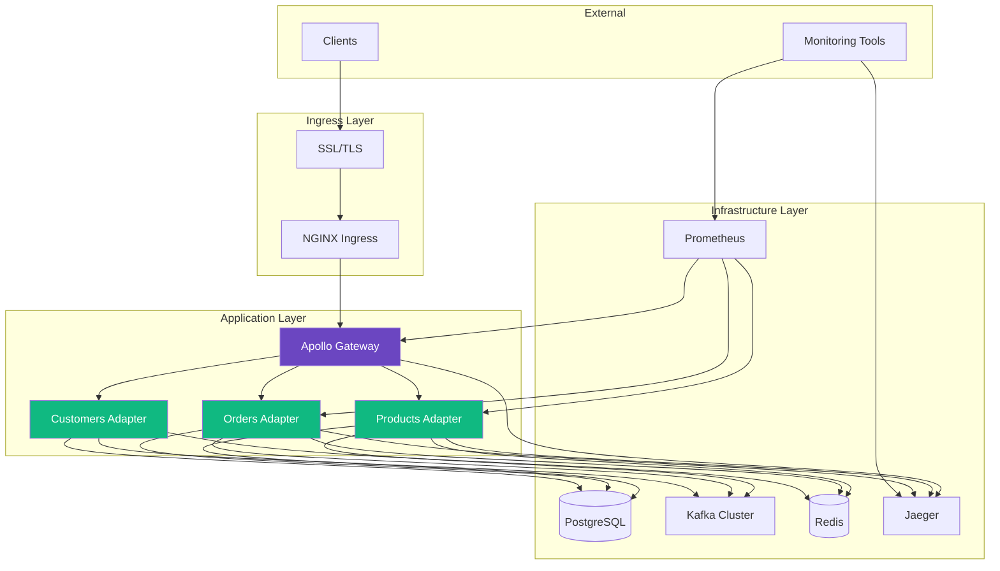

<!--
SPDX-License-Identifier: AGPL-3.0-or-later
Copyright (C) 2025 Controle Digital Ltda
-->

---
sidebar_position: 4
---

# Deployment Guide

Deploy DictaMesh and your adapters to production with Kubernetes, monitoring, and best practices for enterprise environments.

## Overview

This guide covers production deployment of the entire DictaMesh stack:
- Core infrastructure (PostgreSQL, Kafka, Redis)
- Gateway and services
- Custom adapters
- Monitoring and observability
- Security and networking

## Architecture



## Prerequisites

### Infrastructure Requirements

- **Kubernetes Cluster**: v1.25+
  - 3+ nodes for HA
  - 8 CPU cores per node minimum
  - 16GB RAM per node minimum
  - 100GB storage per node

- **Storage**:
  - Block storage for PostgreSQL (SSD recommended)
  - Object storage for backups

- **Networking**:
  - Load balancer support
  - DNS management
  - SSL/TLS certificates

### Tools Required

```bash
# Install required tools
kubectl version --client
helm version
kustomize version
argocd version
```

## Step 1: Prepare Infrastructure

### PostgreSQL Deployment

Deploy PostgreSQL with high availability:

```yaml
# SPDX-License-Identifier: AGPL-3.0-or-later
# Copyright (C) 2025 Controle Digital Ltda

apiVersion: v1
kind: Namespace
metadata:
  name: dictamesh-infra
---
apiVersion: v1
kind: Secret
metadata:
  name: postgres-credentials
  namespace: dictamesh-infra
type: Opaque
stringData:
  postgres-password: "CHANGE_ME"
  replication-password: "CHANGE_ME"
---
apiVersion: apps/v1
kind: StatefulSet
metadata:
  name: postgres
  namespace: dictamesh-infra
spec:
  serviceName: postgres
  replicas: 3
  selector:
    matchLabels:
      app: postgres
  template:
    metadata:
      labels:
        app: postgres
    spec:
      containers:
      - name: postgres
        image: postgres:16-alpine
        ports:
        - containerPort: 5432
          name: postgres
        env:
        - name: POSTGRES_DB
          value: dictamesh
        - name: POSTGRES_USER
          value: dictamesh
        - name: POSTGRES_PASSWORD
          valueFrom:
            secretKeyRef:
              name: postgres-credentials
              key: postgres-password
        - name: PGDATA
          value: /var/lib/postgresql/data/pgdata
        volumeMounts:
        - name: postgres-storage
          mountPath: /var/lib/postgresql/data
        - name: postgres-config
          mountPath: /etc/postgresql
        resources:
          requests:
            cpu: 2000m
            memory: 4Gi
          limits:
            cpu: 4000m
            memory: 8Gi
        livenessProbe:
          exec:
            command:
            - /bin/sh
            - -c
            - pg_isready -U dictamesh
          initialDelaySeconds: 30
          periodSeconds: 10
        readinessProbe:
          exec:
            command:
            - /bin/sh
            - -c
            - pg_isready -U dictamesh
          initialDelaySeconds: 5
          periodSeconds: 5
      volumes:
      - name: postgres-config
        configMap:
          name: postgres-config
  volumeClaimTemplates:
  - metadata:
      name: postgres-storage
    spec:
      accessModes: [ "ReadWriteOnce" ]
      storageClassName: fast-ssd
      resources:
        requests:
          storage: 100Gi
---
apiVersion: v1
kind: Service
metadata:
  name: postgres
  namespace: dictamesh-infra
spec:
  selector:
    app: postgres
  ports:
  - port: 5432
    targetPort: 5432
  clusterIP: None
---
apiVersion: v1
kind: Service
metadata:
  name: postgres-read
  namespace: dictamesh-infra
spec:
  selector:
    app: postgres
  ports:
  - port: 5432
    targetPort: 5432
---
apiVersion: v1
kind: ConfigMap
metadata:
  name: postgres-config
  namespace: dictamesh-infra
data:
  postgresql.conf: |
    # Connection settings
    max_connections = 200
    shared_buffers = 2GB
    effective_cache_size = 6GB
    maintenance_work_mem = 512MB
    checkpoint_completion_target = 0.9
    wal_buffers = 16MB
    default_statistics_target = 100
    random_page_cost = 1.1
    effective_io_concurrency = 200
    work_mem = 10485kB
    min_wal_size = 1GB
    max_wal_size = 4GB
    max_worker_processes = 4
    max_parallel_workers_per_gather = 2
    max_parallel_workers = 4
    max_parallel_maintenance_workers = 2
```

### Kafka Deployment

Deploy Kafka using Strimzi operator:

```yaml
# SPDX-License-Identifier: AGPL-3.0-or-later
# Copyright (C) 2025 Controle Digital Ltda

apiVersion: kafka.strimzi.io/v1beta2
kind: Kafka
metadata:
  name: dictamesh-kafka
  namespace: dictamesh-infra
spec:
  kafka:
    version: 3.6.0
    replicas: 3
    listeners:
      - name: plain
        port: 9092
        type: internal
        tls: false
      - name: tls
        port: 9093
        type: internal
        tls: true
    config:
      offsets.topic.replication.factor: 3
      transaction.state.log.replication.factor: 3
      transaction.state.log.min.isr: 2
      default.replication.factor: 3
      min.insync.replicas: 2
      inter.broker.protocol.version: "3.6"
      log.retention.hours: 168
      log.segment.bytes: 1073741824
      compression.type: snappy
      auto.create.topics.enable: true
    storage:
      type: jbod
      volumes:
      - id: 0
        type: persistent-claim
        size: 100Gi
        class: fast-ssd
        deleteClaim: false
    resources:
      requests:
        memory: 4Gi
        cpu: 2000m
      limits:
        memory: 8Gi
        cpu: 4000m
    jvmOptions:
      -Xms: 4096m
      -Xmx: 4096m
    metricsConfig:
      type: jmxPrometheusExporter
      valueFrom:
        configMapKeyRef:
          name: kafka-metrics
          key: kafka-metrics-config.yml
  zookeeper:
    replicas: 3
    storage:
      type: persistent-claim
      size: 10Gi
      class: fast-ssd
      deleteClaim: false
    resources:
      requests:
        memory: 2Gi
        cpu: 1000m
      limits:
        memory: 4Gi
        cpu: 2000m
  entityOperator:
    topicOperator: {}
    userOperator: {}
---
apiVersion: v1
kind: ConfigMap
metadata:
  name: kafka-metrics
  namespace: dictamesh-infra
data:
  kafka-metrics-config.yml: |
    lowercaseOutputName: true
    rules:
    - pattern: kafka.server<type=(.+), name=(.+)><>Value
      name: kafka_server_$1_$2
    - pattern: kafka.controller<type=(.+), name=(.+)><>Value
      name: kafka_controller_$1_$2
```

### Redis Deployment

Deploy Redis for caching:

```yaml
# SPDX-License-Identifier: AGPL-3.0-or-later
# Copyright (C) 2025 Controle Digital Ltda

apiVersion: apps/v1
kind: StatefulSet
metadata:
  name: redis
  namespace: dictamesh-infra
spec:
  serviceName: redis
  replicas: 3
  selector:
    matchLabels:
      app: redis
  template:
    metadata:
      labels:
        app: redis
    spec:
      containers:
      - name: redis
        image: redis:7-alpine
        ports:
        - containerPort: 6379
          name: redis
        command:
        - redis-server
        - --appendonly yes
        - --maxmemory 4gb
        - --maxmemory-policy allkeys-lru
        volumeMounts:
        - name: redis-storage
          mountPath: /data
        resources:
          requests:
            cpu: 500m
            memory: 2Gi
          limits:
            cpu: 1000m
            memory: 4Gi
        livenessProbe:
          tcpSocket:
            port: 6379
          initialDelaySeconds: 30
          periodSeconds: 10
        readinessProbe:
          exec:
            command:
            - redis-cli
            - ping
          initialDelaySeconds: 5
          periodSeconds: 5
  volumeClaimTemplates:
  - metadata:
      name: redis-storage
    spec:
      accessModes: [ "ReadWriteOnce" ]
      storageClassName: fast-ssd
      resources:
        requests:
          storage: 10Gi
---
apiVersion: v1
kind: Service
metadata:
  name: redis
  namespace: dictamesh-infra
spec:
  selector:
    app: redis
  ports:
  - port: 6379
    targetPort: 6379
  clusterIP: None
```

## Step 2: Deploy Monitoring Stack

### Prometheus and Grafana

```yaml
# SPDX-License-Identifier: AGPL-3.0-or-later
# Copyright (C) 2025 Controle Digital Ltda

# Install using Helm
helm repo add prometheus-community https://prometheus-community.github.io/helm-charts
helm repo update

helm install prometheus prometheus-community/kube-prometheus-stack \
  --namespace monitoring \
  --create-namespace \
  --set prometheus.prometheusSpec.retention=30d \
  --set prometheus.prometheusSpec.storageSpec.volumeClaimTemplate.spec.storageClassName=fast-ssd \
  --set prometheus.prometheusSpec.storageSpec.volumeClaimTemplate.spec.resources.requests.storage=100Gi \
  --set grafana.adminPassword=CHANGE_ME
```

### Jaeger for Tracing

```yaml
# SPDX-License-Identifier: AGPL-3.0-or-later
# Copyright (C) 2025 Controle Digital Ltda

helm repo add jaegertracing https://jaegertracing.github.io/helm-charts
helm repo update

helm install jaeger jaegertracing/jaeger \
  --namespace monitoring \
  --set provisionDataStore.cassandra=false \
  --set storage.type=elasticsearch \
  --set storage.elasticsearch.host=elasticsearch:9200
```

## Step 3: Deploy Adapters

### Adapter Deployment Template

```yaml
# SPDX-License-Identifier: AGPL-3.0-or-later
# Copyright (C) 2025 Controle Digital Ltda

apiVersion: v1
kind: Namespace
metadata:
  name: dictamesh-adapters
---
apiVersion: v1
kind: ConfigMap
metadata:
  name: product-adapter-config
  namespace: dictamesh-adapters
data:
  config.yaml: |
    adapter:
      name: products-adapter
      version: 1.0.0

    source:
      url: https://api.ecommerce.example.com
      timeout: 30s

    database:
      host: postgres.dictamesh-infra
      port: 5432
      database: dictamesh
      user: dictamesh

    kafka:
      brokers:
        - dictamesh-kafka-kafka-bootstrap.dictamesh-infra:9092
      group_id: products-adapter

    redis:
      addr: redis.dictamesh-infra:6379
      db: 0

    observability:
      jaeger_endpoint: jaeger-collector.monitoring:14268
      metrics_port: 9090
---
apiVersion: v1
kind: Secret
metadata:
  name: product-adapter-secrets
  namespace: dictamesh-adapters
type: Opaque
stringData:
  api-key: "CHANGE_ME"
  database-password: "CHANGE_ME"
---
apiVersion: apps/v1
kind: Deployment
metadata:
  name: product-adapter
  namespace: dictamesh-adapters
  labels:
    app: product-adapter
spec:
  replicas: 3
  selector:
    matchLabels:
      app: product-adapter
  template:
    metadata:
      labels:
        app: product-adapter
      annotations:
        prometheus.io/scrape: "true"
        prometheus.io/port: "9090"
        prometheus.io/path: "/metrics"
    spec:
      containers:
      - name: adapter
        image: your-registry/product-adapter:1.0.0
        imagePullPolicy: Always
        ports:
        - containerPort: 8080
          name: http
        - containerPort: 9090
          name: metrics
        env:
        - name: CONFIG_FILE
          value: /etc/config/config.yaml
        - name: API_KEY
          valueFrom:
            secretKeyRef:
              name: product-adapter-secrets
              key: api-key
        - name: DATABASE_PASSWORD
          valueFrom:
            secretKeyRef:
              name: product-adapter-secrets
              key: database-password
        - name: LOG_LEVEL
          value: info
        - name: JAEGER_AGENT_HOST
          value: jaeger-agent.monitoring
        - name: JAEGER_AGENT_PORT
          value: "6831"
        volumeMounts:
        - name: config
          mountPath: /etc/config
        resources:
          requests:
            cpu: 500m
            memory: 512Mi
          limits:
            cpu: 2000m
            memory: 2Gi
        livenessProbe:
          httpGet:
            path: /health
            port: 8080
          initialDelaySeconds: 30
          periodSeconds: 10
          timeoutSeconds: 5
          failureThreshold: 3
        readinessProbe:
          httpGet:
            path: /ready
            port: 8080
          initialDelaySeconds: 10
          periodSeconds: 5
          timeoutSeconds: 3
          failureThreshold: 3
      volumes:
      - name: config
        configMap:
          name: product-adapter-config
      affinity:
        podAntiAffinity:
          preferredDuringSchedulingIgnoredDuringExecution:
          - weight: 100
            podAffinityTerm:
              labelSelector:
                matchExpressions:
                - key: app
                  operator: In
                  values:
                  - product-adapter
              topologyKey: kubernetes.io/hostname
---
apiVersion: v1
kind: Service
metadata:
  name: product-adapter
  namespace: dictamesh-adapters
  labels:
    app: product-adapter
spec:
  selector:
    app: product-adapter
  ports:
  - name: http
    port: 8080
    targetPort: 8080
  - name: metrics
    port: 9090
    targetPort: 9090
  type: ClusterIP
---
apiVersion: autoscaling/v2
kind: HorizontalPodAutoscaler
metadata:
  name: product-adapter
  namespace: dictamesh-adapters
spec:
  scaleTargetRef:
    apiVersion: apps/v1
    kind: Deployment
    name: product-adapter
  minReplicas: 3
  maxReplicas: 10
  metrics:
  - type: Resource
    resource:
      name: cpu
      target:
        type: Utilization
        averageUtilization: 70
  - type: Resource
    resource:
      name: memory
      target:
        type: Utilization
        averageUtilization: 80
---
apiVersion: policy/v1
kind: PodDisruptionBudget
metadata:
  name: product-adapter
  namespace: dictamesh-adapters
spec:
  minAvailable: 2
  selector:
    matchLabels:
      app: product-adapter
```

## Step 4: Deploy Gateway

```yaml
# SPDX-License-Identifier: AGPL-3.0-or-later
# Copyright (C) 2025 Controle Digital Ltda

apiVersion: v1
kind: ConfigMap
metadata:
  name: gateway-config
  namespace: dictamesh-adapters
data:
  gateway.yaml: |
    subgraphs:
      - name: products
        url: http://product-adapter:8080/graphql
      - name: orders
        url: http://order-adapter:8080/graphql
      - name: customers
        url: http://customer-adapter:8080/graphql

    cors:
      origins:
        - https://app.example.com
      credentials: true

    introspection: false
    playground: false
---
apiVersion: apps/v1
kind: Deployment
metadata:
  name: gateway
  namespace: dictamesh-adapters
spec:
  replicas: 3
  selector:
    matchLabels:
      app: gateway
  template:
    metadata:
      labels:
        app: gateway
      annotations:
        prometheus.io/scrape: "true"
        prometheus.io/port: "9090"
    spec:
      containers:
      - name: gateway
        image: your-registry/apollo-gateway:1.0.0
        ports:
        - containerPort: 4000
          name: http
        - containerPort: 9090
          name: metrics
        env:
        - name: CONFIG_FILE
          value: /etc/config/gateway.yaml
        - name: PORT
          value: "4000"
        volumeMounts:
        - name: config
          mountPath: /etc/config
        resources:
          requests:
            cpu: 1000m
            memory: 1Gi
          limits:
            cpu: 2000m
            memory: 2Gi
        livenessProbe:
          httpGet:
            path: /.well-known/apollo/server-health
            port: 4000
          initialDelaySeconds: 30
          periodSeconds: 10
        readinessProbe:
          httpGet:
            path: /.well-known/apollo/server-health
            port: 4000
          initialDelaySeconds: 10
          periodSeconds: 5
      volumes:
      - name: config
        configMap:
          name: gateway-config
---
apiVersion: v1
kind: Service
metadata:
  name: gateway
  namespace: dictamesh-adapters
spec:
  selector:
    app: gateway
  ports:
  - port: 4000
    targetPort: 4000
---
apiVersion: networking.k8s.io/v1
kind: Ingress
metadata:
  name: gateway
  namespace: dictamesh-adapters
  annotations:
    cert-manager.io/cluster-issuer: letsencrypt-prod
    nginx.ingress.kubernetes.io/rate-limit: "100"
    nginx.ingress.kubernetes.io/ssl-redirect: "true"
spec:
  ingressClassName: nginx
  tls:
  - hosts:
    - api.dictamesh.example.com
    secretName: gateway-tls
  rules:
  - host: api.dictamesh.example.com
    http:
      paths:
      - path: /
        pathType: Prefix
        backend:
          service:
            name: gateway
            port:
              number: 4000
```

## Step 5: CI/CD with GitOps

### ArgoCD Application

```yaml
# SPDX-License-Identifier: AGPL-3.0-or-later
# Copyright (C) 2025 Controle Digital Ltda

apiVersion: argoproj.io/v1alpha1
kind: Application
metadata:
  name: dictamesh
  namespace: argocd
spec:
  project: default
  source:
    repoURL: https://github.com/your-org/dictamesh-deployments
    targetRevision: main
    path: k8s/overlays/production
  destination:
    server: https://kubernetes.default.svc
    namespace: dictamesh-adapters
  syncPolicy:
    automated:
      prune: true
      selfHeal: true
      allowEmpty: false
    syncOptions:
    - CreateNamespace=true
    retry:
      limit: 5
      backoff:
        duration: 5s
        factor: 2
        maxDuration: 3m
  ignoreDifferences:
  - group: apps
    kind: Deployment
    jsonPointers:
    - /spec/replicas
```

### GitHub Actions Workflow

```yaml
# SPDX-License-Identifier: AGPL-3.0-or-later
# Copyright (C) 2025 Controle Digital Ltda

name: Build and Deploy

on:
  push:
    branches: [ main ]
    paths:
    - 'src/**'
    - 'Dockerfile'
    - '.github/workflows/**'

env:
  REGISTRY: ghcr.io
  IMAGE_NAME: ${{ github.repository }}/product-adapter

jobs:
  build:
    runs-on: ubuntu-latest
    permissions:
      contents: read
      packages: write

    steps:
    - name: Checkout
      uses: actions/checkout@v4

    - name: Set up Go
      uses: actions/setup-go@v4
      with:
        go-version: '1.21'

    - name: Run tests
      run: go test -v -race -coverprofile=coverage.out ./...

    - name: Build
      run: go build -v -o product-adapter ./cmd/server

    - name: Log in to Registry
      uses: docker/login-action@v3
      with:
        registry: ${{ env.REGISTRY }}
        username: ${{ github.actor }}
        password: ${{ secrets.GITHUB_TOKEN }}

    - name: Extract metadata
      id: meta
      uses: docker/metadata-action@v5
      with:
        images: ${{ env.REGISTRY }}/${{ env.IMAGE_NAME }}
        tags: |
          type=ref,event=branch
          type=ref,event=pr
          type=semver,pattern={{version}}
          type=semver,pattern={{major}}.{{minor}}
          type=sha

    - name: Build and push
      uses: docker/build-push-action@v5
      with:
        context: .
        push: true
        tags: ${{ steps.meta.outputs.tags }}
        labels: ${{ steps.meta.outputs.labels }}

    - name: Update deployment
      run: |
        cd k8s/overlays/production
        kustomize edit set image \
          product-adapter=${{ env.REGISTRY }}/${{ env.IMAGE_NAME }}:${{ github.sha }}
        git config user.name "GitHub Actions"
        git config user.email "actions@github.com"
        git commit -am "Update product-adapter image to ${{ github.sha }}"
        git push
```

## Step 6: Security

### Network Policies

```yaml
# SPDX-License-Identifier: AGPL-3.0-or-later
# Copyright (C) 2025 Controle Digital Ltda

apiVersion: networking.k8s.io/v1
kind: NetworkPolicy
metadata:
  name: adapter-network-policy
  namespace: dictamesh-adapters
spec:
  podSelector:
    matchLabels:
      app: product-adapter
  policyTypes:
  - Ingress
  - Egress
  ingress:
  - from:
    - namespaceSelector:
        matchLabels:
          name: dictamesh-adapters
    - podSelector:
        matchLabels:
          app: gateway
    ports:
    - protocol: TCP
      port: 8080
  egress:
  - to:
    - namespaceSelector:
        matchLabels:
          name: dictamesh-infra
    ports:
    - protocol: TCP
      port: 5432  # PostgreSQL
    - protocol: TCP
      port: 9092  # Kafka
    - protocol: TCP
      port: 6379  # Redis
  - to:
    - namespaceSelector: {}
      podSelector:
        matchLabels:
          k8s-app: kube-dns
    ports:
    - protocol: UDP
      port: 53
```

### Pod Security Standards

```yaml
# SPDX-License-Identifier: AGPL-3.0-or-later
# Copyright (C) 2025 Controle Digital Ltda

apiVersion: v1
kind: Namespace
metadata:
  name: dictamesh-adapters
  labels:
    pod-security.kubernetes.io/enforce: restricted
    pod-security.kubernetes.io/audit: restricted
    pod-security.kubernetes.io/warn: restricted
```

### RBAC

```yaml
# SPDX-License-Identifier: AGPL-3.0-or-later
# Copyright (C) 2025 Controle Digital Ltda

apiVersion: v1
kind: ServiceAccount
metadata:
  name: product-adapter
  namespace: dictamesh-adapters
---
apiVersion: rbac.authorization.k8s.io/v1
kind: Role
metadata:
  name: product-adapter
  namespace: dictamesh-adapters
rules:
- apiGroups: [""]
  resources: ["configmaps", "secrets"]
  verbs: ["get", "list"]
---
apiVersion: rbac.authorization.k8s.io/v1
kind: RoleBinding
metadata:
  name: product-adapter
  namespace: dictamesh-adapters
roleRef:
  apiGroup: rbac.authorization.k8s.io
  kind: Role
  name: product-adapter
subjects:
- kind: ServiceAccount
  name: product-adapter
  namespace: dictamesh-adapters
```

## Step 7: Backup and Disaster Recovery

### PostgreSQL Backup

```yaml
# SPDX-License-Identifier: AGPL-3.0-or-later
# Copyright (C) 2025 Controle Digital Ltda

apiVersion: batch/v1
kind: CronJob
metadata:
  name: postgres-backup
  namespace: dictamesh-infra
spec:
  schedule: "0 2 * * *"  # Daily at 2 AM
  jobTemplate:
    spec:
      template:
        spec:
          containers:
          - name: backup
            image: postgres:16-alpine
            command:
            - /bin/sh
            - -c
            - |
              pg_dump -h postgres -U dictamesh dictamesh | \
              gzip > /backup/dictamesh-$(date +%Y%m%d-%H%M%S).sql.gz

              # Upload to S3
              aws s3 cp /backup/dictamesh-*.sql.gz \
                s3://your-bucket/dictamesh-backups/

              # Cleanup old backups (keep 30 days)
              find /backup -name "*.sql.gz" -mtime +30 -delete
            env:
            - name: PGPASSWORD
              valueFrom:
                secretKeyRef:
                  name: postgres-credentials
                  key: postgres-password
            volumeMounts:
            - name: backup
              mountPath: /backup
          restartPolicy: OnFailure
          volumes:
          - name: backup
            persistentVolumeClaim:
              claimName: postgres-backup
```

## Monitoring and Alerting

### Grafana Dashboards

Import pre-built dashboards for DictaMesh components.

### Prometheus Alerts

```yaml
# SPDX-License-Identifier: AGPL-3.0-or-later
# Copyright (C) 2025 Controle Digital Ltda

apiVersion: monitoring.coreos.com/v1
kind: PrometheusRule
metadata:
  name: dictamesh-alerts
  namespace: monitoring
spec:
  groups:
  - name: dictamesh
    interval: 30s
    rules:
    - alert: AdapterDown
      expr: up{job="product-adapter"} == 0
      for: 5m
      labels:
        severity: critical
      annotations:
        summary: "Adapter {{ $labels.instance }} is down"
        description: "Product adapter has been down for more than 5 minutes"

    - alert: HighErrorRate
      expr: rate(http_requests_total{status=~"5.."}[5m]) > 0.05
      for: 10m
      labels:
        severity: warning
      annotations:
        summary: "High error rate on {{ $labels.job }}"
        description: "Error rate is {{ $value }} over 5 minutes"

    - alert: KafkaConsumerLag
      expr: kafka_consumer_lag > 10000
      for: 15m
      labels:
        severity: warning
      annotations:
        summary: "High Kafka consumer lag"
        description: "Consumer {{ $labels.consumer_group }} has lag {{ $value }}"

    - alert: DatabaseConnectionPoolExhausted
      expr: database_connections_used / database_connections_max > 0.9
      for: 5m
      labels:
        severity: warning
      annotations:
        summary: "Database connection pool nearly exhausted"
        description: "{{ $value }}% of connections in use"
```

## Performance Tuning

### Resource Optimization

```go
// SPDX-License-Identifier: AGPL-3.0-or-later
// Copyright (C) 2025 Controle Digital Ltda

package main

import (
    "runtime"
)

func init() {
    // Optimize for containerized environments
    numCPU := runtime.NumCPU()
    runtime.GOMAXPROCS(numCPU)

    // Set memory limit (aligned with K8s limits)
    debug.SetMemoryLimit(2 * 1024 * 1024 * 1024) // 2GB
}
```

### Database Connection Pooling

```go
// SPDX-License-Identifier: AGPL-3.0-or-later
// Copyright (C) 2025 Controle Digital Ltda

db.SetMaxOpenConns(25)
db.SetMaxIdleConns(25)
db.SetConnMaxLifetime(5 * time.Minute)
db.SetConnMaxIdleTime(10 * time.Minute)
```

## Best Practices

### 1. High Availability
- Run at least 3 replicas of each service
- Use pod anti-affinity rules
- Configure PodDisruptionBudgets
- Implement health checks

### 2. Scalability
- Use HorizontalPodAutoscaler
- Configure resource requests and limits
- Optimize database queries
- Implement caching

### 3. Security
- Use network policies
- Enable pod security standards
- Rotate credentials regularly
- Scan images for vulnerabilities

### 4. Observability
- Collect metrics from all components
- Implement distributed tracing
- Set up alerting rules
- Create dashboards

### 5. Cost Optimization
- Right-size resource requests
- Use spot instances where appropriate
- Implement autoscaling
- Clean up unused resources

## Troubleshooting

### Common Issues

1. **Pod crashes**: Check logs with `kubectl logs`
2. **High latency**: Review traces in Jaeger
3. **Database connection issues**: Check connection pool settings
4. **Kafka lag**: Scale consumers or optimize processing

### Debug Commands

```bash
# Check pod status
kubectl get pods -n dictamesh-adapters

# View logs
kubectl logs -f deployment/product-adapter -n dictamesh-adapters

# Execute into pod
kubectl exec -it deployment/product-adapter -n dictamesh-adapters -- /bin/sh

# Port forward for local access
kubectl port-forward svc/gateway 4000:4000 -n dictamesh-adapters

# Check events
kubectl get events -n dictamesh-adapters --sort-by='.lastTimestamp'
```

## Next Steps

- 🧪 [Testing Guide](./testing.md) - Test your deployment
- 🏗️ [Building Adapters](./building-adapters.md) - Deploy custom adapters
- 📊 [GraphQL Federation](./graphql-federation.md) - Configure the gateway

---

**Previous**: [← Event Streaming](./event-streaming.md) | **Next**: [Testing →](./testing.md)
