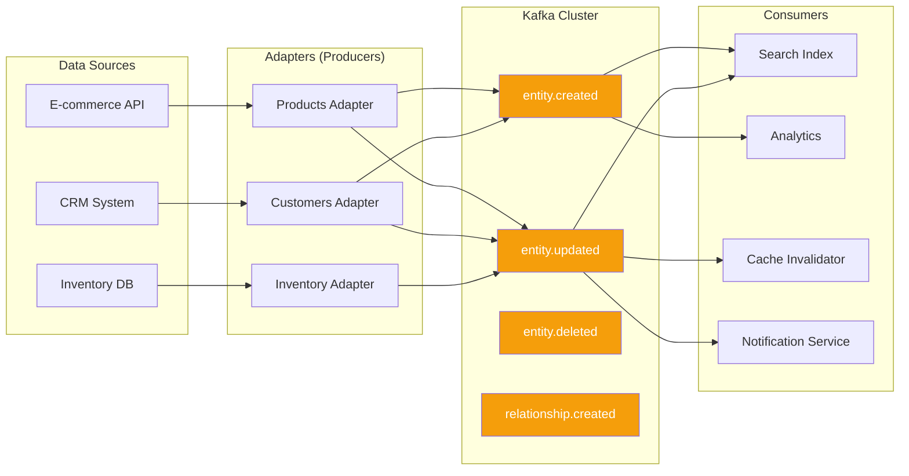

<!--
SPDX-License-Identifier: AGPL-3.0-or-later
Copyright (C) 2025 Controle Digital Ltda
-->

---
sidebar_position: 3
---

# Event Streaming with Kafka

Master event-driven architecture with Apache Kafka for real-time data synchronization across your data mesh.

## Overview

DictaMesh uses Apache Kafka as the backbone for event streaming, enabling real-time data propagation, decoupled architectures, and event sourcing patterns.

### Why Event Streaming?

- ⚡ **Real-time Sync** - Changes propagate instantly across services
- 🔄 **Decoupled Architecture** - Services communicate asynchronously
- 📊 **Event Sourcing** - Complete audit trail of all changes
- 🎯 **Scalability** - Handle millions of events per second
- 🔁 **Replay** - Re-process historical events
- 🛡️ **Reliability** - Durable, fault-tolerant messaging

## Event Architecture



## Event Types

DictaMesh defines standard event types for the data mesh:

### Entity Events

```go
// SPDX-License-Identifier: AGPL-3.0-or-later
// Copyright (C) 2025 Controle Digital Ltda

package events

import "time"

// EntityCreated is published when a new entity is discovered
type EntityCreated struct {
    EventID       string                 `json:"event_id"`
    EntityID      string                 `json:"entity_id"`
    EntityType    string                 `json:"entity_type"`
    Timestamp     time.Time              `json:"timestamp"`
    SourceAdapter string                 `json:"source_adapter"`
    SourceSystem  string                 `json:"source_system"`
    Data          map[string]interface{} `json:"data"`
    SchemaVersion string                 `json:"schema_version"`
    TraceID       string                 `json:"trace_id,omitempty"`
}

// EntityUpdated is published when an entity is modified
type EntityUpdated struct {
    EventID       string                 `json:"event_id"`
    EntityID      string                 `json:"entity_id"`
    EntityType    string                 `json:"entity_type"`
    Timestamp     time.Time              `json:"timestamp"`
    SourceAdapter string                 `json:"source_adapter"`
    SourceSystem  string                 `json:"source_system"`
    ChangedFields []string               `json:"changed_fields"`
    PreviousData  map[string]interface{} `json:"previous_data,omitempty"`
    Data          map[string]interface{} `json:"data"`
    SchemaVersion string                 `json:"schema_version"`
    TraceID       string                 `json:"trace_id,omitempty"`
}

// EntityDeleted is published when an entity is removed
type EntityDeleted struct {
    EventID       string    `json:"event_id"`
    EntityID      string    `json:"entity_id"`
    EntityType    string    `json:"entity_type"`
    Timestamp     time.Time `json:"timestamp"`
    SourceAdapter string    `json:"source_adapter"`
    SourceSystem  string    `json:"source_system"`
    Reason        string    `json:"reason,omitempty"`
    TraceID       string    `json:"trace_id,omitempty"`
}
```

### Relationship Events

```go
// RelationshipCreated is published when entities are linked
type RelationshipCreated struct {
    EventID          string                 `json:"event_id"`
    RelationshipID   string                 `json:"relationship_id"`
    RelationshipType string                 `json:"relationship_type"`
    SubjectID        string                 `json:"subject_id"`
    SubjectType      string                 `json:"subject_type"`
    ObjectID         string                 `json:"object_id"`
    ObjectType       string                 `json:"object_type"`
    Timestamp        time.Time              `json:"timestamp"`
    SourceAdapter    string                 `json:"source_adapter"`
    Metadata         map[string]interface{} `json:"metadata,omitempty"`
    TraceID          string                 `json:"trace_id,omitempty"`
}

// RelationshipDeleted is published when entities are unlinked
type RelationshipDeleted struct {
    EventID          string    `json:"event_id"`
    RelationshipID   string    `json:"relationship_id"`
    RelationshipType string    `json:"relationship_type"`
    SubjectID        string    `json:"subject_id"`
    SubjectType      string    `json:"subject_type"`
    ObjectID         string    `json:"object_id"`
    ObjectType       string    `json:"object_type"`
    Timestamp        time.Time `json:"timestamp"`
    SourceAdapter    string    `json:"source_adapter"`
    TraceID          string    `json:"trace_id,omitempty"`
}
```

## Publishing Events

### Basic Publisher

```go
// SPDX-License-Identifier: AGPL-3.0-or-later
// Copyright (C) 2025 Controle Digital Ltda

package events

import (
    "context"
    "encoding/json"
    "fmt"

    "github.com/segmentio/kafka-go"
    "go.opentelemetry.io/otel/trace"
)

// Publisher publishes events to Kafka
type Publisher struct {
    writer  *kafka.Writer
    tracer  trace.Tracer
    metrics *Metrics
}

// NewPublisher creates a new event publisher
func NewPublisher(cfg *Config) (*Publisher, error) {
    writer := &kafka.Writer{
        Addr:                   kafka.TCP(cfg.Brokers...),
        Balancer:               &kafka.LeastBytes{},
        MaxAttempts:            3,
        RequiredAcks:           kafka.RequireAll,
        Compression:            kafka.Snappy,
        Async:                  false,
        AllowAutoTopicCreation: true,
    }

    return &Publisher{
        writer:  writer,
        tracer:  tracer.Tracer("events.publisher"),
        metrics: NewMetrics("events_publisher"),
    }, nil
}

// Publish publishes an event to a topic
func (p *Publisher) Publish(ctx context.Context, topic string, event interface{}) error {
    ctx, span := p.tracer.Start(ctx, "publisher.Publish")
    defer span.End()

    span.SetAttributes(
        attribute.String("topic", topic),
        attribute.String("event_type", fmt.Sprintf("%T", event)),
    )

    // Serialize event
    data, err := json.Marshal(event)
    if err != nil {
        span.RecordError(err)
        return fmt.Errorf("failed to marshal event: %w", err)
    }

    // Extract key from event
    key := p.extractKey(event)

    // Create Kafka message
    msg := kafka.Message{
        Topic: topic,
        Key:   []byte(key),
        Value: data,
        Headers: []kafka.Header{
            {Key: "event-type", Value: []byte(fmt.Sprintf("%T", event))},
            {Key: "trace-id", Value: []byte(trace.SpanFromContext(ctx).SpanContext().TraceID().String())},
        },
        Time: time.Now(),
    }

    // Write message
    startTime := time.Now()
    err = p.writer.WriteMessages(ctx, msg)
    duration := time.Since(startTime)

    // Record metrics
    p.metrics.PublishDuration.WithLabelValues(topic).Observe(duration.Seconds())
    if err != nil {
        p.metrics.PublishErrors.WithLabelValues(topic).Inc()
        span.RecordError(err)
        return fmt.Errorf("failed to write message: %w", err)
    }

    p.metrics.PublishedTotal.WithLabelValues(topic).Inc()
    return nil
}

// PublishBatch publishes multiple events in one batch
func (p *Publisher) PublishBatch(ctx context.Context, topic string, events []interface{}) error {
    ctx, span := p.tracer.Start(ctx, "publisher.PublishBatch")
    defer span.End()

    span.SetAttributes(
        attribute.String("topic", topic),
        attribute.Int("batch_size", len(events)),
    )

    messages := make([]kafka.Message, len(events))

    for i, event := range events {
        data, err := json.Marshal(event)
        if err != nil {
            return fmt.Errorf("failed to marshal event %d: %w", i, err)
        }

        messages[i] = kafka.Message{
            Topic: topic,
            Key:   []byte(p.extractKey(event)),
            Value: data,
            Headers: []kafka.Header{
                {Key: "event-type", Value: []byte(fmt.Sprintf("%T", event))},
            },
            Time: time.Now(),
        }
    }

    startTime := time.Now()
    err := p.writer.WriteMessages(ctx, messages...)
    duration := time.Since(startTime)

    p.metrics.PublishDuration.WithLabelValues(topic).Observe(duration.Seconds())
    if err != nil {
        p.metrics.PublishErrors.WithLabelValues(topic).Inc()
        return fmt.Errorf("failed to write batch: %w", err)
    }

    p.metrics.PublishedTotal.WithLabelValues(topic).Add(float64(len(events)))
    return nil
}

// extractKey extracts the partition key from an event
func (p *Publisher) extractKey(event interface{}) string {
    switch e := event.(type) {
    case *EntityCreated:
        return fmt.Sprintf("%s:%s", e.EntityType, e.EntityID)
    case *EntityUpdated:
        return fmt.Sprintf("%s:%s", e.EntityType, e.EntityID)
    case *EntityDeleted:
        return fmt.Sprintf("%s:%s", e.EntityType, e.EntityID)
    case *RelationshipCreated:
        return fmt.Sprintf("rel:%s:%s", e.SubjectType, e.SubjectID)
    case *RelationshipDeleted:
        return fmt.Sprintf("rel:%s:%s", e.SubjectType, e.SubjectID)
    default:
        return ""
    }
}

// Close closes the publisher
func (p *Publisher) Close() error {
    return p.writer.Close()
}
```

### Usage in Adapters

```go
// SPDX-License-Identifier: AGPL-3.0-or-later
// Copyright (C) 2025 Controle Digital Ltda

package adapter

import (
    "context"
    "time"

    "github.com/click2-run/dictamesh/pkg/events"
    "github.com/google/uuid"
)

// syncEntity synchronizes an entity and publishes events
func (a *ProductAdapter) syncEntity(ctx context.Context, productID string) error {
    // Fetch from source
    product, err := a.client.GetProduct(ctx, productID)
    if err != nil {
        return err
    }

    // Transform to entity
    entity := a.transform(product)

    // Check if entity exists
    existing, err := a.catalog.FindBySource(ctx, "ecommerce", productID, "product")
    isNew := err != nil

    if isNew {
        // Register new entity
        if err := a.catalog.Register(ctx, entity); err != nil {
            return err
        }

        // Publish created event
        event := &events.EntityCreated{
            EventID:       uuid.New().String(),
            EntityID:      entity.ID,
            EntityType:    entity.Type,
            Timestamp:     time.Now(),
            SourceAdapter: "products-adapter",
            SourceSystem:  "ecommerce",
            Data:          entity.Attributes,
            SchemaVersion: "1.0.0",
            TraceID:       trace.SpanFromContext(ctx).SpanContext().TraceID().String(),
        }

        return a.events.Publish(ctx, "entity.created", event)
    }

    // Detect changes
    changedFields := a.detectChanges(existing, entity)
    if len(changedFields) == 0 {
        return nil // No changes
    }

    // Update existing entity
    if err := a.catalog.Update(ctx, entity); err != nil {
        return err
    }

    // Publish updated event
    event := &events.EntityUpdated{
        EventID:       uuid.New().String(),
        EntityID:      entity.ID,
        EntityType:    entity.Type,
        Timestamp:     time.Now(),
        SourceAdapter: "products-adapter",
        SourceSystem:  "ecommerce",
        ChangedFields: changedFields,
        PreviousData:  existing.Attributes,
        Data:          entity.Attributes,
        SchemaVersion: "1.0.0",
        TraceID:       trace.SpanFromContext(ctx).SpanContext().TraceID().String(),
    }

    return a.events.Publish(ctx, "entity.updated", event)
}

// detectChanges identifies changed fields between two entities
func (a *ProductAdapter) detectChanges(old, new *core.Entity) []string {
    changed := []string{}

    for key, newVal := range new.Attributes {
        oldVal, exists := old.Attributes[key]
        if !exists || !reflect.DeepEqual(oldVal, newVal) {
            changed = append(changed, key)
        }
    }

    return changed
}
```

## Consuming Events

### Basic Consumer

```go
// SPDX-License-Identifier: AGPL-3.0-or-later
// Copyright (C) 2025 Controle Digital Ltda

package events

import (
    "context"
    "encoding/json"
    "fmt"

    "github.com/segmentio/kafka-go"
)

// Consumer consumes events from Kafka
type Consumer struct {
    reader  *kafka.Reader
    tracer  trace.Tracer
    metrics *Metrics
}

// NewConsumer creates a new event consumer
func NewConsumer(cfg *ConsumerConfig) (*Consumer, error) {
    reader := kafka.NewReader(kafka.ReaderConfig{
        Brokers:         cfg.Brokers,
        GroupID:         cfg.GroupID,
        Topic:           cfg.Topic,
        MinBytes:        10e3, // 10KB
        MaxBytes:        10e6, // 10MB
        MaxWait:         1 * time.Second,
        CommitInterval:  1 * time.Second,
        StartOffset:     kafka.LastOffset,
        SessionTimeout:  10 * time.Second,
        HeartbeatInterval: 3 * time.Second,
    })

    return &Consumer{
        reader:  reader,
        tracer:  tracer.Tracer("events.consumer"),
        metrics: NewMetrics("events_consumer"),
    }, nil
}

// Consume starts consuming events
func (c *Consumer) Consume(ctx context.Context, handler EventHandler) error {
    for {
        select {
        case <-ctx.Done():
            return ctx.Err()
        default:
            msg, err := c.reader.FetchMessage(ctx)
            if err != nil {
                c.metrics.ConsumeErrors.WithLabelValues(c.reader.Config().Topic).Inc()
                return fmt.Errorf("failed to fetch message: %w", err)
            }

            // Process message
            if err := c.processMessage(ctx, msg, handler); err != nil {
                c.logger.Error("Failed to process message",
                    "error", err,
                    "topic", msg.Topic,
                    "partition", msg.Partition,
                    "offset", msg.Offset,
                )
                continue
            }

            // Commit offset
            if err := c.reader.CommitMessages(ctx, msg); err != nil {
                c.logger.Error("Failed to commit message", "error", err)
            }
        }
    }
}

// processMessage processes a single message
func (c *Consumer) processMessage(ctx context.Context, msg kafka.Message, handler EventHandler) error {
    ctx, span := c.tracer.Start(ctx, "consumer.ProcessMessage")
    defer span.End()

    span.SetAttributes(
        attribute.String("topic", msg.Topic),
        attribute.Int("partition", msg.Partition),
        attribute.Int64("offset", msg.Offset),
    )

    startTime := time.Now()

    // Extract trace context from headers
    for _, header := range msg.Headers {
        if header.Key == "trace-id" {
            span.SetAttributes(attribute.String("parent_trace_id", string(header.Value)))
        }
    }

    // Deserialize event
    var event interface{}
    eventType := c.getEventType(msg.Headers)

    switch eventType {
    case "EntityCreated":
        event = &EntityCreated{}
    case "EntityUpdated":
        event = &EntityUpdated{}
    case "EntityDeleted":
        event = &EntityDeleted{}
    default:
        return fmt.Errorf("unknown event type: %s", eventType)
    }

    if err := json.Unmarshal(msg.Value, event); err != nil {
        return fmt.Errorf("failed to unmarshal event: %w", err)
    }

    // Handle event
    if err := handler.Handle(ctx, event); err != nil {
        span.RecordError(err)
        c.metrics.HandlerErrors.WithLabelValues(msg.Topic, eventType).Inc()
        return err
    }

    duration := time.Since(startTime)
    c.metrics.ProcessDuration.WithLabelValues(msg.Topic).Observe(duration.Seconds())
    c.metrics.ConsumedTotal.WithLabelValues(msg.Topic).Inc()

    return nil
}

func (c *Consumer) getEventType(headers []kafka.Header) string {
    for _, header := range headers {
        if header.Key == "event-type" {
            return string(header.Value)
        }
    }
    return ""
}

// Close closes the consumer
func (c *Consumer) Close() error {
    return c.reader.Close()
}
```

### Event Handler Interface

```go
// SPDX-License-Identifier: AGPL-3.0-or-later
// Copyright (C) 2025 Controle Digital Ltda

package events

import "context"

// EventHandler processes events
type EventHandler interface {
    Handle(ctx context.Context, event interface{}) error
}

// EventHandlerFunc is a function adapter for EventHandler
type EventHandlerFunc func(ctx context.Context, event interface{}) error

func (f EventHandlerFunc) Handle(ctx context.Context, event interface{}) error {
    return f(ctx, event)
}
```

### Consumer Examples

#### Search Index Updater

```go
// SPDX-License-Identifier: AGPL-3.0-or-later
// Copyright (C) 2025 Controle Digital Ltda

package consumers

import (
    "context"

    "github.com/click2-run/dictamesh/pkg/events"
)

// SearchIndexUpdater updates search index from events
type SearchIndexUpdater struct {
    searchClient *search.Client
    logger       *logger.Logger
}

// NewSearchIndexUpdater creates a new search index updater
func NewSearchIndexUpdater(searchClient *search.Client) *SearchIndexUpdater {
    return &SearchIndexUpdater{
        searchClient: searchClient,
        logger:       logger.New("search-index-updater"),
    }
}

// Handle handles an event
func (h *SearchIndexUpdater) Handle(ctx context.Context, event interface{}) error {
    switch e := event.(type) {
    case *events.EntityCreated:
        return h.handleEntityCreated(ctx, e)
    case *events.EntityUpdated:
        return h.handleEntityUpdated(ctx, e)
    case *events.EntityDeleted:
        return h.handleEntityDeleted(ctx, e)
    default:
        return nil // Ignore other events
    }
}

func (h *SearchIndexUpdater) handleEntityCreated(ctx context.Context, event *events.EntityCreated) error {
    doc := &search.Document{
        ID:   event.EntityID,
        Type: event.EntityType,
        Data: event.Data,
    }

    if err := h.searchClient.Index(ctx, doc); err != nil {
        h.logger.Error("Failed to index entity", "id", event.EntityID, "error", err)
        return err
    }

    h.logger.Info("Indexed entity", "id", event.EntityID, "type", event.EntityType)
    return nil
}

func (h *SearchIndexUpdater) handleEntityUpdated(ctx context.Context, event *events.EntityUpdated) error {
    doc := &search.Document{
        ID:   event.EntityID,
        Type: event.EntityType,
        Data: event.Data,
    }

    if err := h.searchClient.Update(ctx, doc); err != nil {
        h.logger.Error("Failed to update entity", "id", event.EntityID, "error", err)
        return err
    }

    h.logger.Info("Updated entity", "id", event.EntityID, "changed_fields", event.ChangedFields)
    return nil
}

func (h *SearchIndexUpdater) handleEntityDeleted(ctx context.Context, event *events.EntityDeleted) error {
    if err := h.searchClient.Delete(ctx, event.EntityID); err != nil {
        h.logger.Error("Failed to delete entity", "id", event.EntityID, "error", err)
        return err
    }

    h.logger.Info("Deleted entity", "id", event.EntityID)
    return nil
}
```

#### Cache Invalidator

```go
// SPDX-License-Identifier: AGPL-3.0-or-later
// Copyright (C) 2025 Controle Digital Ltda

package consumers

import (
    "context"
    "fmt"

    "github.com/click2-run/dictamesh/pkg/events"
)

// CacheInvalidator invalidates cache entries from events
type CacheInvalidator struct {
    cache  cache.Cache
    logger *logger.Logger
}

// NewCacheInvalidator creates a new cache invalidator
func NewCacheInvalidator(cache cache.Cache) *CacheInvalidator {
    return &CacheInvalidator{
        cache:  cache,
        logger: logger.New("cache-invalidator"),
    }
}

// Handle handles an event
func (h *CacheInvalidator) Handle(ctx context.Context, event interface{}) error {
    switch e := event.(type) {
    case *events.EntityUpdated:
        return h.invalidateEntity(ctx, e.EntityType, e.EntityID)
    case *events.EntityDeleted:
        return h.invalidateEntity(ctx, e.EntityType, e.EntityID)
    default:
        return nil
    }
}

func (h *CacheInvalidator) invalidateEntity(ctx context.Context, entityType, entityID string) error {
    // Invalidate direct cache key
    key := fmt.Sprintf("%s:%s", entityType, entityID)
    if err := h.cache.Delete(ctx, key); err != nil {
        h.logger.Warn("Failed to invalidate cache", "key", key, "error", err)
    }

    // Invalidate list caches
    listKey := fmt.Sprintf("%s:list:*", entityType)
    if err := h.cache.DeletePattern(ctx, listKey); err != nil {
        h.logger.Warn("Failed to invalidate list cache", "pattern", listKey, "error", err)
    }

    h.logger.Info("Invalidated cache", "entity_type", entityType, "entity_id", entityID)
    return nil
}
```

## Advanced Patterns

### Dead Letter Queue (DLQ)

Handle failed messages:

```go
// SPDX-License-Identifier: AGPL-3.0-or-later
// Copyright (C) 2025 Controle Digital Ltda

package events

// ConsumerWithDLQ wraps a consumer with DLQ support
type ConsumerWithDLQ struct {
    consumer    *Consumer
    dlqPublisher *Publisher
    maxRetries  int
}

// Consume consumes with DLQ support
func (c *ConsumerWithDLQ) Consume(ctx context.Context, handler EventHandler) error {
    return c.consumer.Consume(ctx, EventHandlerFunc(func(ctx context.Context, event interface{}) error {
        // Try to handle the event
        err := handler.Handle(ctx, event)
        if err == nil {
            return nil
        }

        // Get retry count from metadata
        retries := c.getRetryCount(event)
        if retries >= c.maxRetries {
            // Send to DLQ
            return c.sendToDLQ(ctx, event, err)
        }

        // Increment retry count and retry
        c.incrementRetryCount(event)
        return err
    }))
}

func (c *ConsumerWithDLQ) sendToDLQ(ctx context.Context, event interface{}, err error) error {
    dlqEvent := &DLQEvent{
        OriginalEvent: event,
        Error:         err.Error(),
        Timestamp:     time.Now(),
        Retries:       c.getRetryCount(event),
    }

    return c.dlqPublisher.Publish(ctx, "dlq.events", dlqEvent)
}
```

### Exactly-Once Semantics

Implement idempotency:

```go
// SPDX-License-Identifier: AGPL-3.0-or-later
// Copyright (C) 2025 Controle Digital Ltda

package events

// IdempotentHandler ensures events are processed exactly once
type IdempotentHandler struct {
    handler EventHandler
    store   IdempotencyStore
    ttl     time.Duration
}

// NewIdempotentHandler creates an idempotent handler
func NewIdempotentHandler(handler EventHandler, store IdempotencyStore, ttl time.Duration) *IdempotentHandler {
    return &IdempotentHandler{
        handler: handler,
        store:   store,
        ttl:     ttl,
    }
}

// Handle handles an event idempotently
func (h *IdempotentHandler) Handle(ctx context.Context, event interface{}) error {
    eventID := h.getEventID(event)

    // Check if already processed
    if processed, err := h.store.IsProcessed(ctx, eventID); err != nil {
        return err
    } else if processed {
        return nil // Skip already processed event
    }

    // Process event
    if err := h.handler.Handle(ctx, event); err != nil {
        return err
    }

    // Mark as processed
    return h.store.MarkProcessed(ctx, eventID, h.ttl)
}

func (h *IdempotentHandler) getEventID(event interface{}) string {
    switch e := event.(type) {
    case *EntityCreated:
        return e.EventID
    case *EntityUpdated:
        return e.EventID
    case *EntityDeleted:
        return e.EventID
    default:
        return ""
    }
}

// IdempotencyStore stores processed event IDs
type IdempotencyStore interface {
    IsProcessed(ctx context.Context, eventID string) (bool, error)
    MarkProcessed(ctx context.Context, eventID string, ttl time.Duration) error
}
```

### Event Replay

Replay events from a specific timestamp:

```go
// SPDX-License-Identifier: AGPL-3.0-or-later
// Copyright (C) 2025 Controle Digital Ltda

package events

// ReplayConsumer replays events from a specific time
type ReplayConsumer struct {
    brokers []string
    topic   string
}

// NewReplayConsumer creates a replay consumer
func NewReplayConsumer(brokers []string, topic string) *ReplayConsumer {
    return &ReplayConsumer{
        brokers: brokers,
        topic:   topic,
    }
}

// Replay replays events from a specific timestamp
func (r *ReplayConsumer) Replay(ctx context.Context, since time.Time, handler EventHandler) error {
    // Create reader starting from timestamp
    reader := kafka.NewReader(kafka.ReaderConfig{
        Brokers:     r.brokers,
        Topic:       r.topic,
        StartOffset: kafka.TimeOffset(since),
    })
    defer reader.Close()

    for {
        select {
        case <-ctx.Done():
            return ctx.Err()
        default:
            msg, err := reader.FetchMessage(ctx)
            if err != nil {
                return err
            }

            // Only process messages after the timestamp
            if msg.Time.Before(since) {
                continue
            }

            // Deserialize and handle event
            var event interface{}
            if err := json.Unmarshal(msg.Value, &event); err != nil {
                return err
            }

            if err := handler.Handle(ctx, event); err != nil {
                return err
            }
        }
    }
}
```

## Topic Naming Conventions

Use consistent topic naming:

```
entity.{action}              # Entity events
entity.created
entity.updated
entity.deleted

relationship.{action}        # Relationship events
relationship.created
relationship.deleted

{domain}.{entity}.{action}   # Domain-specific events
products.product.created
orders.order.placed
orders.order.shipped

system.{component}.{event}   # System events
system.adapter.started
system.adapter.stopped
```

## Performance Optimization

### Batch Processing

```go
// SPDX-License-Identifier: AGPL-3.0-or-later
// Copyright (C) 2025 Controle Digital Ltda

package events

// BatchConsumer consumes events in batches
type BatchConsumer struct {
    reader      *kafka.Reader
    batchSize   int
    batchTimeout time.Duration
}

// ConsumeBatch consumes events in batches
func (c *BatchConsumer) ConsumeBatch(ctx context.Context, handler BatchHandler) error {
    batch := make([]interface{}, 0, c.batchSize)
    timer := time.NewTimer(c.batchTimeout)

    for {
        select {
        case <-ctx.Done():
            if len(batch) > 0 {
                handler.HandleBatch(ctx, batch)
            }
            return ctx.Err()

        case <-timer.C:
            if len(batch) > 0 {
                if err := handler.HandleBatch(ctx, batch); err != nil {
                    return err
                }
                batch = batch[:0]
            }
            timer.Reset(c.batchTimeout)

        default:
            msg, err := c.reader.FetchMessage(ctx)
            if err != nil {
                continue
            }

            var event interface{}
            if err := json.Unmarshal(msg.Value, &event); err != nil {
                continue
            }

            batch = append(batch, event)

            if len(batch) >= c.batchSize {
                if err := handler.HandleBatch(ctx, batch); err != nil {
                    return err
                }
                batch = batch[:0]
                timer.Reset(c.batchTimeout)
            }
        }
    }
}

// BatchHandler processes batches of events
type BatchHandler interface {
    HandleBatch(ctx context.Context, events []interface{}) error
}
```

### Compression

Enable compression for better throughput:

```go
writer := &kafka.Writer{
    Addr:        kafka.TCP(brokers...),
    Compression: kafka.Snappy, // Or kafka.Gzip, kafka.Lz4, kafka.Zstd
}
```

## Monitoring and Metrics

```go
// SPDX-License-Identifier: AGPL-3.0-or-later
// Copyright (C) 2025 Controle Digital Ltda

package events

import "github.com/prometheus/client_golang/prometheus"

// Metrics for event streaming
type Metrics struct {
    PublishedTotal   *prometheus.CounterVec
    PublishDuration  *prometheus.HistogramVec
    PublishErrors    *prometheus.CounterVec
    ConsumedTotal    *prometheus.CounterVec
    ProcessDuration  *prometheus.HistogramVec
    ConsumeErrors    *prometheus.CounterVec
    HandlerErrors    *prometheus.CounterVec
    ConsumerLag      *prometheus.GaugeVec
}

// NewMetrics creates event metrics
func NewMetrics(subsystem string) *Metrics {
    return &Metrics{
        PublishedTotal: prometheus.NewCounterVec(
            prometheus.CounterOpts{
                Subsystem: subsystem,
                Name:      "published_total",
                Help:      "Total number of published events",
            },
            []string{"topic"},
        ),
        ProcessDuration: prometheus.NewHistogramVec(
            prometheus.HistogramOpts{
                Subsystem: subsystem,
                Name:      "process_duration_seconds",
                Help:      "Event processing duration",
                Buckets:   []float64{.001, .005, .01, .05, .1, .5, 1, 5},
            },
            []string{"topic"},
        ),
        ConsumerLag: prometheus.NewGaugeVec(
            prometheus.GaugeOpts{
                Subsystem: subsystem,
                Name:      "consumer_lag",
                Help:      "Consumer lag in messages",
            },
            []string{"topic", "consumer_group"},
        ),
    }
}
```

## Best Practices

### 1. Event Schema
- Use structured schemas (Avro, Protobuf)
- Version your events
- Include trace IDs
- Add timestamps

### 2. Error Handling
- Implement DLQ for failures
- Use idempotency
- Log all errors
- Monitor error rates

### 3. Performance
- Batch when possible
- Enable compression
- Tune consumer settings
- Monitor lag

### 4. Scalability
- Partition by entity ID
- Scale consumers horizontally
- Use consumer groups
- Monitor throughput

## Next Steps

- 🚀 [Deployment Guide](./deployment.md) - Deploy Kafka infrastructure
- 🧪 [Testing Guide](./testing.md) - Test event flows
- 🏗️ [Building Adapters](./building-adapters.md) - Integrate events

---

**Previous**: [← GraphQL Federation](./graphql-federation.md) | **Next**: [Deployment →](./deployment.md)
