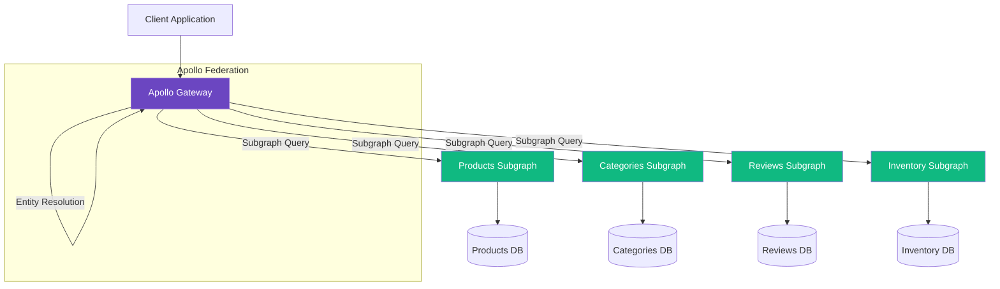
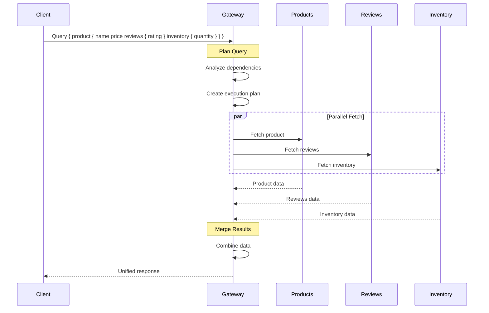

<!--
SPDX-License-Identifier: AGPL-3.0-or-later
Copyright (C) 2025 Controle Digital Ltda
-->

---
sidebar_position: 2
---

# GraphQL Federation

Learn how to build federated GraphQL APIs that compose data from multiple adapters into a unified graph.

## Overview

DictaMesh uses Apollo Federation to create a unified GraphQL API across all your adapters. Each adapter exposes a subgraph, and the gateway automatically merges them into a single, queryable schema.

### Benefits of Federation

- 🔗 **Unified API** - Single endpoint for all data sources
- 🎯 **Domain Ownership** - Each team owns their subgraph
- 🚀 **Independent Deployment** - Deploy adapters independently
- 📊 **Intelligent Query Planning** - Optimal query execution
- 🔄 **Entity Resolution** - Join data across services
- ⚡ **Performance** - DataLoader batching built-in

## Federation Architecture



## Core Concepts

### Entities

Entities are types that can be extended across subgraphs. They must have a `@key` directive:

```graphql
type Product @key(fields: "id") {
  id: ID!
  name: String!
  price: Decimal!
}
```

### Entity References

Other subgraphs can extend entities and add fields:

```graphql
# In reviews subgraph
extend type Product @key(fields: "id") {
  id: ID! @external
  reviews: [Review!]!
}
```

### Value Types

Value types are shared across subgraphs but don't have identity:

```graphql
type Money {
  amount: Decimal!
  currency: String!
}
```

## Building a Subgraph

### Step 1: Define Your Schema

```graphql
# SPDX-License-Identifier: AGPL-3.0-or-later
# Copyright (C) 2025 Controle Digital Ltda

extend schema
  @link(url: "https://specs.apollo.dev/federation/v2.0",
        import: ["@key", "@shareable", "@external", "@requires", "@provides"])

"""
Product entity representing items for sale
"""
type Product @key(fields: "id") {
  "Unique product identifier"
  id: ID!

  "Product name"
  name: String!

  "Product description"
  description: String

  "Product price"
  price: Money!

  "Stock keeping unit"
  sku: String!

  "Product availability"
  inStock: Boolean!

  "Product category"
  category: Category @provides(fields: "id name")

  "Product images"
  images: [ProductImage!]!

  "Product metadata"
  metadata: ProductMetadata!

  "Timestamps"
  createdAt: DateTime!
  updatedAt: DateTime!
}

"""
Product category
"""
type Category @key(fields: "id") {
  id: ID!
  name: String!
  slug: String!
  description: String
  parentId: ID
  parent: Category
}

"""
Product image
"""
type ProductImage {
  url: String!
  alt: String
  width: Int!
  height: Int!
  isPrimary: Boolean!
}

"""
Product metadata
"""
type ProductMetadata {
  views: Int!
  favorites: Int!
  tags: [String!]!
}

"""
Monetary amount
"""
type Money @shareable {
  amount: Decimal!
  currency: String!
}

"""
Paginated product connection
"""
type ProductConnection {
  nodes: [Product!]!
  edges: [ProductEdge!]!
  pageInfo: PageInfo!
  totalCount: Int!
}

"""
Product edge in connection
"""
type ProductEdge {
  node: Product!
  cursor: String!
}

"""
Page information for pagination
"""
type PageInfo {
  hasNextPage: Boolean!
  hasPreviousPage: Boolean!
  startCursor: String
  endCursor: String
}

"""
Root query type
"""
type Query {
  "Get product by ID"
  product(id: ID!): Product

  "List products with pagination"
  products(
    first: Int = 20
    after: String
    filters: ProductFilters
  ): ProductConnection!

  "Search products"
  searchProducts(
    query: String!
    filters: ProductFilters
    first: Int = 20
  ): ProductConnection!
}

"""
Product filters
"""
input ProductFilters {
  categoryId: ID
  minPrice: Decimal
  maxPrice: Decimal
  inStock: Boolean
  tags: [String!]
}

scalar Decimal
scalar DateTime
```

### Step 2: Implement Entity Resolvers

```go
// SPDX-License-Identifier: AGPL-3.0-or-later
// Copyright (C) 2025 Controle Digital Ltda

package graphql

import (
    "context"

    "github.com/graph-gophers/graphql-go"
)

// ProductResolver resolves Product entities
type ProductResolver struct {
    entity *core.Entity
    loader *DataLoader
}

// ID returns the product ID
func (r *ProductResolver) ID() graphql.ID {
    return graphql.ID(r.entity.ID)
}

// Name returns the product name
func (r *ProductResolver) Name() string {
    return r.entity.Attributes["name"].(string)
}

// Description returns the product description
func (r *ProductResolver) Description() *string {
    if desc, ok := r.entity.Attributes["description"].(string); ok {
        return &desc
    }
    return nil
}

// Price returns the product price
func (r *ProductResolver) Price() *MoneyResolver {
    amount := r.entity.Attributes["price"].(float64)
    currency := r.entity.Attributes["currency"].(string)

    return &MoneyResolver{
        amount:   amount,
        currency: currency,
    }
}

// Category returns the product category (federated)
func (r *ProductResolver) Category(ctx context.Context) (*CategoryResolver, error) {
    categoryID, ok := r.entity.Attributes["category_id"].(string)
    if !ok || categoryID == "" {
        return nil, nil
    }

    // This will be resolved by the categories subgraph
    return &CategoryResolver{
        id: categoryID,
    }, nil
}

// Images returns product images
func (r *ProductResolver) Images() []*ProductImageResolver {
    images, ok := r.entity.Attributes["images"].([]interface{})
    if !ok {
        return []*ProductImageResolver{}
    }

    resolvers := make([]*ProductImageResolver, len(images))
    for i, img := range images {
        imgMap := img.(map[string]interface{})
        resolvers[i] = &ProductImageResolver{
            url:       imgMap["url"].(string),
            alt:       imgMap["alt"].(string),
            width:     int32(imgMap["width"].(float64)),
            height:    int32(imgMap["height"].(float64)),
            isPrimary: imgMap["is_primary"].(bool),
        }
    }

    return resolvers
}

// Metadata returns product metadata
func (r *ProductResolver) Metadata() *ProductMetadataResolver {
    metadata := r.entity.Attributes["metadata"].(map[string]interface{})

    return &ProductMetadataResolver{
        views:     int32(metadata["views"].(float64)),
        favorites: int32(metadata["favorites"].(float64)),
        tags:      metadata["tags"].([]string),
    }
}

// MoneyResolver resolves Money type
type MoneyResolver struct {
    amount   float64
    currency string
}

func (r *MoneyResolver) Amount() float64 {
    return r.amount
}

func (r *MoneyResolver) Currency() string {
    return r.currency
}

// CategoryResolver is a stub that will be resolved by the categories subgraph
type CategoryResolver struct {
    id string
}

func (r *CategoryResolver) ID() graphql.ID {
    return graphql.ID(r.id)
}
```

### Step 3: Implement Reference Resolution

Reference resolution allows the gateway to fetch entities by key:

```go
// SPDX-License-Identifier: AGPL-3.0-or-later
// Copyright (C) 2025 Controle Digital Ltda

package graphql

import (
    "context"
    "encoding/json"

    "github.com/graph-gophers/graphql-go"
)

// Entities resolves entity references from other subgraphs
func (r *Resolver) Entities(ctx context.Context, args struct {
    Representations []map[string]interface{}
}) ([]interface{}, error) {
    entities := make([]interface{}, len(args.Representations))

    for i, repr := range args.Representations {
        typename := repr["__typename"].(string)

        switch typename {
        case "Product":
            id := repr["id"].(string)
            entity, err := r.loader.Load(ctx, id)
            if err != nil {
                return nil, err
            }
            entities[i] = &ProductResolver{
                entity: entity,
                loader: r.loader,
            }

        case "Category":
            id := repr["id"].(string)
            entity, err := r.loader.LoadCategory(ctx, id)
            if err != nil {
                return nil, err
            }
            entities[i] = &CategoryResolver{
                entity: entity,
            }

        default:
            return nil, fmt.Errorf("unknown typename: %s", typename)
        }
    }

    return entities, nil
}
```

### Step 4: Configure the Gateway

```go
// SPDX-License-Identifier: AGPL-3.0-or-later
// Copyright (C) 2025 Controle Digital Ltda

package gateway

import (
    "context"
    "net/http"

    "github.com/99designs/gqlgen/graphql/handler"
    "github.com/99designs/gqlgen/graphql/handler/extension"
    "github.com/99designs/gqlgen/graphql/handler/transport"
)

// Config holds gateway configuration
type Config struct {
    Subgraphs []SubgraphConfig
    Port      int
    Debug     bool
}

// SubgraphConfig defines a subgraph endpoint
type SubgraphConfig struct {
    Name string
    URL  string
}

// Gateway represents the Apollo Federation gateway
type Gateway struct {
    config  *Config
    planner *QueryPlanner
    cache   *ResponseCache
}

// NewGateway creates a new federation gateway
func NewGateway(cfg *Config) (*Gateway, error) {
    planner, err := NewQueryPlanner(cfg.Subgraphs)
    if err != nil {
        return nil, err
    }

    return &Gateway{
        config:  cfg,
        planner: planner,
        cache:   NewResponseCache(),
    }, nil
}

// Handler returns an HTTP handler for the gateway
func (g *Gateway) Handler() http.Handler {
    srv := handler.NewDefaultServer(g.schema())

    // Add extensions
    srv.Use(extension.Introspection{})
    srv.Use(extension.AutomaticPersistedQuery{
        Cache: g.cache,
    })

    // Configure transports
    srv.AddTransport(transport.POST{})
    srv.AddTransport(transport.GET{})
    srv.AddTransport(transport.Websocket{
        KeepAlivePingInterval: 10 * time.Second,
    })

    return srv
}

// ExecuteQuery executes a federated query
func (g *Gateway) ExecuteQuery(ctx context.Context, query string, variables map[string]interface{}) (*Response, error) {
    // Plan the query
    plan, err := g.planner.Plan(query)
    if err != nil {
        return nil, err
    }

    // Execute query plan
    return g.executePlan(ctx, plan, variables)
}

// executePlan executes a query plan
func (g *Gateway) executePlan(ctx context.Context, plan *QueryPlan, variables map[string]interface{}) (*Response, error) {
    results := make(map[string]interface{})

    // Execute parallel fetches
    for _, fetch := range plan.ParallelFetches {
        result, err := g.executeFetch(ctx, fetch, variables)
        if err != nil {
            return nil, err
        }
        results[fetch.ServiceName] = result
    }

    // Execute sequential fetches
    for _, fetch := range plan.SequentialFetches {
        result, err := g.executeFetch(ctx, fetch, variables)
        if err != nil {
            return nil, err
        }
        results[fetch.ServiceName] = result
    }

    // Merge results
    return g.mergeResults(results, plan), nil
}

// executeFetch executes a single fetch to a subgraph
func (g *Gateway) executeFetch(ctx context.Context, fetch *Fetch, variables map[string]interface{}) (interface{}, error) {
    subgraph := g.getSubgraph(fetch.ServiceName)
    if subgraph == nil {
        return nil, fmt.Errorf("subgraph not found: %s", fetch.ServiceName)
    }

    // Create HTTP request
    req, err := http.NewRequestWithContext(ctx, "POST", subgraph.URL, nil)
    if err != nil {
        return nil, err
    }

    // Add query and variables
    body := map[string]interface{}{
        "query":     fetch.Query,
        "variables": variables,
    }

    bodyBytes, err := json.Marshal(body)
    if err != nil {
        return nil, err
    }

    req.Body = io.NopCloser(bytes.NewReader(bodyBytes))
    req.Header.Set("Content-Type", "application/json")

    // Execute request
    resp, err := http.DefaultClient.Do(req)
    if err != nil {
        return nil, err
    }
    defer resp.Body.Close()

    // Parse response
    var result map[string]interface{}
    if err := json.NewDecoder(resp.Body).Decode(&result); err != nil {
        return nil, err
    }

    return result["data"], nil
}
```

## Advanced Federation Patterns

### Cross-Service Entity Resolution

Extend entities from other subgraphs:

```graphql
# In reviews subgraph

extend type Product @key(fields: "id") {
  id: ID! @external
  reviews(first: Int = 10): ReviewConnection!
  averageRating: Float!
  reviewCount: Int!
}

type Review {
  id: ID!
  productId: ID!
  rating: Int!
  title: String!
  comment: String!
  author: User!
  createdAt: DateTime!
}

type ReviewConnection {
  nodes: [Review!]!
  pageInfo: PageInfo!
  totalCount: Int!
}
```

Resolver implementation:

```go
// SPDX-License-Identifier: AGPL-3.0-or-later
// Copyright (C) 2025 Controle Digital Ltda

package graphql

// Reviews resolver for Product type (from reviews subgraph)
func (r *ProductResolver) Reviews(ctx context.Context, args struct {
    First *int32
}) (*ReviewConnectionResolver, error) {
    limit := 10
    if args.First != nil {
        limit = int(*args.First)
    }

    // Fetch reviews for this product
    reviews, err := r.loader.LoadReviews(ctx, r.entity.ID, limit)
    if err != nil {
        return nil, err
    }

    return &ReviewConnectionResolver{
        reviews: reviews,
    }, nil
}

// AverageRating calculates average rating
func (r *ProductResolver) AverageRating(ctx context.Context) (float64, error) {
    stats, err := r.loader.LoadReviewStats(ctx, r.entity.ID)
    if err != nil {
        return 0, err
    }
    return stats.AverageRating, nil
}

// ReviewCount returns total review count
func (r *ProductResolver) ReviewCount(ctx context.Context) (int32, error) {
    stats, err := r.loader.LoadReviewStats(ctx, r.entity.ID)
    if err != nil {
        return 0, err
    }
    return int32(stats.Count), nil
}
```

### Using @requires and @provides

The `@requires` directive indicates that a field needs data from another service:

```graphql
type Product @key(fields: "id") {
  id: ID!
  name: String!
  price: Money!

  # This field requires dimensions from the inventory subgraph
  shippingCost: Money! @requires(fields: "dimensions { weight length width height }")
}

extend type Product @key(fields: "id") {
  id: ID! @external
  dimensions: ProductDimensions! @external
}

type ProductDimensions {
  weight: Float!
  length: Float!
  width: Float!
  height: Float!
}
```

The `@provides` directive optimizes query execution:

```graphql
type Order @key(fields: "id") {
  id: ID!
  items: [OrderItem!]!
}

type OrderItem {
  id: ID!

  # Provides basic product info to avoid extra fetches
  product: Product! @provides(fields: "id name price")

  quantity: Int!
  subtotal: Money!
}
```

### Shared Types with @shareable

Mark types that can be defined in multiple subgraphs:

```graphql
# In both products and orders subgraphs
type Money @shareable {
  amount: Decimal!
  currency: String!
}

type Address @shareable {
  street: String!
  city: String!
  state: String!
  postalCode: String!
  country: String!
}
```

## Query Planning

The gateway creates an execution plan for federated queries:



### Query Plan Example

```json
{
  "kind": "QueryPlan",
  "node": {
    "kind": "Parallel",
    "nodes": [
      {
        "kind": "Fetch",
        "serviceName": "products",
        "query": "query($id: ID!) { product(id: $id) { id name price } }"
      },
      {
        "kind": "Sequence",
        "nodes": [
          {
            "kind": "Fetch",
            "serviceName": "products",
            "query": "query($id: ID!) { _entities(representations: [{__typename: \"Product\", id: $id}]) { ... on Product { __typename id } } }"
          },
          {
            "kind": "Flatten",
            "path": ["product"],
            "node": {
              "kind": "Fetch",
              "serviceName": "reviews",
              "query": "query($representations: [_Any!]!) { _entities(representations: $representations) { ... on Product { reviews { rating comment } } } }"
            }
          }
        ]
      }
    ]
  }
}
```

## DataLoader Integration

Prevent N+1 queries with DataLoader:

```go
// SPDX-License-Identifier: AGPL-3.0-or-later
// Copyright (C) 2025 Controle Digital Ltda

package graphql

import (
    "context"
    "time"

    "github.com/graph-gophers/dataloader/v7"
)

// DataLoader handles batched entity loading
type DataLoader struct {
    productLoader  *dataloader.Loader[string, *core.Entity]
    reviewsLoader  *dataloader.Loader[string, []*Review]
    categoryLoader *dataloader.Loader[string, *Category]
}

// NewDataLoader creates a new DataLoader
func NewDataLoader(adapter *adapter.Adapter) *DataLoader {
    dl := &DataLoader{}

    // Product loader
    dl.productLoader = dataloader.NewBatchedLoader(
        func(ctx context.Context, keys []string) []*dataloader.Result[*core.Entity] {
            return dl.batchLoadProducts(ctx, keys)
        },
        dataloader.WithWait[string, *core.Entity](5*time.Millisecond),
        dataloader.WithBatchCapacity[string, *core.Entity](100),
    )

    // Reviews loader
    dl.reviewsLoader = dataloader.NewBatchedLoader(
        func(ctx context.Context, keys []string) []*dataloader.Result[[]*Review] {
            return dl.batchLoadReviews(ctx, keys)
        },
        dataloader.WithWait[string, []*Review](5*time.Millisecond),
    )

    return dl
}

// LoadProduct loads a single product
func (dl *DataLoader) LoadProduct(ctx context.Context, id string) (*core.Entity, error) {
    return dl.productLoader.Load(ctx, id)()
}

// LoadProducts loads multiple products
func (dl *DataLoader) LoadProducts(ctx context.Context, ids []string) ([]*core.Entity, []error) {
    return dl.productLoader.LoadMany(ctx, ids)()
}

// batchLoadProducts loads multiple products in one query
func (dl *DataLoader) batchLoadProducts(ctx context.Context, ids []string) []*dataloader.Result[*core.Entity] {
    // Fetch all products in one query
    products, err := adapter.GetEntitiesByIDs(ctx, ids)
    if err != nil {
        // Return error for all
        results := make([]*dataloader.Result[*core.Entity], len(ids))
        for i := range results {
            results[i] = &dataloader.Result[*core.Entity]{Error: err}
        }
        return results
    }

    // Map products by ID
    productMap := make(map[string]*core.Entity)
    for _, p := range products {
        productMap[p.ID] = p
    }

    // Build results in order
    results := make([]*dataloader.Result[*core.Entity], len(ids))
    for i, id := range ids {
        if product, ok := productMap[id]; ok {
            results[i] = &dataloader.Result[*core.Entity]{Data: product}
        } else {
            results[i] = &dataloader.Result[*core.Entity]{
                Error: fmt.Errorf("product not found: %s", id),
            }
        }
    }

    return results
}
```

## Performance Optimization

### 1. Query Complexity Analysis

Prevent expensive queries:

```go
// SPDX-License-Identifier: AGPL-3.0-or-later
// Copyright (C) 2025 Controle Digital Ltda

package gateway

import (
    "github.com/99designs/gqlgen/graphql"
)

// ComplexityConfig defines field complexity
func ComplexityConfig() graphql.ComplexityRoot {
    return graphql.ComplexityRoot{
        Query: graphql.QueryComplexityRoot{
            Products: func(childComplexity int, first *int) int {
                limit := 20
                if first != nil {
                    limit = *first
                }
                return limit * childComplexity
            },
        },
        Product: graphql.ProductComplexityRoot{
            Reviews: func(childComplexity int, first *int) int {
                limit := 10
                if first != nil {
                    limit = *first
                }
                return limit * childComplexity
            },
        },
    }
}

// WithMaxComplexity limits query complexity
func WithMaxComplexity(maxComplexity int) func(http.Handler) http.Handler {
    return func(next http.Handler) http.Handler {
        return http.HandlerFunc(func(w http.ResponseWriter, r *http.Request) {
            complexity := graphql.GetOperationContext(r.Context()).Complexity
            if complexity > maxComplexity {
                http.Error(w, "Query too complex", http.StatusBadRequest)
                return
            }
            next.ServeHTTP(w, r)
        })
    }
}
```

### 2. Response Caching

Cache frequently accessed queries:

```go
// SPDX-License-Identifier: AGPL-3.0-or-later
// Copyright (C) 2025 Controle Digital Ltda

package gateway

import (
    "context"
    "crypto/sha256"
    "encoding/json"
    "fmt"
    "time"
)

// ResponseCache caches GraphQL responses
type ResponseCache struct {
    cache cache.Cache
}

// NewResponseCache creates a response cache
func NewResponseCache() *ResponseCache {
    return &ResponseCache{
        cache: cache.NewRedis(redisClient),
    }
}

// Get retrieves a cached response
func (rc *ResponseCache) Get(ctx context.Context, query string, variables map[string]interface{}) (interface{}, bool) {
    key := rc.cacheKey(query, variables)

    cached, err := rc.cache.Get(ctx, key)
    if err != nil {
        return nil, false
    }

    return cached, true
}

// Set stores a response in cache
func (rc *ResponseCache) Set(ctx context.Context, query string, variables map[string]interface{}, response interface{}, ttl time.Duration) error {
    key := rc.cacheKey(query, variables)
    return rc.cache.Set(ctx, key, response, ttl)
}

func (rc *ResponseCache) cacheKey(query string, variables map[string]interface{}) string {
    data := map[string]interface{}{
        "query":     query,
        "variables": variables,
    }

    bytes, _ := json.Marshal(data)
    hash := sha256.Sum256(bytes)
    return fmt.Sprintf("gql:%x", hash)
}
```

### 3. Automatic Persisted Queries (APQ)

Reduce bandwidth with query IDs:

```go
// Client sends query hash instead of full query
{
  "operationName": "GetProduct",
  "extensions": {
    "persistedQuery": {
      "version": 1,
      "sha256Hash": "abc123..."
    }
  }
}

// Server looks up query by hash
// If not found, client sends full query once
// Subsequent requests use hash only
```

## Testing Federation

```go
// SPDX-License-Identifier: AGPL-3.0-or-later
// Copyright (C) 2025 Controle Digital Ltda

package graphql_test

import (
    "context"
    "testing"

    "github.com/stretchr/testify/assert"
    "github.com/stretchr/testify/require"
)

func TestFederatedQuery(t *testing.T) {
    // Setup test gateway
    gateway := setupTestGateway(t)

    query := `
        query GetProductWithReviews($id: ID!) {
            product(id: $id) {
                id
                name
                price { amount currency }
                reviews(first: 5) {
                    nodes {
                        rating
                        comment
                    }
                }
            }
        }
    `

    variables := map[string]interface{}{
        "id": "prod-123",
    }

    // Execute federated query
    result, err := gateway.ExecuteQuery(context.Background(), query, variables)
    require.NoError(t, err)

    // Verify result includes data from multiple subgraphs
    assert.NotNil(t, result.Data["product"])
    product := result.Data["product"].(map[string]interface{})
    assert.Equal(t, "prod-123", product["id"])
    assert.NotEmpty(t, product["reviews"])
}

func TestEntityResolution(t *testing.T) {
    resolver := setupTestResolver(t)

    // Test entity reference resolution
    representations := []map[string]interface{}{
        {
            "__typename": "Product",
            "id":         "prod-123",
        },
    }

    entities, err := resolver.Entities(context.Background(), struct {
        Representations []map[string]interface{}
    }{
        Representations: representations,
    })

    require.NoError(t, err)
    assert.Len(t, entities, 1)
}
```

## Best Practices

### 1. Schema Design
- Use meaningful entity keys
- Define clear boundaries between subgraphs
- Share only necessary types with @shareable
- Use @requires sparingly to avoid coupling

### 2. Performance
- Implement DataLoader for all entity fetches
- Use APQ for production
- Set query complexity limits
- Cache at multiple levels

### 3. Versioning
- Version your schemas semantically
- Support multiple versions during migration
- Use @deprecated for field deprecation
- Document breaking changes

### 4. Monitoring
- Track query execution times
- Monitor subgraph health
- Alert on high error rates
- Analyze query patterns

## Next Steps

- 🌊 [Event Streaming Guide](./event-streaming.md) - Master Kafka integration
- 🧪 [Testing Guide](./testing.md) - Test your federation
- 🚀 [Deployment Guide](./deployment.md) - Deploy the gateway

---

**Previous**: [← Building Adapters](./building-adapters.md) | **Next**: [Event Streaming →](./event-streaming.md)
