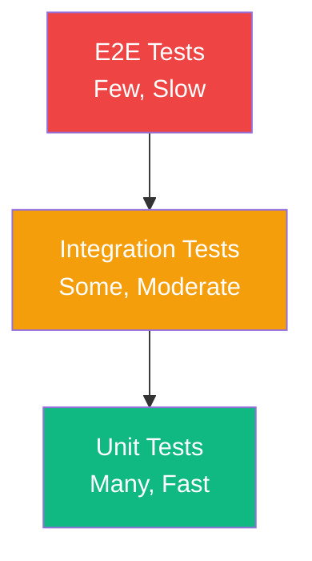

<!--
SPDX-License-Identifier: AGPL-3.0-or-later
Copyright (C) 2025 Controle Digital Ltda
-->

---
sidebar_position: 5
---

# Testing Strategies

Comprehensive testing strategies for DictaMesh adapters, from unit tests to end-to-end integration testing.

## Overview

Testing is critical for reliable data mesh adapters. This guide covers:
- Unit testing
- Integration testing
- Contract testing
- End-to-end testing
- Performance testing
- Chaos engineering

## Testing Pyramid



## Unit Testing

### Testing Adapter Logic

```go
// SPDX-License-Identifier: AGPL-3.0-or-later
// Copyright (C) 2025 Controle Digital Ltda

package adapter_test

import (
    "context"
    "testing"

    "github.com/stretchr/testify/assert"
    "github.com/stretchr/testify/require"
    "github.com/your-org/product-adapter/internal/adapter"
    "github.com/your-org/product-adapter/internal/models"
)

func TestGetEntity(t *testing.T) {
    tests := []struct {
        name        string
        productID   string
        mockProduct *models.Product
        mockError   error
        wantErr     bool
    }{
        {
            name:      "successful fetch",
            productID: "prod-123",
            mockProduct: &models.Product{
                ID:          "prod-123",
                Name:        "Test Product",
                Price:       29.99,
                Currency:    "USD",
                SKU:         "TEST-SKU",
                InStock:     true,
            },
            wantErr: false,
        },
        {
            name:        "product not found",
            productID:   "prod-999",
            mockProduct: nil,
            mockError:   errors.New("not found"),
            wantErr:     true,
        },
        {
            name:        "client error",
            productID:   "prod-123",
            mockProduct: nil,
            mockError:   errors.New("connection error"),
            wantErr:     true,
        },
    }

    for _, tt := range tests {
        t.Run(tt.name, func(t *testing.T) {
            // Create mock client
            mockClient := &MockClient{
                GetProductFunc: func(ctx context.Context, id string) (*models.Product, error) {
                    return tt.mockProduct, tt.mockError
                },
            }

            // Create adapter with mock client
            adapter := adapter.NewProductAdapter(
                adapter.WithClient(mockClient),
                adapter.WithCatalog(&MockCatalog{}),
                adapter.WithEvents(&MockEvents{}),
            )

            // Execute test
            ctx := context.Background()
            entity, err := adapter.GetEntity(ctx, tt.productID)

            // Assertions
            if tt.wantErr {
                require.Error(t, err)
                assert.Nil(t, entity)
            } else {
                require.NoError(t, err)
                require.NotNil(t, entity)
                assert.Equal(t, tt.productID, entity.ID)
                assert.Equal(t, "product", entity.Type)
                assert.Equal(t, "Test Product", entity.Attributes["name"])
            }
        })
    }
}

func TestTransform(t *testing.T) {
    adapter := adapter.NewProductAdapter()

    product := &models.Product{
        ID:          "prod-123",
        Name:        "Test Product",
        Description: "Test description",
        Price:       29.99,
        Currency:    "USD",
        SKU:         "TEST-SKU",
        CategoryID:  "cat-456",
        Inventory:   10,
        CreatedAt:   time.Now(),
        UpdatedAt:   time.Now(),
    }

    entity := adapter.Transform(product)

    assert.Equal(t, "prod-123", entity.ID)
    assert.Equal(t, "product", entity.Type)
    assert.Equal(t, "ecommerce-api", entity.SourceSystem)
    assert.Equal(t, "Test Product", entity.Attributes["name"])
    assert.Equal(t, 29.99, entity.Attributes["price"])
    assert.Equal(t, true, entity.Attributes["in_stock"])
}

func TestDetectChanges(t *testing.T) {
    adapter := adapter.NewProductAdapter()

    oldEntity := &core.Entity{
        ID:   "prod-123",
        Type: "product",
        Attributes: map[string]interface{}{
            "name":  "Old Name",
            "price": 19.99,
            "sku":   "OLD-SKU",
        },
    }

    newEntity := &core.Entity{
        ID:   "prod-123",
        Type: "product",
        Attributes: map[string]interface{}{
            "name":  "New Name",
            "price": 29.99,
            "sku":   "OLD-SKU",
        },
    }

    changes := adapter.DetectChanges(oldEntity, newEntity)

    assert.Len(t, changes, 2)
    assert.Contains(t, changes, "name")
    assert.Contains(t, changes, "price")
    assert.NotContains(t, changes, "sku")
}
```

### Mock Implementations

```go
// SPDX-License-Identifier: AGPL-3.0-or-later
// Copyright (C) 2025 Controle Digital Ltda

package adapter_test

import (
    "context"

    "github.com/your-org/product-adapter/internal/models"
)

// MockClient is a mock implementation of the client interface
type MockClient struct {
    GetProductFunc    func(ctx context.Context, id string) (*models.Product, error)
    ListProductsFunc  func(ctx context.Context, opts *client.ListOptions) ([]*models.Product, error)
    SearchProductsFunc func(ctx context.Context, query string, filters map[string]interface{}) ([]*models.Product, error)
}

func (m *MockClient) GetProduct(ctx context.Context, id string) (*models.Product, error) {
    if m.GetProductFunc != nil {
        return m.GetProductFunc(ctx, id)
    }
    return nil, nil
}

func (m *MockClient) ListProducts(ctx context.Context, opts *client.ListOptions) ([]*models.Product, error) {
    if m.ListProductsFunc != nil {
        return m.ListProductsFunc(ctx, opts)
    }
    return nil, nil
}

// MockCatalog is a mock implementation of the catalog interface
type MockCatalog struct {
    RegisterFunc       func(ctx context.Context, entity *core.Entity) error
    FindBySourceFunc   func(ctx context.Context, system, id, entityType string) (*core.Entity, error)
    UpdateFunc         func(ctx context.Context, entity *core.Entity) error
}

func (m *MockCatalog) Register(ctx context.Context, entity *core.Entity) error {
    if m.RegisterFunc != nil {
        return m.RegisterFunc(ctx, entity)
    }
    return nil
}

// MockEvents is a mock implementation of the events interface
type MockEvents struct {
    PublishFunc func(ctx context.Context, topic string, event interface{}) error
}

func (m *MockEvents) Publish(ctx context.Context, topic string, event interface{}) error {
    if m.PublishFunc != nil {
        return m.PublishFunc(ctx, topic, event)
    }
    return nil
}
```

### Table-Driven Tests

```go
// SPDX-License-Identifier: AGPL-3.0-or-later
// Copyright (C) 2025 Controle Digital Ltda

package adapter_test

func TestListEntities(t *testing.T) {
    tests := []struct {
        name          string
        limit         int
        offset        int
        filters       map[string]interface{}
        mockProducts  []*models.Product
        expectedCount int
        wantErr       bool
    }{
        {
            name:   "list first page",
            limit:  10,
            offset: 0,
            mockProducts: []*models.Product{
                {ID: "prod-1", Name: "Product 1"},
                {ID: "prod-2", Name: "Product 2"},
                {ID: "prod-3", Name: "Product 3"},
            },
            expectedCount: 3,
            wantErr:       false,
        },
        {
            name:   "list with pagination",
            limit:  10,
            offset: 10,
            mockProducts: []*models.Product{
                {ID: "prod-11", Name: "Product 11"},
                {ID: "prod-12", Name: "Product 12"},
            },
            expectedCount: 2,
            wantErr:       false,
        },
        {
            name:   "list with filters",
            limit:  10,
            offset: 0,
            filters: map[string]interface{}{
                "category_id": "cat-123",
            },
            mockProducts: []*models.Product{
                {ID: "prod-1", Name: "Product 1", CategoryID: "cat-123"},
            },
            expectedCount: 1,
            wantErr:       false,
        },
        {
            name:          "empty result",
            limit:         10,
            offset:        0,
            mockProducts:  []*models.Product{},
            expectedCount: 0,
            wantErr:       false,
        },
    }

    for _, tt := range tests {
        t.Run(tt.name, func(t *testing.T) {
            mockClient := &MockClient{
                ListProductsFunc: func(ctx context.Context, opts *client.ListOptions) ([]*models.Product, error) {
                    return tt.mockProducts, nil
                },
            }

            adapter := adapter.NewProductAdapter(adapter.WithClient(mockClient))

            entities, err := adapter.ListEntities(context.Background(), core.ListOptions{
                Limit:   tt.limit,
                Offset:  tt.offset,
                Filters: tt.filters,
            })

            if tt.wantErr {
                require.Error(t, err)
            } else {
                require.NoError(t, err)
                assert.Len(t, entities, tt.expectedCount)
            }
        })
    }
}
```

## Integration Testing

### Database Integration Tests

```go
// SPDX-License-Identifier: AGPL-3.0-or-later
// Copyright (C) 2025 Controle Digital Ltda

package repository_test

import (
    "context"
    "testing"

    "github.com/stretchr/testify/assert"
    "github.com/stretchr/testify/require"
    "github.com/testcontainers/testcontainers-go"
    "github.com/testcontainers/testcontainers-go/wait"
)

func setupTestDB(t *testing.T) (*gorm.DB, func()) {
    ctx := context.Background()

    // Start PostgreSQL container
    req := testcontainers.ContainerRequest{
        Image:        "postgres:16-alpine",
        ExposedPorts: []string{"5432/tcp"},
        Env: map[string]string{
            "POSTGRES_DB":       "testdb",
            "POSTGRES_USER":     "test",
            "POSTGRES_PASSWORD": "test",
        },
        WaitingFor: wait.ForLog("database system is ready to accept connections"),
    }

    container, err := testcontainers.GenericContainer(ctx, testcontainers.GenericContainerRequest{
        ContainerRequest: req,
        Started:          true,
    })
    require.NoError(t, err)

    // Get connection details
    host, err := container.Host(ctx)
    require.NoError(t, err)

    port, err := container.MappedPort(ctx, "5432")
    require.NoError(t, err)

    // Connect to database
    dsn := fmt.Sprintf("host=%s port=%s user=test password=test dbname=testdb sslmode=disable",
        host, port.Port())

    db, err := gorm.Open(postgres.Open(dsn), &gorm.Config{})
    require.NoError(t, err)

    // Run migrations
    err = db.AutoMigrate(&models.EntityCatalog{}, &models.EntityRelationship{})
    require.NoError(t, err)

    // Return cleanup function
    cleanup := func() {
        container.Terminate(ctx)
    }

    return db, cleanup
}

func TestCatalogRepository_Create(t *testing.T) {
    db, cleanup := setupTestDB(t)
    defer cleanup()

    repo := repository.NewCatalogRepository(db)

    entity := &models.EntityCatalog{
        EntityType:      "product",
        Domain:          "ecommerce",
        SourceSystem:    "api",
        SourceEntityID:  "prod-123",
        APIBaseURL:      "https://api.example.com",
        APIPathTemplate: "/products/{{id}}",
        APIMethod:       "GET",
        Status:          "active",
    }

    err := repo.Create(context.Background(), entity)
    require.NoError(t, err)

    // Verify creation
    assert.NotEmpty(t, entity.ID)

    // Retrieve and verify
    retrieved, err := repo.FindByID(context.Background(), entity.ID)
    require.NoError(t, err)
    assert.Equal(t, entity.EntityType, retrieved.EntityType)
    assert.Equal(t, entity.SourceEntityID, retrieved.SourceEntityID)
}

func TestCatalogRepository_List(t *testing.T) {
    db, cleanup := setupTestDB(t)
    defer cleanup()

    repo := repository.NewCatalogRepository(db)

    // Insert test data
    entities := []*models.EntityCatalog{
        {
            EntityType:      "product",
            Domain:          "ecommerce",
            SourceSystem:    "api",
            SourceEntityID:  "prod-1",
            APIBaseURL:      "https://api.example.com",
            APIPathTemplate: "/products/{{id}}",
            Status:          "active",
        },
        {
            EntityType:      "product",
            Domain:          "ecommerce",
            SourceSystem:    "api",
            SourceEntityID:  "prod-2",
            APIBaseURL:      "https://api.example.com",
            APIPathTemplate: "/products/{{id}}",
            Status:          "active",
        },
        {
            EntityType:      "category",
            Domain:          "ecommerce",
            SourceSystem:    "api",
            SourceEntityID:  "cat-1",
            APIBaseURL:      "https://api.example.com",
            APIPathTemplate: "/categories/{{id}}",
            Status:          "active",
        },
    }

    for _, entity := range entities {
        err := repo.Create(context.Background(), entity)
        require.NoError(t, err)
    }

    // Test listing
    tests := []struct {
        name          string
        filters       *repository.CatalogFilters
        expectedCount int
    }{
        {
            name:          "list all",
            filters:       &repository.CatalogFilters{},
            expectedCount: 3,
        },
        {
            name: "filter by entity type",
            filters: &repository.CatalogFilters{
                EntityType: "product",
            },
            expectedCount: 2,
        },
        {
            name: "filter by domain",
            filters: &repository.CatalogFilters{
                Domain: "ecommerce",
            },
            expectedCount: 3,
        },
        {
            name: "with pagination",
            filters: &repository.CatalogFilters{
                Limit:  2,
                Offset: 1,
            },
            expectedCount: 2,
        },
    }

    for _, tt := range tests {
        t.Run(tt.name, func(t *testing.T) {
            results, err := repo.List(context.Background(), tt.filters)
            require.NoError(t, err)
            assert.Len(t, results, tt.expectedCount)
        })
    }
}
```

### Kafka Integration Tests

```go
// SPDX-License-Identifier: AGPL-3.0-or-later
// Copyright (C) 2025 Controle Digital Ltda

package events_test

import (
    "context"
    "testing"
    "time"

    "github.com/stretchr/testify/assert"
    "github.com/stretchr/testify/require"
    "github.com/testcontainers/testcontainers-go"
)

func setupTestKafka(t *testing.T) ([]string, func()) {
    ctx := context.Background()

    // Start Kafka container
    req := testcontainers.ContainerRequest{
        Image:        "confluentinc/cp-kafka:7.5.0",
        ExposedPorts: []string{"9092/tcp"},
        Env: map[string]string{
            "KAFKA_BROKER_ID":                        "1",
            "KAFKA_ZOOKEEPER_CONNECT":                "zookeeper:2181",
            "KAFKA_ADVERTISED_LISTENERS":             "PLAINTEXT://localhost:9092",
            "KAFKA_OFFSETS_TOPIC_REPLICATION_FACTOR": "1",
        },
        WaitingFor: wait.ForLog("started (kafka.server.KafkaServer)"),
    }

    container, err := testcontainers.GenericContainer(ctx, testcontainers.GenericContainerRequest{
        ContainerRequest: req,
        Started:          true,
    })
    require.NoError(t, err)

    host, err := container.Host(ctx)
    require.NoError(t, err)

    port, err := container.MappedPort(ctx, "9092")
    require.NoError(t, err)

    brokers := []string{fmt.Sprintf("%s:%s", host, port.Port())}

    cleanup := func() {
        container.Terminate(ctx)
    }

    return brokers, cleanup
}

func TestEventPublishing(t *testing.T) {
    brokers, cleanup := setupTestKafka(t)
    defer cleanup()

    // Create publisher
    publisher, err := events.NewPublisher(&events.Config{
        Brokers: brokers,
    })
    require.NoError(t, err)
    defer publisher.Close()

    // Create consumer
    consumer, err := events.NewConsumer(&events.ConsumerConfig{
        Brokers: brokers,
        GroupID: "test-group",
        Topic:   "entity.created",
    })
    require.NoError(t, err)
    defer consumer.Close()

    // Publish event
    event := &events.EntityCreated{
        EventID:       "evt-123",
        EntityID:      "prod-123",
        EntityType:    "product",
        Timestamp:     time.Now(),
        SourceAdapter: "test-adapter",
        Data: map[string]interface{}{
            "name":  "Test Product",
            "price": 29.99,
        },
    }

    err = publisher.Publish(context.Background(), "entity.created", event)
    require.NoError(t, err)

    // Consume event
    received := make(chan *events.EntityCreated, 1)
    handler := events.EventHandlerFunc(func(ctx context.Context, e interface{}) error {
        if created, ok := e.(*events.EntityCreated); ok {
            received <- created
        }
        return nil
    })

    go consumer.Consume(context.Background(), handler)

    // Wait for event
    select {
    case receivedEvent := <-received:
        assert.Equal(t, event.EventID, receivedEvent.EventID)
        assert.Equal(t, event.EntityID, receivedEvent.EntityID)
        assert.Equal(t, event.EntityType, receivedEvent.EntityType)
    case <-time.After(10 * time.Second):
        t.Fatal("Timeout waiting for event")
    }
}
```

## Contract Testing

### GraphQL Schema Tests

```go
// SPDX-License-Identifier: AGPL-3.0-or-later
// Copyright (C) 2025 Controle Digital Ltda

package graphql_test

import (
    "context"
    "testing"

    "github.com/stretchr/testify/assert"
    "github.com/stretchr/testify/require"
)

func TestGraphQLSchema(t *testing.T) {
    resolver := setupTestResolver(t)

    tests := []struct {
        name     string
        query    string
        variables map[string]interface{}
        wantErr  bool
    }{
        {
            name: "query product",
            query: `
                query GetProduct($id: ID!) {
                    product(id: $id) {
                        id
                        name
                        price {
                            amount
                            currency
                        }
                    }
                }
            `,
            variables: map[string]interface{}{
                "id": "prod-123",
            },
            wantErr: false,
        },
        {
            name: "query products with pagination",
            query: `
                query ListProducts($first: Int, $after: String) {
                    products(first: $first, after: $after) {
                        nodes {
                            id
                            name
                        }
                        pageInfo {
                            hasNextPage
                            endCursor
                        }
                    }
                }
            `,
            variables: map[string]interface{}{
                "first": 10,
            },
            wantErr: false,
        },
        {
            name: "search products",
            query: `
                query SearchProducts($query: String!) {
                    searchProducts(query: $query) {
                        id
                        name
                        price {
                            amount
                        }
                    }
                }
            `,
            variables: map[string]interface{}{
                "query": "test",
            },
            wantErr: false,
        },
    }

    for _, tt := range tests {
        t.Run(tt.name, func(t *testing.T) {
            result := resolver.Execute(context.Background(), tt.query, tt.variables)

            if tt.wantErr {
                assert.NotEmpty(t, result.Errors)
            } else {
                require.Empty(t, result.Errors)
                assert.NotNil(t, result.Data)
            }
        })
    }
}

func TestFederationSupport(t *testing.T) {
    resolver := setupTestResolver(t)

    // Test entity resolution
    query := `
        query GetEntities($representations: [_Any!]!) {
            _entities(representations: $representations) {
                ... on Product {
                    id
                    name
                }
            }
        }
    `

    variables := map[string]interface{}{
        "representations": []map[string]interface{}{
            {
                "__typename": "Product",
                "id":         "prod-123",
            },
        },
    }

    result := resolver.Execute(context.Background(), query, variables)
    require.Empty(t, result.Errors)
    assert.NotNil(t, result.Data)
}
```

### API Contract Tests with Pact

```go
// SPDX-License-Identifier: AGPL-3.0-or-later
// Copyright (C) 2025 Controle Digital Ltda

package adapter_test

import (
    "fmt"
    "testing"

    "github.com/pact-foundation/pact-go/dsl"
)

func TestProductAdapterContract(t *testing.T) {
    pact := &dsl.Pact{
        Consumer: "search-service",
        Provider: "product-adapter",
    }

    defer pact.Teardown()

    t.Run("get product by id", func(t *testing.T) {
        pact.
            AddInteraction().
            Given("product prod-123 exists").
            UponReceiving("a request for product prod-123").
            WithRequest(dsl.Request{
                Method: "GET",
                Path:   dsl.String("/products/prod-123"),
                Headers: dsl.MapMatcher{
                    "Content-Type": dsl.String("application/json"),
                },
            }).
            WillRespondWith(dsl.Response{
                Status: 200,
                Headers: dsl.MapMatcher{
                    "Content-Type": dsl.String("application/json"),
                },
                Body: dsl.Match(&models.Product{
                    ID:       "prod-123",
                    Name:     "Test Product",
                    Price:    29.99,
                    Currency: "USD",
                }),
            })

        err := pact.Verify(func() error {
            // Make actual request to adapter
            client := client.New(fmt.Sprintf("http://localhost:%d", pact.Server.Port))
            product, err := client.GetProduct(context.Background(), "prod-123")
            if err != nil {
                return err
            }

            // Verify response
            if product.ID != "prod-123" {
                return fmt.Errorf("expected ID prod-123, got %s", product.ID)
            }

            return nil
        })

        if err != nil {
            t.Fatalf("Pact verification failed: %v", err)
        }
    })
}
```

## End-to-End Testing

```go
// SPDX-License-Identifier: AGPL-3.0-or-later
// Copyright (C) 2025 Controle Digital Ltda

package e2e_test

import (
    "context"
    "testing"
    "time"

    "github.com/stretchr/testify/assert"
    "github.com/stretchr/testify/require"
)

func TestProductSyncFlow(t *testing.T) {
    if testing.Short() {
        t.Skip("Skipping E2E test in short mode")
    }

    // Setup
    ctx := context.Background()
    adapter := setupE2EAdapter(t)
    defer teardownE2E(t)

    // Step 1: Sync a product
    productID := "prod-e2e-" + time.Now().Format("20060102150405")
    err := adapter.SyncEntity(ctx, productID)
    require.NoError(t, err)

    // Step 2: Verify in catalog
    time.Sleep(2 * time.Second) // Wait for async processing
    entity, err := adapter.Catalog.FindBySource(ctx, "ecommerce", productID, "product")
    require.NoError(t, err)
    assert.Equal(t, productID, entity.SourceID)

    // Step 3: Verify event published
    events := consumeEvents(t, "entity.created", 5*time.Second)
    assert.NotEmpty(t, events)

    var found bool
    for _, event := range events {
        if created, ok := event.(*events.EntityCreated); ok {
            if created.EntityID == productID {
                found = true
                break
            }
        }
    }
    assert.True(t, found, "EntityCreated event not found")

    // Step 4: Query via GraphQL
    query := `
        query GetProduct($id: ID!) {
            product(id: $id) {
                id
                name
                price { amount currency }
            }
        }
    `
    result := queryGraphQL(t, query, map[string]interface{}{"id": productID})
    assert.NotNil(t, result.Data)

    // Step 5: Update product
    err = adapter.SyncEntity(ctx, productID)
    require.NoError(t, err)

    // Step 6: Verify update event
    time.Sleep(2 * time.Second)
    events = consumeEvents(t, "entity.updated", 5*time.Second)
    assert.NotEmpty(t, events)

    // Cleanup
    err = adapter.DeleteEntity(ctx, productID)
    require.NoError(t, err)
}
```

## Performance Testing

```go
// SPDX-License-Identifier: AGPL-3.0-or-later
// Copyright (C) 2025 Controle Digital Ltda

package performance_test

import (
    "context"
    "sync"
    "testing"
    "time"
)

func BenchmarkGetEntity(b *testing.B) {
    adapter := setupBenchAdapter(b)
    ctx := context.Background()

    b.ResetTimer()
    for i := 0; i < b.N; i++ {
        _, err := adapter.GetEntity(ctx, "prod-123")
        if err != nil {
            b.Fatal(err)
        }
    }
}

func BenchmarkListEntities(b *testing.B) {
    adapter := setupBenchAdapter(b)
    ctx := context.Background()

    b.ResetTimer()
    for i := 0; i < b.N; i++ {
        _, err := adapter.ListEntities(ctx, core.ListOptions{
            Limit: 20,
        })
        if err != nil {
            b.Fatal(err)
        }
    }
}

func TestConcurrentRequests(t *testing.T) {
    adapter := setupTestAdapter(t)
    ctx := context.Background()

    numRequests := 100
    concurrency := 10

    var wg sync.WaitGroup
    errors := make(chan error, numRequests)
    durations := make(chan time.Duration, numRequests)

    semaphore := make(chan struct{}, concurrency)

    start := time.Now()

    for i := 0; i < numRequests; i++ {
        wg.Add(1)
        go func(id int) {
            defer wg.Done()

            semaphore <- struct{}{}
            defer func() { <-semaphore }()

            start := time.Now()
            _, err := adapter.GetEntity(ctx, fmt.Sprintf("prod-%d", id%10))
            duration := time.Since(start)

            if err != nil {
                errors <- err
            }
            durations <- duration
        }(i)
    }

    wg.Wait()
    close(errors)
    close(durations)

    totalDuration := time.Since(start)

    // Check for errors
    errorCount := len(errors)
    assert.Zero(t, errorCount, "Expected no errors")

    // Calculate statistics
    var totalDuration time.Duration
    var maxDuration time.Duration
    var minDuration time.Duration = time.Hour

    for d := range durations {
        totalDuration += d
        if d > maxDuration {
            maxDuration = d
        }
        if d < minDuration {
            minDuration = d
        }
    }

    avgDuration := totalDuration / time.Duration(numRequests)
    throughput := float64(numRequests) / totalDuration.Seconds()

    t.Logf("Total time: %v", totalDuration)
    t.Logf("Average duration: %v", avgDuration)
    t.Logf("Min duration: %v", minDuration)
    t.Logf("Max duration: %v", maxDuration)
    t.Logf("Throughput: %.2f req/s", throughput)

    // Assert performance requirements
    assert.Less(t, avgDuration, 100*time.Millisecond, "Average response time too high")
    assert.Greater(t, throughput, 50.0, "Throughput too low")
}
```

## Load Testing with k6

```javascript
// SPDX-License-Identifier: AGPL-3.0-or-later
// Copyright (C) 2025 Controle Digital Ltda

import http from 'k6/http';
import { check, sleep } from 'k6';
import { Rate } from 'k6/metrics';

const errorRate = new Rate('errors');

export const options = {
  stages: [
    { duration: '1m', target: 50 },   // Ramp up to 50 users
    { duration: '5m', target: 50 },   // Stay at 50 users
    { duration: '1m', target: 100 },  // Ramp up to 100 users
    { duration: '5m', target: 100 },  // Stay at 100 users
    { duration: '1m', target: 0 },    // Ramp down
  ],
  thresholds: {
    http_req_duration: ['p(95)<500'],  // 95% of requests must complete below 500ms
    errors: ['rate<0.01'],             // Error rate must be below 1%
  },
};

const BASE_URL = __ENV.BASE_URL || 'http://localhost:8080';

export default function () {
  // Test GET product
  const productId = `prod-${Math.floor(Math.random() * 1000)}`;
  const getRes = http.get(`${BASE_URL}/products/${productId}`);

  check(getRes, {
    'status is 200': (r) => r.status === 200,
    'response time < 500ms': (r) => r.timings.duration < 500,
  }) || errorRate.add(1);

  sleep(1);

  // Test list products
  const listRes = http.get(`${BASE_URL}/products?limit=20`);

  check(listRes, {
    'status is 200': (r) => r.status === 200,
    'has products': (r) => JSON.parse(r.body).products.length > 0,
  }) || errorRate.add(1);

  sleep(1);

  // Test GraphQL query
  const graphqlQuery = {
    query: `
      query GetProduct($id: ID!) {
        product(id: $id) {
          id
          name
          price { amount currency }
        }
      }
    `,
    variables: { id: productId },
  };

  const graphqlRes = http.post(
    `${BASE_URL}/graphql`,
    JSON.stringify(graphqlQuery),
    {
      headers: { 'Content-Type': 'application/json' },
    }
  );

  check(graphqlRes, {
    'status is 200': (r) => r.status === 200,
    'no errors': (r) => !JSON.parse(r.body).errors,
  }) || errorRate.add(1);

  sleep(1);
}
```

## Chaos Engineering

```go
// SPDX-License-Identifier: AGPL-3.0-or-later
// Copyright (C) 2025 Controle Digital Ltda

package chaos_test

import (
    "context"
    "testing"
    "time"

    "github.com/stretchr/testify/assert"
)

// TestDatabaseFailure tests adapter behavior when database is unavailable
func TestDatabaseFailure(t *testing.T) {
    adapter := setupChaosAdapter(t)

    // Simulate database failure
    adapter.Catalog.SimulateFailure(true)

    ctx := context.Background()
    _, err := adapter.GetEntity(ctx, "prod-123")

    // Should fail gracefully
    assert.Error(t, err)
    assert.Contains(t, err.Error(), "database")

    // Restore database
    adapter.Catalog.SimulateFailure(false)

    // Should recover
    entity, err := adapter.GetEntity(ctx, "prod-123")
    assert.NoError(t, err)
    assert.NotNil(t, entity)
}

// TestNetworkLatency tests adapter behavior with high network latency
func TestNetworkLatency(t *testing.T) {
    adapter := setupChaosAdapter(t)

    // Add network latency
    adapter.Client.SimulateLatency(2 * time.Second)

    ctx, cancel := context.WithTimeout(context.Background(), 5*time.Second)
    defer cancel()

    start := time.Now()
    entity, err := adapter.GetEntity(ctx, "prod-123")
    duration := time.Since(start)

    // Should complete despite latency
    assert.NoError(t, err)
    assert.NotNil(t, entity)
    assert.Greater(t, duration, 2*time.Second)
    assert.Less(t, duration, 5*time.Second)
}

// TestCircuitBreaker tests circuit breaker behavior
func TestCircuitBreaker(t *testing.T) {
    adapter := setupChaosAdapter(t)
    ctx := context.Background()

    // Cause failures to open circuit breaker
    adapter.Client.SimulateError(true)

    for i := 0; i < 10; i++ {
        adapter.GetEntity(ctx, "prod-123")
    }

    // Circuit should be open
    _, err := adapter.GetEntity(ctx, "prod-123")
    assert.Error(t, err)
    assert.Contains(t, err.Error(), "circuit breaker")

    // Restore service
    adapter.Client.SimulateError(false)

    // Wait for circuit to half-open
    time.Sleep(30 * time.Second)

    // Should allow test requests
    entity, err := adapter.GetEntity(ctx, "prod-123")
    assert.NoError(t, err)
    assert.NotNil(t, entity)
}
```

## Test Organization

### Test Structure

```
tests/
├── unit/               # Unit tests
│   ├── adapter/
│   ├── client/
│   └── transformer/
├── integration/        # Integration tests
│   ├── database/
│   ├── kafka/
│   └── redis/
├── contract/           # Contract tests
│   └── pact/
├── e2e/               # End-to-end tests
│   └── flows/
├── performance/       # Performance tests
│   ├── benchmarks/
│   └── load/
└── chaos/             # Chaos tests
    └── scenarios/
```

### Running Tests

```bash
# Run all tests
go test ./...

# Run unit tests only
go test -short ./...

# Run with coverage
go test -cover ./...
go test -coverprofile=coverage.out ./...
go tool cover -html=coverage.out

# Run specific test
go test -run TestGetEntity ./internal/adapter

# Run benchmarks
go test -bench=. ./...

# Run load tests
k6 run tests/performance/load/products.js

# Run with race detector
go test -race ./...

# Verbose output
go test -v ./...
```

## Best Practices

### 1. Test Coverage
- Aim for 80%+ coverage
- Focus on critical paths
- Test edge cases
- Test error handling

### 2. Test Isolation
- Use test containers
- Mock external dependencies
- Clean up after tests
- Avoid test interdependencies

### 3. Performance
- Keep unit tests fast (less than 10ms)
- Use parallel tests where possible
- Cache test fixtures
- Use table-driven tests

### 4. Maintainability
- Use descriptive test names
- Follow AAA pattern (Arrange, Act, Assert)
- DRY principle for test helpers
- Document complex test scenarios

## Continuous Integration

```yaml
# SPDX-License-Identifier: AGPL-3.0-or-later
# Copyright (C) 2025 Controle Digital Ltda

name: Test

on: [push, pull_request]

jobs:
  test:
    runs-on: ubuntu-latest
    steps:
    - uses: actions/checkout@v4

    - name: Set up Go
      uses: actions/setup-go@v4
      with:
        go-version: '1.21'

    - name: Run unit tests
      run: go test -short -race -coverprofile=coverage.out ./...

    - name: Run integration tests
      run: go test -tags=integration ./...

    - name: Upload coverage
      uses: codecov/codecov-action@v3
      with:
        file: ./coverage.out

  e2e:
    runs-on: ubuntu-latest
    steps:
    - uses: actions/checkout@v4

    - name: Start infrastructure
      run: docker-compose up -d

    - name: Run E2E tests
      run: go test -tags=e2e ./tests/e2e/...

  load:
    runs-on: ubuntu-latest
    steps:
    - uses: actions/checkout@v4

    - name: Install k6
      run: |
        curl -L https://github.com/grafana/k6/releases/download/v0.47.0/k6-v0.47.0-linux-amd64.tar.gz | tar xvz
        sudo mv k6-*/k6 /usr/local/bin/

    - name: Run load tests
      run: k6 run tests/performance/load/products.js
```

## Next Steps

- 🏗️ [Building Adapters](./building-adapters.md) - Apply testing to your adapters
- 🚀 [Deployment](./deployment.md) - Set up CI/CD pipelines
- 📊 [GraphQL Federation](./graphql-federation.md) - Test federation

---

**Previous**: [← Deployment](./deployment.md) | **Next**: [Architecture Overview →](../architecture/overview.md)
